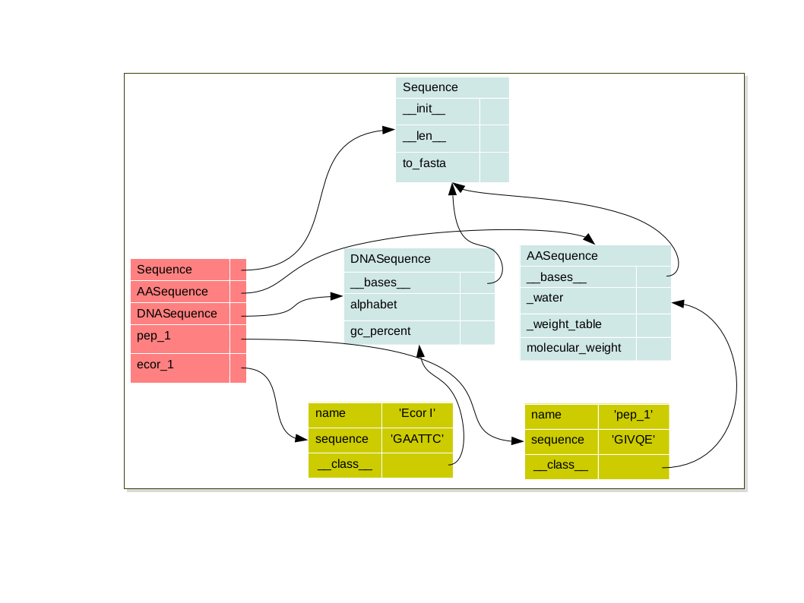

.. Architecture_and_Design

***************************************
Object-oriented Architecture and Design
***************************************

Inheritance
===========

In the introduction of I mentioned that one of the objectives of OOP is to address some of the issues of software quality.

What we have seen so far, object-based programming, consists in designing programs with objects, that are built
with classes. In most object-oriented programming languages, you also have a mechanism that enables classes to
share code. The idea is very simple: whenever there are some commonalities between classes, why having them
repeat the same code, thus leading to maintenance complexity and potential inconsistency? So the principle of
this mechanism is to define some classes as being the same as other ones, with some differences.

In the example below we have design two classes to represent to kind of sequences DNA or AA. As we can see the 2 kinds
of sequence have the same attributes (name and sequence) have some common methods (len, to_fasta) but have also some
specific methods gc_percent and molecular_weight.

.. literalinclude:: _static/code/sequence.py
   :linenos:
   :language: python

The problem with this implementation is that a large part of code is the same in the 2 classes. It's bad because if
I have to modify a part of common code I have to do it twice. If in future I'll need a new type of Sequence as RNA sequence
I will have to duplicate code again on so on. the code will be hard to maintain. I need to keep together the common code,
and be able to specify only what is specific for each type of Sequences

So we keep our two classes to deal with DNA and protein sequences, and we add a new
class: Sequence, which will be a common class to deal with general sequence functions. In order to specify that
a DNA (or a Protein) is a Sequence in Python is:

.. literalinclude:: _static/code/inheritance_sequence.py
   :linenos:
   :language: python

* Each object have it's own namespace which are linked to the class namespace via the special attribute: ``__class__``
* Each class is link to it's parents namespace via the special attribute ``__bases__`` on so on until the object class
  namespace

.. code-block:: python

   pep_1 = AASequence('pep_1', 'GIVQE')
   bar = DNASequence('Ecor I', 'GAATTC')

.. container:: clearer

  .. image :: _static/figs/spacer.png

Overloading
-----------

Overloading an attribute or a method is to redefine at a subclass level an attribute or method that exists in upper
classes of a class hierarchy.

.. literalinclude:: _static/code/overloading.py
   :linenos:
   :language: python

We we overload a method sometimes we just want to add something to the parent's method. in this case we can call
explicitly the parent's method by using the keywords ``super``. The syntax of this method is lit bit tricky.
the first argument must be the class that you want to retrieve the parent (usually the class you are coding),
the second argument is the object you want to retrieve the parent class (usual self) and it return a proxy to the parent
so you just have to call the method. see it in action, in the example below we overload the __init__ method
and just add 2 attribute but for the name and sequence we call the Sequence __init__ method.

.. literalinclude:: _static/code/super1.py
   :linenos:
   :language: python

In python3 the syntax has been simplified. we can just call super() that's all.

Polymorphism
============

The term polymorphism, in the OOP lingo, refers to the ability of an object to adapt the code to the type of the data it is processing.

Polymorphism has two major applications in an OOP language.
The first is that an object may provide different implementations of one of its methods depending on the type of the input parameters.
The second is that code written for a given type of data may be used on other data with another datatype as long as
the other data have compatible behavior.

.. literalinclude:: _static/code/polymorphism.py
   :linenos:
   :language: python

Albeit data are type, my method my_sum work equally on different type as integer, string or sequence.
The my_sum method is called polymorph.

Multiple inheritance
====================

In Python, as in several programming language, you can have a class inherit from several base classes. Normally,
this happens when you need to mix very different functionalities.

Inheriting from classes that come
from the same hierarchy can be tricky, in particular if methods are defined everywhere: you will have to know how
the interpretor choose a path in the classes graph. But this case is more like a theoretical limit case, that should
not happen in a well designed program.

.. literalinclude:: _static/code/mro.py
   :linenos:
   :language: python

Which method will be executed?

To determine the order of lookup, python use an algorithm call *method resolution order* .
in the example above, the result of ``mro`` is::

   >>> E.__mro__
   (<class '__main__.E'>, <class '__main__.C'>, <class '__main__.D'>, <class '__main__.B'>, <class '__main__.A'>, <class 'object'>)

Abstract classes
================

Composition
===========
Here is a problem that come to me during a software design. I have to modelize a generic macromolecular system of proteins.
following the main characteristics of a system.

 * A systems is composed of several genes
 * some genes a mandatory
 * some genes are accessory
 * some other are forbidden
 * for some efficient reason each genes must search only ones

I have in some case to search for lot of systems in on run.

Ok I have only each gene is unique for all systems. So I design the program to have only one instance of a gene.
 but several systems can reference the same gene.
after some experiments it was obvious we need a new concept to be more sensitive.

 * some genes have homologs and some other have analogs
 * a gene can appeared in one system a mandatory gene and is an homolog of an other gene in an other system.
 * a homologs have the same characteristics than a gene, it just have in more the reference to the gene it is the homologs
 * the analogs are the same as homologs.

The first idea which came in my mind was to create an Homolog and Analog classes which inherits of Gene.
 But if I did that when a gene appeared as gene in a system and as homologs in other systems. I search this gene twice.
 It was not I want. So I need to think again to my design. I decide to use composition instead of inheritance.
 I create a class of Analog and Homologue but which not inherits from Gene. But they have a property gene encapsulated
 inside them. And I use delegation for all properties and methods for gene.
  This means that I create same properties in Homologs that exist in Gene, but when I call these property in homolgs
  it just call the method from the gene encapsulated.

.. literalinclude:: _static/code/homolog.py
   :linenos:
   :language: python

This design pattern is called composition. This is a powerful design that mimics inheritance but with more flexibility.
But it's lit bit boring to recode all methods we need to  delegate to the gene. So in python there is a special
method which allow to do this automatically: ``__getattr__`` when python look inside the instance and it does not find
an attribute (remember in python methods are attributes) and find the special method __getattr__ it call this method
with the looking attribute as argument.

.. literalinclude:: _static/code/homolog_getattr.py
   :linenos:
   :language: python

.. warning::
   It is very convenient but you must use ``__getattr__`` with parsimony and well document it as it can obfuscate the code.

Exercises
=========

