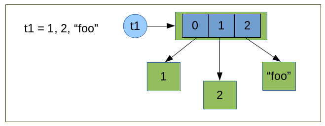
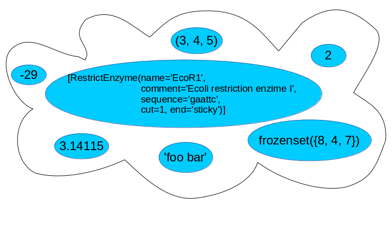
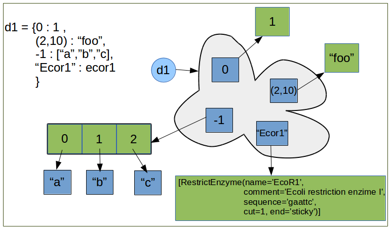
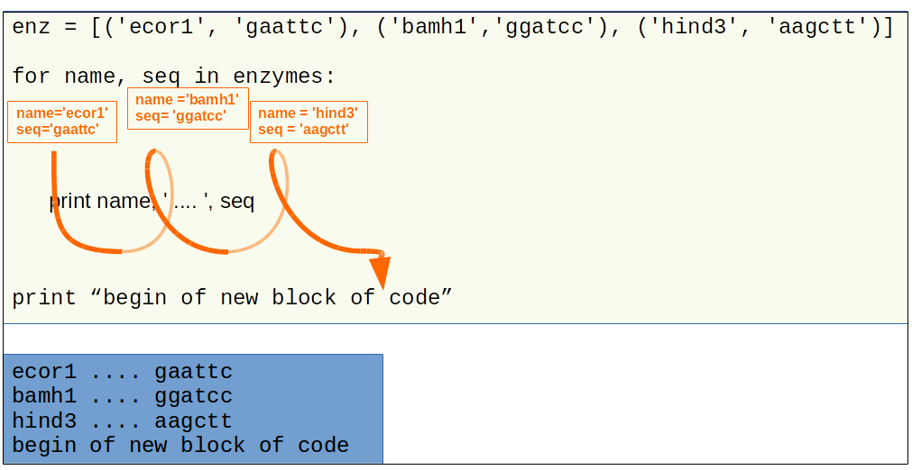
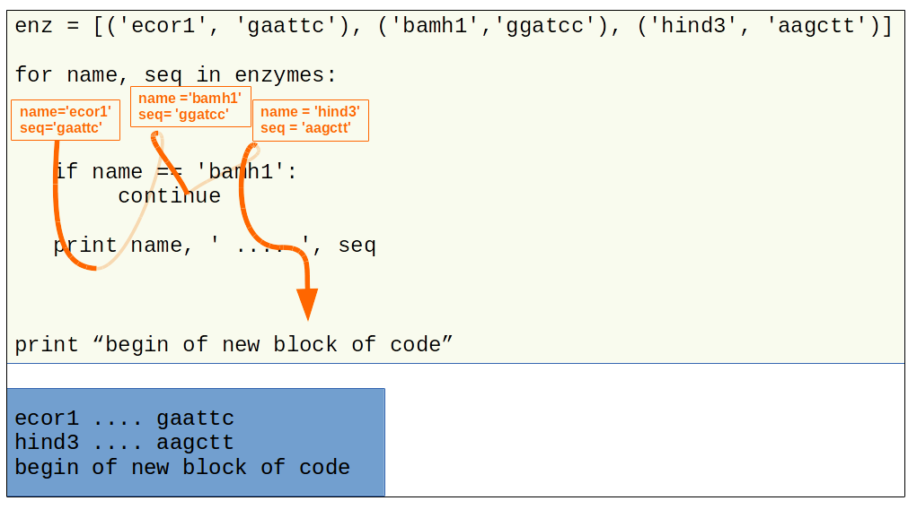
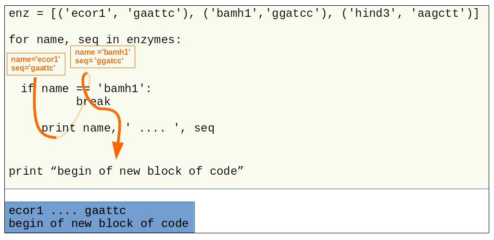
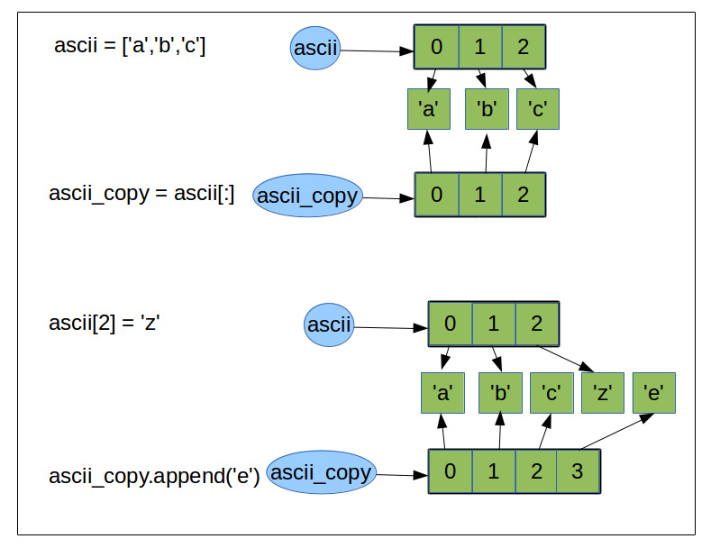
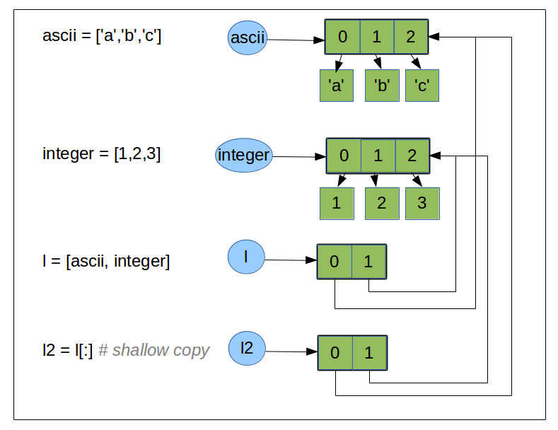

.. sectnum:: 
   :start: 4

.. _Collection_Data_types:

*********************
Collection Data Types
*********************

It is often convenient to hold entire collections of data items. 
Python provides several collection data types that can hold items.
Each collection data types have properties which make it more suitable
for some problems and inappropriate for the others.

There is 2 kinds of data collection the *imutables* and *mutables*.
As we seen in :ref` Variables chapter <_immutable obj>` 

* *imutable* objects are objects that we **cannot** change the state (the value).
  So the collection is frozen after it's creation, of course we can access to the items, 
  but we cannot change the colection add, remove, reorder the collection.
  
* *mutable* objects are objects that we can modify the state (the value). 
  So we can access to the items but we **can** modify the collection: add, remove, change or sort items
  

.. _sequences:

Sequence Types
==============

A *sequence* type is one that supports the membership operator ``in``, the size function ``len()``, slices ``[]``.
Python provide three sequence types ``tuple``, ``list`` and ``string`` (in python 3 there is also ``bytearray`` and ``bytes``).
The string are covered in :ref:`previous chapter <strings>`.
Some other sequence type are also provide by the standard library for instance ``collections.namedtuple``  or ``collections.set``.

Tuples
------

A tuple is an ordered sequence of zero or more object references. 
As tuple are sequences types, they supports slicing and striding as strings.
This make easy to extract items from tuple.
As they are immutable, we cannot replace or delete or add any items after creation.

The tuple data type can be called as a function, *tuple()*, without any arguments it return an empty tuple, 
with a tuple as argument it returns a shallow copy of the argument, and with any other argument it 
attempts to convert the given object to a tuple. 
Ther is a more convnient way to create tuple. an empty tuple is create with parenthesis (), 
and a tuple of one or more items with commas. 
Sometimes tuple are surrounding by parenthesis to avoid syntactic ambiguity.

**tuple creation, what happens in memory.**

   
* Python create 3 objects, 2 integers one string.
* Python create tuple with 3 "slots".
* Each slots refer to one object, in the same order they have been "declared".
* the object reference *t1* is created and reference the tuple object .
 
.. container:: clearer

   .. image :: _static/figs/spacer.png
    
::

   >>> tuple()
   ()
   >>> t1 = 1, 2, "foo"
   >>> print t1
   (1, 2, "foo")
   >>> t2 = tuple(t1)
   >>> print t2
   (1, 2, "foo")
   >>> t1[1]
   2
   >>> t1[-1]
   "foo"
   >>> t1[::-1]
   ('foo', 2, 1)
   >>> len(t1)
   3
 
Tuple provide just two methods *t.count(x)*, which returns the number of of times object *x* occurs in tuple *t*,
and *t.index(x)*, which returns the index position of the left most occurence of object *x* in tuple *t*
(if the object *x* is not find in *t* count raise a ValueError). ::

   >>> t1.count("bar")
   0
   >>> t1.count("foo")
   1
   >>> t1.index("foo")
   2    

Named Tuples
------------

A named tuple behaves just like a plain tuple, and has the same performance and characteristics.
It simply adds the possibilty to access to the data items in the tuple either by their index position
or by name.
A name tuple allow us to aggregate data and improve code readibility.

We must first create a new named tuple data type, then we can use this new datatype to create tuple with values.
To create the new custom tuple data type ``collections`` module from the standard library provides the *namedtuple()* fuction. 
The first argument is the name of the custom data type (After the creation the built-in function type() 
call on a tuple will return this name). The second argument is a string space delimiter names, 
one for each item that our custom tuples will take.
The function return a new custom class (new data type) that can be used to creates named tuple.
 
For example: ::

   >>> import collections
   >>> RestrictEnzyme = collections.namedtuple("RestrictEnzyme", "name comment sequence cut end")
   >>> ecor1 = RestrictEnzyme("EcoR1", "Ecoli restriction enzime I", "gaattc", 1, "sticky")
   >>> bamh1 = RestrictEnzyme("BamH1", "type II restriction endonuclease from Bacillus amyloliquefaciens ", "ggatcc", 1, "sticky")
   >>>
   >>> ecor1[2]
   'gaattc'
   >>> ecor1.sequence
   'gaattc'
   >>> ecor1.end == bamh1.end
   True
   >>> ecor1_frg = ecor1.sequence[:ecor1.cut] , ecor1.sequence[ecor1.cut:]
   >>> print ecor1_frg 
   ('g', 'aattc')
   
.. note::

   Although named tuple can be very convenient to aggregate data, we can go beyond by creating our own data type
   and add behavior to some aggregated data with *object-oriented* programming. 
   This topic will not cover in this course but if you are interested in, read http://www.qtrac.eu/py3book.html
   
.. _list:

Lists
-----

A list is an ordered ``sequence`` of zero or more object refernces.
lists support the same extracting, slicing syntax as ``strings`` or ``tuples``.
Unlike ``strings`` and ``tuples``, lists are *mutable*, so we can replace, delete any of their items.
It is also possible to insert, replace, and delete slices of lists.

The list data type can be called as function, ``list()``, with no arguments it return an empty list,
with a list as argument, it returns a shallow copy of the argument, and with any other argument,
it attempts to convert the given object to a list. It does not accept more than one argument. 

The is others ways to created *lists*, 
 
 * by enclosing a comma separated sequence of object references between square brackets.
 * using a list comprehension.
 
Since all the items in a list are really object references, data item can be of any data type, including collections
tuple, list, ... 

::

   >>> digest = [ecor1, bamh1]
   >>>
   >>> digest2 = list(digest)
   >>> id(digest)
   139847879780184
   >>> id(digest2)
   139847879857648
   >>> list("argument")
   ['a', 'r', 'g', 'u', 'm', 'e', 'n', 't']
   >>>   
   >>> hind3 =  RestrictEnzyme("HindIII", "type II site-specific nuclease from Haemophilus influenzae", "aagctt", 1 , "sticky")
   >>> digest.append(hindIII)
   >>>
   >>> tree = ['Bovine', ['Gibbon', ['Orang', ['Gorilla', ['Chimp', 'Human']]]], 'Mouse' ]
   >>>
   >>> aas = "ALA TYR TRP SER GLY".split()
   >>> print aas
   ['ALA', 'TYR', 'TRP', 'SER', 'GLY']
   >>> " ".join(aas)
   
List can be compared using the standard comparison operators (==, !=, >=, <=, <, >). 
The comparison will be applied item by item (and recursively for nested item such as list in list). ::
     
   >>> l1 = [1,2,3]
   >>> l2 = [1,4]
   >>> l1 > l2
   False
   >>> l1 = [1,2,[3,4]]
   >>> l2 = [1,2,[3,5]]
   >>> l2 > l1
   True

The following operations are defined on mutable sequence types (where x is an arbitrary object):

.. tabularcolumns:: |l|l|l| 

+---------------------------------+------------------------------------------------------------------------------+---------------+
| Operation                       | Result                                                                       | notes         |
+=================================+==============================================================================+===============+
| s[i] = x                        | item *i* of s is replaced by *x*                                             |               |
+---------------------------------+------------------------------------------------------------------------------+---------------+
| s[i:j] = t                      | slice of *s* from *i* to *j* is replaced by the contents of the iterable *t* |               |
+---------------------------------+------------------------------------------------------------------------------+---------------+
| del s[i:j]                      | same as s[i:j] = []                                                          |               |
+---------------------------------+------------------------------------------------------------------------------+---------------+
| s[i:j:k] = t                    | the elements of s[i:j:k] are replaced by those of *t*                        | (1)           |
+---------------------------------+------------------------------------------------------------------------------+---------------+
| del s[i:j:k]                    | removes the elements of s[i:j:k] from the list                               |               |
+---------------------------------+------------------------------------------------------------------------------+---------------+
| s.append(x)                     | same as s[len(s):len(s)] = [x]                                               | (2)           |
+---------------------------------+------------------------------------------------------------------------------+---------------+
| s.extend(x)                     | same as s[len(s):len(s)] = x                                                 | (3)           |
+---------------------------------+------------------------------------------------------------------------------+---------------+
| s.count(x)                      | return number of *i*‘s for which s[i] == x                                   |               |
+---------------------------------+------------------------------------------------------------------------------+---------------+
| s.index(x[, i[, j]])            | return smallest k such that s[k] == x and i <= k < j                         | (4)           |
+---------------------------------+------------------------------------------------------------------------------+---------------+
| s.insert(i, x)                  | same as s[i:i] = [x]                                                         | (5)           |
+---------------------------------+------------------------------------------------------------------------------+---------------+
| s.pop([i])                      | same as x = s[i]; del s[i]; return x                                         | (6)           |
+---------------------------------+------------------------------------------------------------------------------+---------------+
| s.remove(x)                     | same as del s[s.index(x)]                                                    | (4)           |
+---------------------------------+------------------------------------------------------------------------------+---------------+
| s.reverse()                     | reverses the items of *s* in place                                           | (7)           |
+---------------------------------+------------------------------------------------------------------------------+---------------+
| s.sort([cmp[, key[, reverse]]]) | sort the items of *s* in place                                               | (7)(8)(9)(10) |
+---------------------------------+------------------------------------------------------------------------------+---------------+

Notes:

    #. *t* must have the same length as the slice it is replacing.
    #. The C implementation of Python has historically accepted multiple parameters and implicitly joined them into a tuple; 
       this no longer works in Python 2.0. Use of this misfeature has been deprecated since Python 1.4.
    #. *x* can be any iterable object.
    #. Raises ValueError when *x* is not found in s. 
       When a negative index is passed as the second or third parameter to the **index()** method, 
       the list length is added, as for slice indices. 
       If it is still negative, it is truncated to zero, as for slice indices.
      
       Changed in version 2.3: Previously, **index()** didn’t have arguments for specifying start and stop positions.
      
    #. When a negative index is passed as the first parameter to the **insert()** method, 
       the list length is added, as for slice indices. If it is still negative, 
       it is truncated to zero, as for slice indices.
     
       Changed in version 2.3: Previously, all negative indices were truncated to zero.
     
    #. The **pop()** method’s optional argument i defaults to -1, 
       so that by default the last item is removed and returned.
    #. The **sort()** and **reverse()** methods modify the list in place for economy of space when sorting or reversing a large list. 
       To remind you that they operate by side effect, they don’t return the sorted or reversed list.
    #. The **sort()** method takes optional arguments for controlling the comparisons.
       
       cmp specifies a custom comparison function of two arguments (list items) 
       which should return a negative, zero or positive number depending on whether 
       the first argument is considered smaller than, equal to, 
       or larger than the second argument: 
       ``cmp=lambda x,y: cmp(x.lower(), y.lower())``. The default value is None.
     
       key specifies a function of one argument that is used to extract a comparison key from each list element: 
       ``key=str.lower``. The default value is **None**.
       
       reverse is a boolean value. If set to **True**, then the list elements are sorted as if each comparison were reversed.
    
       In general, the key and reverse conversion processes are much faster than specifying an equivalent cmp function. 
       This is because cmp is called multiple times for each list element while key and reverse touch each element only once. 
       Use functools.cmp_to_key() to convert an old-style cmp function to a key function.
       
       Changed in version 2.3: Support for **None** as an equivalent to omitting cmp was added.
    
       Changed in version 2.4: Support for key and reverse was added.
    #. Starting with Python 2.3, the **sort()** method is guaranteed to be stable. 
       A sort is stable if it guarantees not to change the relative order of elements that compare equal 
       — this is helpful for sorting in multiple passes (for example, sort by department, then by salary grade).
    #. **CPython implementation detail**: While a list is being sorted, the effect of attempting to mutate, 
       or even inspect, the list is undefined. The C implementation of Python 2.3 and newer makes the list
       appear empty for the duration, and raises ValueError if it can detect that the list has been mutated during a sort.

examples of item replacing and deleting: ::

   >>> sma1 =  RestrictEnzyme("SmaI", "Serratia marcescens", "cccggg", 3 , "blunt")
   >>> print digest
   
   >>> digest[1] = sma1 #replace bamH1 whith smai in digest
   >>> del digest[-1]   #remove hind3 from digest. Is hind3 exist any more?
    
.. _lists_comprehension:
   
Lists Comprehensions
^^^^^^^^^^^^^^^^^^^^

Small list are often created using literals but long lists are usually created programmatically. 
To create a list from an other sequence object Python offer a very convenient syntax: the ``lists comprehension``.
A ``list comprehension`` is an expression and a :ref:`loop <loop>` with an optional :ref:`condition <condition>` enclosed in brackets
where the loop is use to generate items for the list and where condition filter out unwanted items.

| [*expression* for *item* in *iterable*]
| [*expression* for *item* in *iterable* if *condition*]  

::
   
   >>> [enz.name for enz in digest]
   ['EcoR1', 'SmaI', 'HindIII']
   >>> [enz.name for enz in digest if enz.end != 'blunt']
   ['EcoR1', 'HindIII']
   
   
Set Types
=========

A set type is a collection data type that support ``in`` and ``len`` operator and is iterable. 
But the the interest of sets is they support operations like ``union``, ``intersection``, ``difference``, ``isdisjoint``.
When iterated, set types provide their items in an **arbitrary** order.

Only *hashable* objects may be added to a set. Hashable objects are objects
 whose return value is always the same throughout the object’s lifetime, 
 and which can be compared for equality.
 
All the built-in immutable data types, such as float , frozenset , int , str , and
tuple , are hashable and can be added to sets. The built-in mutable data types,
such as dict, list, and set, are not hashable since their hash value changes
depending on the items they contain, so they cannot be added to sets.

Sets
----

A set is an unordered collection of zero or more object references that refer to
hashable objects. Sets are mutable, so we can easily ``add`` or ``remove`` items, but
since they are unordered they have **no** notion of index position and so **cannot**
be sliced or strided. 

The set data type can be called as function, ``set()``, with no arguments and it return an empty set,
the items can be add one by one using the ``add`` method::

   s = set()
   s.add('a')
   s.add('b')
   s.add((1,2))

With a set as argument it returns a shallow copy of the argument, and with any other argument it attempts 
to convert the given object to a set. It does not accept more than one argument.::

   l = [1,2,3,4,3,2]
   s = set(l)
   print s
   set([1, 2, 3, 4])
   
.. warning::
   If you want to have a string in your set, you cannot use the expression: ::
      >>> s = set("toto")
   
   As the strings are sequence data types "t", "o", "t", "o" will be added to the set.
   And as set is a collection of unique items your set will contains only "t", "o" ::
   
      >>> print s
      set(['t', 'o'])
      
   To have "toto" in the set you need to use the ``add`` method or create the set dircetly with the string with curly brackets (see below).
      
The other way to create a set is by enclosing a comma separated sequence of object references between curly brackets.
(see figure below). ::

      s.add("toto")

    
This figure illustrates the set created by the following code snippet::
   S = {'foo bar', 2, ecor1, frozenset({8, 4, 7}), -29, (3, 4, 5)}

.. container:: clearer

    .. image :: _static/figs/spacer.png
       
Sets always contains unique items. It safe to add several times the same item but pointless.
Sets support ``len`` and fast membership testing ``in`` and ``not in``.
Tey also support ususal set operators: Union, Intersection, Difference, Symetric difference::

   >>> pecan = set("pecan")
   >>> pie = set("pie")
   >>> print pecan ," ... ", pie
   set(['a', 'p', 'c', 'e', 'n'])  ...  set(['i', 'p', 'e'])
   >>> ## Union ## 
   >>> pecan | pie 
   set(['a', 'c', 'e', 'i', 'n', 'p'])
   >>> ## Intersection ##
   >>> pecan & pie 
   set(['p', 'e'])
   >>> ## Difference ##
   >>> pecan - pie
   set(['a', 'c', 'n'])
   >>> pie - pecan
   set(['i'])
   >>> Symetric Difference ##
   >>> pecan ^ pie
   set(['a', 'c', 'i', 'n'])
   >>> pie ^ pecan
   set(['a', 'c', 'i', 'n'])

.. _set_methods_and_operator:

Set methods and Operators

.. tabularcolumns:: |l|l|l| 

+-------------------------------+------------------------------------------------------------------------------------------------------------------------------------+-------------------------------+
| Syntax                        | Description                                                                                                                        | also available for frozen set |
+===============================+====================================================================================================================================+===============================+
| s.add(x)                      | Adds item x to set s if it is not already in s                                                                                     |                               |
+-------------------------------+------------------------------------------------------------------------------------------------------------------------------------+-------------------------------+
| s.clear()                     | Removes all the items from set s                                                                                                   |                               |
+-------------------------------+------------------------------------------------------------------------------------------------------------------------------------+-------------------------------+
| s.copy()                      | Returns a shallow copy of set s                                                                                                    | *                             |
+-------------------------------+------------------------------------------------------------------------------------------------------------------------------------+-------------------------------+
| s.difference(t)               | Returns a new set that has every item that is in  set s that is not in set t                                                       | *                             |
+-------------------------------+------------------------------------------------------------------------------------------------------------------------------------+-------------------------------+
| s -= t                        | Removes every item that is in set t from set s                                                                                     |                               |
+-------------------------------+------------------------------------------------------------------------------------------------------------------------------------+-------------------------------+
| s.discard(x)                  | Removes item x from set s if it is in s ; see also     set.remove()                                                                |                               |
+-------------------------------+------------------------------------------------------------------------------------------------------------------------------------+-------------------------------+
| s.intersection(t)             | Returns a new set that has each item that is in both set s and set t                                                               | *                             |
+-------------------------------+------------------------------------------------------------------------------------------------------------------------------------+-------------------------------+
| s.intersection_update(t)      | Makes set s contain the intersection of itself and set t                                                                           |                               |
+-------------------------------+------------------------------------------------------------------------------------------------------------------------------------+-------------------------------+
| s.isdisjoint(t)               | Returns True if set s s and t have no items in common                                                                              | *                             |
+-------------------------------+------------------------------------------------------------------------------------------------------------------------------------+-------------------------------+
| s.issubset(t)                 | Returns True if set s is equal to or a subset of set t ; use s < t to test whether s is a proper subset of t                       | *                             |
+-------------------------------+------------------------------------------------------------------------------------------------------------------------------------+-------------------------------+
| s.issuperset(t)               | Returns True if set s is equal to or a superset of set t ; use s > t to test whether s is a proper superset of t                   | *                             |
+-------------------------------+------------------------------------------------------------------------------------------------------------------------------------+-------------------------------+
| s.pop()                       | Returns and removes a random item from set s, or raises a KeyError exception if s is empty                                         |                               |
+-------------------------------+------------------------------------------------------------------------------------------------------------------------------------+-------------------------------+
| s.remove(x)                   | Removes item x from set s , or raises a KeyError exception if x is not in s ; see also set.discard()                               |                               |
+-------------------------------+------------------------------------------------------------------------------------------------------------------------------------+-------------------------------+
| s.symmetri_difference         | Returns a new set that has every item that is in set s and every item that is in set t , but excluding items that are in both sets | *                             |
+-------------------------------+------------------------------------------------------------------------------------------------------------------------------------+-------------------------------+
| s.symmetric_difference_update | Makes set s contain the symmetric difference of itself and set t                                                                   |                               |
+-------------------------------+------------------------------------------------------------------------------------------------------------------------------------+-------------------------------+
| s.union(t)                    | Returns a new set that has all the items in set s and all the items in set t that are not in set s                                 | *                             |
+-------------------------------+------------------------------------------------------------------------------------------------------------------------------------+-------------------------------+
| s.update(t)                   | Adds every item in set t that is not in set s , to set s                                                                           |                               |
+-------------------------------+------------------------------------------------------------------------------------------------------------------------------------+-------------------------------+

.. _sets_comprehension:

Set Comprehension
^^^^^^^^^^^^^^^^^
As we can build a list using an expresion (see :ref:`lists_comprehension`) we can create sets ::

 {*expression* for *item* in *iterable*}
 {*expression* for *item* in *iterable* if *condition*}  

::

   import collections
   RestrictEnzyme = collections.namedtuple("RestrictEnzyme", "name comment sequence cut end")
   ecor1 = RestrictEnzyme("EcoR1", "Ecoli restriction enzime I", "gaattc", 1, "sticky")
   bamh1 = RestrictEnzyme("BamH1", "type II restriction endonuclease from Bacillus amyloliquefaciens ", "ggatcc", 1, "sticky")
   hind3 =  RestrictEnzyme("HindIII", "type II site-specific nuclease from Haemophilus influenzae", "aagctt", 1 , "sticky")
   sma1 =  RestrictEnzyme("SmaI", "Serratia marcescens", "cccggg", 3 , "blunt")
   digest = [ecor1, bamh1, hind3, sma1]
   >>> 
   >>> {enz.name for enz in digest}
   set(['SmaI', 'BamH1', 'EcoR1', 'HindIII'])
   >>> 
   >>> {enz.name for enz in digest if enz.end != 'blunt'}
   set(['BamH1', 'EcoR1', 'HindIII'])
   
   
   
Frozen Sets
-----------

A frozen set is a set that, once created, cannot be changed.

Since frozen sets are immutable, they support only those methods and oper-
ators that produce a result without affecting the frozen set or sets to which
they are applied ( see :ref:`set methods and operator <set_methods_and_operator>`).

Another consequence of the immutability of frozen sets is that they meet
the hashable criterion for set items, so sets and frozen sets can contain frozen
sets.

.. _mapping_types:

Mapping Types
=============

Mappings are collections of key–value items and provide methods for accessing items and their keys and values.
In mapping type we associated an item to a key. The key provide a direct access to the item, the value, without 
iterating over all the collection.
In Python the mapping type are also call ``dictionary``.

Only hashable objects may be used as dictionary keys, so immutable data types
such as float , frozenset , int , str , and tuple can be used as dictionary keys, but
mutable types such as dict , list , and set cannot.
On the other hand, each key’s
associated value can be an object reference referring to an object of any type,
including numbers, strings, lists, sets, dictionaries, functions, and so on.

Dictionary types can be compared using the standard equality comparison op-
erators ( == and != ), with the comparisons being applied item by item (and recur-
sively for nested items such as tuples or dictionaries inside dictionaries). Com-
parisons using the other comparison operators ( < , <= , >= , > ) are not supported
since they don’t make sense for unordered collections such as dictionaries.

Python provide 3 kind of mapping type:

* the built-in dict type 
* the standard library’s collections.defaultdict type. 
* and an ordered mapping type, collections.OrderedDict.

.. _dictionaries:

Dictionaries
------------

A dict is an unordered collection of zero or more key–value pairs whose keys
are object references that refer to hashable objects, and whose values are object
references referring to objects of any type. Dictionaries are mutable, so we can
easily add or remove items, but since they are unordered they have no notion
of index position and so cannot be sliced or strided.

The ``dict`` data type can be called as a function, dict(), with no arguments it
returns an empty dictionary, and with a mapping argument it returns a shallow copy if the
argument is a dictionary or a dict based on the arguments if it is a DefaultDict or OrderedDict. 
It is also possible to use a sequence argument, providing that each item in the sequence is itself
a sequence of two objects, the first of which is used as a key and the second of which is used as a value.
Dictionaries can also be created using braces—empty braces, {} ,
create an empty dictionary; nonempty braces must contain one or more comma-
separated items, each of which consists of a key, a literal colon, and a value.
Another way of creating dictionaries is to use a dictionary comprehension—a
topic we will cover later in this subsection.
Here are some examples to illustrate the various syntaxes—they all produce
the same dictionary: ::

   dict({"id": 1948, "name": "Washer", "size": 3})
   dict(id=1948, name="Washer", size=3)
   dict([("id", 1948), ("name", "Washer"), ("size", 3)])
   dict(zip(("id", "name", "size"), (1948, "Washer", 3)))
   {"id": 1948, "name": "Washer", "size": 3}

Dictionary keys are unique, so if we add a key–value item whose key is the
same as an existing key, the effect is to **replace** that key’s value with a new value.

   

Illustrates the dictionary created by the following code snippet::
   >>> d1 = {0 : 1 , (2,10) : “foo”, -1 : [ “a”, ”b”, ”c ], “Ecor1” : ecor1 }
      
Brackets are used to access individual values—for example, d[0] returns 1,
d["foo"] returns -1 , and d[91] causes a KeyError exception
to be raised, given the dictionary above.

Brackets can also be used to add and delete dictionary items. To add an item
we use the = operator, for example, d["X"] = 59 . And to delete an item we use
the del statement—for example, del d["foo"] will delete the item whose key
is “foo” from the dictionary, or raise a KeyError :ref:`_exceptions` 
if no item has that key. Items can also be removed (and returned) from the dictionary using the
dict.pop() method.

.. _dict_methods_and_operator:

Dictionary methods and Operators
^^^^^^^^^^^^^^^^^^^^^^^^^^^^^^^^

.. tabularcolumns:: |l|l|

+--------------------+-----------------------------------------------------------------------------------------------------------------------------+
| Syntax Description |                                                                                                                             |
+====================+=============================================================================================================================+
| d.clear()          | Removes all items from dict d                                                                                               |
+--------------------+-----------------------------------------------------------------------------------------------------------------------------+
| d.copy()           | Returns a shallow copy of dict d d.fromkeys(s, v)                                                                           |
|                    | Returns a dict whose keys are the items in sequence s and whose values are None or v if v is given Shallow and deep copying |
+--------------------+-----------------------------------------------------------------------------------------------------------------------------+
| d.get(k)           | Returns key k’s associated value, or None if k isn’t in dict d                                                              |
+--------------------+-----------------------------------------------------------------------------------------------------------------------------+
| d.get(k, v)        | Returns key k’s associated value, or v if k isn’t in dict d                                                                 |
+--------------------+-----------------------------------------------------------------------------------------------------------------------------+
| d.items()          | Returns a view  of all the (key, value) pairs in dict d                                                                     |
+--------------------+-----------------------------------------------------------------------------------------------------------------------------+
| d.keys()           | Returns a view of all the keys in dict d d.pop(k) Returns key k’s associated value and removes the item                     |
|                    | whose key is k, or raises a KeyError exception if k isn’t in d                                                              |
|                    | whose key is k, or returns v if k isn’t in dict d                                                                           |
+--------------------+-----------------------------------------------------------------------------------------------------------------------------+
| d.popitem()        | Returns and removes an arbitrary (key, value) pair from dict d , or raises a KeyError exception if d is empty               |
|                    | d.setdefault(k, v) The same as the dict.get() method, except that if the key is                                             |
|                    | not in dict d, a new item is inserted with the key k , and with                                                             |
|                    | a value of None or of v if v is given d.update(a).                                                                          |
|                    | Adds every (key, value) pair from a that isn’t in dict d to d ,                                                             |
|                    | and for every key that is in both d and a, replaces the corre-                                                              |
|                    | sponding value in d with the one in a — a can be a dictionary,                                                              |
|                    | an iterable of (key, value) pairs, or keyword arguments                                                                     |
+--------------------+-----------------------------------------------------------------------------------------------------------------------------+

.. note::

   In Python 3, the dict.items(), dict.keys(), and dict.values() methods all return dictionary
   views. A dictionary view is effectively a read-only iterable object that appears
   to hold the dictionary’s items or keys or values, depending on the view we have
   asked for. In general, we can simply treat views as iterables. However, two things make
   a view different from a normal iterable. One is that if the dictionary the view
   refers to is changed, the view reflects the change. The other is that key and
   item views support some set-like operations. Given dictionary view v and set
   or dictionary view x , the supported operations are:
   
      * Intersection: v & x
      * Union: v | x
      * Difference: v - x
      * Symmetric difference: v ^ x

   In Python3 ::
   
      >>> d = {1:'a',2:'b',3:'c',4:'e'}
      >>> v = d.keys()
      >>> v
      dict_keys([1, 2, 3, 4])
      >>> type(v)
      <class 'dict_keys'>
      >>> d[5] = 'c'
      >>> v
      dict_keys([1, 2, 3, 4, 5])
      >>> 
   
   In python2 ::
   
      >>> d = {1:'a',2:'b',3:'c',4:'e'}
      >>> d.keys()
      [1, 2, 3, 4]
      >>> l = d.keys()
      >>> type(l)
      <type 'list'>
      >>> d[5] = 'c'
      >>> l
      [1, 2, 3, 4]
      >>> d
      {1: 'a', 2: 'b', 3: 'c', 4: 'e', 5: 'c'}
   
 
Dict Comprehension
^^^^^^^^^^^^^^^^^^
 
A *dictionary comprehension* is an expression and a loop with an optional
condition enclosed in braces, very similar to a set comprehension. Like list and
set comprehensions, two syntaxes are supported: ::

   {keyexpression: valueexpression for key, value in iterable}
   {keyexpression: valueexpression for key, value in iterable if condition}
   
::

   import collections
   RestrictEnzyme = collections.namedtuple("RestrictEnzyme", "name comment sequence cut end")
   ecor1 = RestrictEnzyme("EcoR1", "Ecoli restriction enzime I", "gaattc", 1, "sticky")
   bamh1 = RestrictEnzyme("BamH1", "type II restriction endonuclease from Bacillus amyloliquefaciens ", "ggatcc", 1, "sticky")
   hind3 =  RestrictEnzyme("HindIII", "type II site-specific nuclease from Haemophilus influenzae", "aagctt", 1 , "sticky")
   sma1 =  RestrictEnzyme("SmaI", "Serratia marcescens", "cccggg", 3 , "blunt")
   digest = [ecor1, bamh1, hind3, sma1]
   # now I need a collection to acces direcly to the enzyme given its name
   # so I will create a dictionary where keys are enzyme name and values the enzymes 
   frig = {enz.name : enz for enz in digest}
   # if I want a collection with only cohesive end enzymes  
   cohesive_enz = {enz.name : enz  for enz in digest if enz.end != 'blunt'}
   
      
Default Dictionaries
--------------------

Default dictionaries are dictionaries. They have all the operators and methods
that dictionaries provide. What makes default dictionaries different from
plain dictionaries is the way they handle missing keys; in all other respects
they behave identically to dictionaries.

If we use a nonexistent (“missing”) key when accessing a dictionary, a KeyError
is raised. This is useful because we often want to know whether a key that we
expected to be present is absent. But in some cases we want every key we use
to be present, even if it means that an item with the key is inserted into the
dictionary at the time we first access it.

collections.\ **defaultdict**\ ([default_factory[, ...]])

* The first argument provides the initial value for the default_factory attribute; it defaults to None. 
* All remaining arguments are treated the same as if they were passed to the dict constructor, including keyword arguments.

behavior of defaultdict when a key is missing:

* If the default_factory attribute is None, this raises a **KeyError** exception with the key as argument.
* If default_factory is not None, it is **called without arguments** (that means that *default_factory* must be *callable*)
  to provide a default value for the given key, 
  this value is inserted in the dictionary for the key, and returned.
  For example, if we have a dictionary *d* which does not have an item with
  key *m* , the code *x = d[m]* will raise a KeyError exception. But if d is a suitably
  created default dictionary, if an item with key *m* is in the default dictionary, the
  corresponding value is returned the same as for a dictionary—but if *m* is not a
  key in the default dictionary, a new item with key *m* is created with a default
  value, and the newly created item’s value is returned.
* Note that the mechanism to provide a default value is triggered only if we try to access keys with *[]* notation. 
  This means that get() will, like normal dictionaries, return None as a default rather than using default_factory. ::

   >>> import collections
   >>> # If the default_factory attribute is None, this raises a **KeyError** exception
   >>> d= collections.defaultdict()
   >>> d[3]
   Traceback (most recent call last):
      File "<stdin>", line 1, in <module>
   KeyError: 3

   >>> # If default_factory is not None, it is **called without arguments** (that means that *default_factory* must be *callable*)
   >>> d= collections.defaultdict("toto")
   Traceback (most recent call last):
      File "<stdin>", line 1, in <module>
   TypeError: first argument must be callable

   >>> # the mechanism to provide a default value is triggered only if we try to access keys with *[]* notation.
   >>> d= collections.defaultdict(lambda : "toto")
   >>> d[3]
   'toto'
   >>> print d.get(4) # the default value is not return, the missing key is not created
   None
   >>> print d.get(3)
   toto
   >>> print d
   defaultdict(<function <lambda> at 0x7f87b2662938>, {3: 'toto'})

Ordered Dictionaries
--------------------

The ordered dictionaries, ``OrderedDict``, does not belong to the built-in data types but are in the module ``collections`` as ``defaultdict``. 
Ordered dictionaries can be used as drop-in replacements for unordered dicts because they provide the same API.
The difference between the two is that ordered dictionaries store their items in
the order in which they were inserted.
 

Iterating and copying collections
=================================

Once we have collections of data items, it is natural to want to iterate over all
the items they contain. 
Another common requirement is to copy a collection. There are some subtleties
involved here because of Python’s use of object references (for the sake of
efficiency), so in this section’s second subsection, we will examine how to copy
collections and get the behavior we want.

Iterating over collections
--------------------------

An iterable data type is one that can return each of its items one at a time.

iterator
^^^^^^^^

An iterator is an object which is able read through a collection and return items one by one in turn.
the next method of iterator returns each successive item in turn, and raises a StopIteration
exception when there are no more items.

The order in which items are returned depends on the underlying iterable. In
the case of lists and tuples, items are normally returned in sequential order
starting from the first item (index position 0), but some iterators return the
items in an arbitrary order for example, dictionary and set iterators.

Any (finite) iterable, i , can be converted into a tuple by calling tuple(i) , or can
be converted into a list by calling list(i) .

Iterator support also  ``all()``, ``any()``, ``len()``, ``min()``, ``max()``, and ``sum()`` functions.
Here are a couple of usage examples: ::

   >>> x = [-2, 9, 7, -4, 3]
   >>> all(x), any(x), len(x), min(x), max(x), sum(x)
   (True, True, 5, -4, 9, 13)
   >>> x.append(0)
   >>> all(x), any(x), len(x), min(x), max(x), sum(x)
   (False, True, 6, -4, 9, 13)

The enumerate() function takes an iterator and returns an enumerator object.
This object can be treated like an iterator, and at each iteration it returns a
2-tuple with the tuple’s first item the iteration number (by default starting
from 0) ::

   seq = 'TACCTTCTGAGGCGGAAAGA'
   for i , b in enumerate(seq):
      print i,b

   0 T
   1 A
   2 C
   3 C
   4 T
   5 T
   6 C
   ... on so on
   
   
   140

.. _iterable_operators:

Common Iterable Operators and Functions

.. tabularcolumns:: |l|l|l| 

+---------------------------+------------------------------------------------------------------------------------------------------------------------------------------------------------------------------------------------------------------------------------------------------+
| Syntax                    | Description                                                                                                                                                                                                                                          |
+===========================+======================================================================================================================================================================================================================================================+
| s + t                     | Returns a sequence that is the concatenation of sequences s and t                                                                                                                                                                                    |
+---------------------------+------------------------------------------------------------------------------------------------------------------------------------------------------------------------------------------------------------------------------------------------------+
| s * n                     | Returns a sequence that is int n concatenations of sequence s and t                                                                                                                                                                                  |
+---------------------------+------------------------------------------------------------------------------------------------------------------------------------------------------------------------------------------------------------------------------------------------------+
| x in i                    | Returns True if item x is in iterable i ; use not in to reverse the test                                                                                                                                                                             |
+---------------------------+------------------------------------------------------------------------------------------------------------------------------------------------------------------------------------------------------------------------------------------------------+
| all(i)                    | Returns True if every item in iterable i evaluates to True                                                                                                                                                                                           |
+---------------------------+------------------------------------------------------------------------------------------------------------------------------------------------------------------------------------------------------------------------------------------------------+
| any(i)                    | Returns True if any item in iterable i evaluates to True                                                                                                                                                                                             |
+---------------------------+------------------------------------------------------------------------------------------------------------------------------------------------------------------------------------------------------------------------------------------------------+
| enumerate(i, start)       | Normally used in for ... in loops to provide a sequence of (index, item) tuples with indexes starting at 0 or start ;                                                                                                                                |
+---------------------------+------------------------------------------------------------------------------------------------------------------------------------------------------------------------------------------------------------------------------------------------------+
| len(x)                    | Returns the “length” of x . If x is a collection it is the number  of items; if x is a string it is the number of characters.                                                                                                                        |
+---------------------------+------------------------------------------------------------------------------------------------------------------------------------------------------------------------------------------------------------------------------------------------------+
| max(i, key)               | Returns the biggest item in iterable i or the item with the  biggest key(item) value if a key function is given                                                                                                                                      |
+---------------------------+------------------------------------------------------------------------------------------------------------------------------------------------------------------------------------------------------------------------------------------------------+
| min(i, key)               | Returns the smallest item in iterable i or the item with the smallest key(item) value if a key function is given                                                                                                                                     |
+---------------------------+------------------------------------------------------------------------------------------------------------------------------------------------------------------------------------------------------------------------------------------------------+
| range(start, stop,  step) | Returns an integer iterator. With one argument ( stop ), the iterator goes from 0 to stop - 1; with two arguments ( start , stop )  the iterator goes from start to stop - 1; with three arguments it goes from start to stop - 1 in steps of step . |
+---------------------------+------------------------------------------------------------------------------------------------------------------------------------------------------------------------------------------------------------------------------------------------------+
| reversed(i)               | Returns an iterator that returns the items from iterator i in  reverse order                                                                                                                                                                         |
+---------------------------+------------------------------------------------------------------------------------------------------------------------------------------------------------------------------------------------------------------------------------------------------+
| sorted(i, key, reverse)   | Returns a list of the items from iterator i in sorted order; key is used to provide DSU (Decorate, Sort, Undecorate) sorting. If reverse is True the sorting is done in reverse order.                                                               |
+---------------------------+------------------------------------------------------------------------------------------------------------------------------------------------------------------------------------------------------------------------------------------------------+
| sum(i, start)             | Returns the sum of the items in iterable i plus start (which defaults to 0); i may not contain strings                                                                                                                                               |
+---------------------------+------------------------------------------------------------------------------------------------------------------------------------------------------------------------------------------------------------------------------------------------------+
| zip(i1, ..., iN)          | Returns an iterator of tuples using the iterators i1 to iN ;  see text                                                                                                                                                                               |
+---------------------------+------------------------------------------------------------------------------------------------------------------------------------------------------------------------------------------------------------------------------------------------------+

The for ... in Statement
^^^^^^^^^^^^^^^^^^^^^^^^

Python’s for loop has the following syntax:

**for** *variable* **in** *iterable*\ **:**
   do something
**else:**
   do something else

the **else** block is optional.

.. note::
   We already specify that Python uses indentation to signify its block structure. 
   So here the identation is very important.
   The block "for" begin with the **for** ... **in** statement and included all lines 
   which are right indented. The block ends when the code is align again with the **for** ... **in**  statement
   for instance: 
   
   .. code-block:: python
      :linenos:
   
      for i in [1,2,3]:
         begin of **for** block of code
         do something
         do another thing
      print "foo"
      
   | The block of code begin line n°1. 
   | The lines n° 2,3,4 are executed 3 times with the variable i which is bound successively to 1, 2, 3.
   | The line n° 5 start a new block of code, and is executed when the for loop is fnished.
     
   The Python style guidelines (pep 8) recommend four spaces per level of indentation, and only spaces (no tabs). 
   
In for ... in loop, the variable is set to refer to each object in the iterable in turn.
each line of code in the for .. in block is executed at each turn using the variable refering the new object. ::

   bases = 'acgt'
   for b in bases:
      print 'base = ', b
   a
   c
   g
   t    
   
   z = 0
   for i in [1,2,3]:
      z += i
      print "i = {0}, z = {1}".format(i, z)
   i = 1, z = 1
   i = 2, z = 3
   i = 3, z = 5
   

   
   the schema above symbolizes the code execution flow with the "for" loop.
   
   * in green the source code
   * in blue the execution source code results
   * in orange the execution flow

The for loops has an optional else clause. This latter is rather confusingly named since the else clause’s
suite is always executed if the loop terminates normally. If the loop is broken
out of due to a break statement, or a return statement (if the loop is in a
function or method), or if an exception is raised, the else clause’s suite is not
executed.

The *variable* is normally often a single variable but may be a sequence of variables,
usually in the form of a tuple. If a tuple or list is used for the *variable* , each
item is unpacked into the *variable*’s items. ::

   enzymes = [('ecor1', 'gaattc'), ('bamh1','ggatcc'), ('hind3', 'aagctt')]
   for name, seq in enzymes:
      print name, ' .... ', seq
   ecor1 .... gaattc
   bamh1 .... ggatcc
   hind3 .... aagctt

break and continue
""""""""""""""""""

If a ``continue`` statement is executed inside the for ... in loop’s suite, control is
immediately passed to the top of the loop and the next iteration begins. If the
loop runs to completion it terminates, and any ``else`` suite is executed. If the
loop is broken out of due to a ``break`` statement, or a ``return`` statement (if the loop
is in a function), or if an exception is raised, the ``else`` clause’s suite
is **not** executed. (If an exception occurs, Python skips the else clause and looks
for a suitable exception handler—this is covered in the next section.) ::

   enzymes = [('ecor1', 'gaattc'), ('bamh1','ggatcc'), ('hind3', 'aagctt')]
   for name, seq in enzymes:
      if name == 'bamh1':
         continue
      print name, ' .... ', seq
   ecor1 .... gaattc
   hind3 .... aagctt
   

   
   the schema above symbolizes the code execution flow with the "for" loop, with a **continue** statement.
   
   * in green the source code
   * in blue the execution source code results
   * in orange the execution flow   

::

   enzymes = [('ecor1', 'gaattc'), ('bamh1','ggatcc'), ('hind3', 'aagctt')]
   for name, seq in enzymes:
      if name == 'bamh1':
         break
      print name, ' .... ', seq
   ecor1 .... gaattc
   

   
   the schema above symbolizes the code execution flow with the "for" loop, with a **break** statement.
   
   * in green the source code
   * in blue the execution source code results
   * in orange the execution flow

copying collections
-------------------

Since Python uses object references, when we use the assignment operator ( = ),
no copying takes place. If the right-hand operand is a literal such as a string
or a number, the left-hand operand is set to be an object reference that refers to
the in-memory object that holds the literal’s value. If the right-hand operand
is an object reference, the left-hand operand is set to be an object reference that
refers to the same object as the right-hand operand. One consequence of this
is that assignment is very efficient.

In some situations, we really do want a separate copy of the collection
(or other mutable object). For sequences, when we take a slice.
The slice is always an independent copy of the items copied. So to
copy an entire sequence we can do this: ::

   >>> ascii = ['a','b','c']
   >>> ascii_copy = asci[:]

For dictionaries and sets, copying can be achieved using dict.copy() and
set.copy() . In addition, the copy module provides the copy.copy() function that
returns a copy of the object it is given. Another way to copy the built-in collec-
tion types is to use the type as a function with the collection to be copied as its
argument. Here are some examples:

* copy_of_dict_d = dict(d)
* copy_of_list_L = list(L)
* copy_of_set_s = set(s)

Note, though, that all of these copying techniques are **shallow** that is, 
**only object references are copied and not the objects themselves**. 
 

::

   >>> ascii = ['a','b','c']
   >>> ascii_copy = ascii[:] # shallow copy
   >>> ascii[2] = 'z'
   >>> ascii
   ['a', 'b', 'z']
   >>> ascii_copy = ['a','b','c']
   >>> ascii_copy.append('e')
   >>> ascii_copy
   ['a','b','c','e']
   

   the schema above represent what python do behind the scene when we do a shallow copy.
   Only object references are copied and not the objects themselves.

For immutable data types like numbers and strings this has the same effect as copying 
(except that it is more efficient).
But for mutable data types such as nested collections
this means that the objects they refer to are referred to both by the original
collection and by the copied collection.

::

   >>> ascii = ['a','b','c']
   >>> integer = [1,2,3]
   >>> l = [ascii, integer]
   >>> l2 = l[:] # shallow copy
   >>> 
   >>> l[0]
   ['a', 'b', 'c']

   the schema above represent what python do behind the scene when we do a shallow copy.
   
::

   >>> ascii[0] = 'z'
   >>> l[0]
   ['z', 'b', 'c']
   >>> l2[0]
   ['z', 'b', 'c']
   >>> l2.append('foo')
   >>> l2
   [['z', 'b', 'c'],[1, 2, 3], 'foo']
   >>> l
   [['z', 'b', 'c'],[1, 2, 3]]

   >>> tpl = (ascii, integer)
   >>> tpl
   (['z', 'b', 'c'], [1, 2, 3])
   >>> integer[0] = -99
   >>> tpl
   (['z', 'b', 'c'], [-99, 2, 3])

In these conditions we must keep in mind that if we mutate an item of the collection the both collections are modified. 
In programmation, we call this a *side effect*. We saw the side effect problem on *list* and *tuple* example but it's also true with
dictionnaries.

If we really need independent copies of arbitrarily nested collections, 
we have to do a *deep-copy*. ::

   >>> ascii = ['a','b','c']
   >>> integer = [1,2,3]
   >>> l = [ascii, integer]
   >>> l2 = copy.deepcopy(l)
   >>> ascii[0] = 'z'
   >>> l
   [['z', 'b', 'c'], [1, 2, 3]]
   >>> l2
   [['a', 'b', 'c'], [1, 2, 3]]

Usually the terms *copy* and *shallow copy* are used interchangeably. 
For *deep copy* we have to mentioned it explicitly.

Exercises
=========

Exercise
--------

Draw the representation in memory and specify the data type of each object of the following expressions: ::   

   x = [1, 2, 3, 4]
   y = x[1]
   y = 3.14
   x[1] = 'foo'
   
and ::

   x = [1, 2, 3, 4]
   x += [5, 6]

compare with the exercise on string and integers   
Exercise
--------

without using python shell, what is the results of the following statements:  
 
.. note:: 
   sum is a function which return the sum of each elements of a list.
      
::

   x = [1, 2, 3, 4]
   x[3] = -4 # what is the value of x now ?
   y = sum(x)/len(x) #what is the value of y ? why ?
   
Exercise
--------

How to compute safely the average of a list?

Exercise
--------

Draw the representation in memory of the following expressions. ::

   x = [1, ['a','b','c'], 3, 4]
   y = x[1]
   y[2] = 'z'
   # what is the value of x ?
   
   
Exercise
--------

from the list l = [1, 2, 3, 4, 5, 6, 7, 8, 9] generate 2 lists l1 containing all odd values, and l2 all even values.

Exercise
--------
generate a list containing all codons.

Exercise
--------

From a list return a new list without any duplicate, regardless of the order of items. 
For example: ::

   >>> l = [5,2,3,2,2,3,5,1]
   >>> uniqify(l)
   >>> [1,2,3,5] #is one of the solutions 

Exercise
--------

let the following enzymes collection: ::
 
   import collections
   RestrictEnzyme = collections.namedtuple("RestrictEnzyme", "name comment sequence cut end")

   ecor1 = RestrictEnzyme("EcoRI", "Ecoli restriction enzime I", "gaattc", 1, "sticky")
   ecor5 = RestrictEnzyme("EcoRV", "Ecoli restriction enzime V", "gatatc", 3, "blunt")
   bamh1 = RestrictEnzyme("BamHI", "type II restriction endonuclease from Bacillus amyloliquefaciens ", "ggatcc", 1, "sticky")
   hind3 = RestrictEnzyme("HindIII", "type II site-specific nuclease from Haemophilus influenzae", "aagctt", 1 , "sticky")
   taq1 = RestrictEnzyme("TaqI", "Thermus aquaticus", "tcga", 1 , "sticky")
   not1 = RestrictEnzyme("NotI", "Nocardia otitidis", "gcggccgc", 2 , "sticky")
   sau3a1 = RestrictEnzyme("Sau3aI", "Staphylococcus aureus", "gatc", 0 , "sticky")
   hae3 = RestrictEnzyme("HaeIII", "Haemophilus aegyptius", "ggcc", 2 , "blunt")
   sma1 =  RestrictEnzyme("SmaI", "Serratia marcescens", "cccggg", 3 , "blunt")

and the 2 dna fragments: ::

   dna_1 = """tcgcgcaacgtcgcctacatctcaagattcagcgccgagatccccgggggttgagcgatccccgtcagttggcgtgaattcag
   cagcagcgcaccccgggcgtagaattccagttgcagataatagctgatttagttaacttggatcacagaagcttccaga
   ccaccgtatggatcccaacgcactgttacggatccaattcgtacgtttggggtgatttgattcccgctgcctgccagg"""

   dna_2 = """gagcatgagcggaattctgcatagcgcaagaatgcggccgcttagagcgatgctgccctaaactctatgcagcgggcgtgagg
   attcagtggcttcagaattcctcccgggagaagctgaatagtgaaacgattgaggtgttgtggtgaaccgagtaag
   agcagcttaaatcggagagaattccatttactggccagggtaagagttttggtaaatatatagtgatatctggcttg"""

| which enzymes cut the dna_1 ?
|                  the dna_2 ?
|                  the dna_1 but not the dna_2?

Exercise
--------
From a list return a new list without any duplicate, but keeping the order of items. 
For example: ::

   >>> l = [5,2,3,2,2,3,5,1]
   >>> uniqify_with_order(l)
   >>> [5,2,3,1]  

Exercise
--------

list and count occurences of every 3mers in the following sequence ::

   """gtcagaccttcctcctcagaagctcacagaaaaacacgctttctgaaagattccacactcaatgccaaaatataccacag
   gaaaattttgcaaggctcacggatttccagtgcaccactggctaaccaagtaggagcacctcttctactgccatgaaagg
   aaaccttcaaaccctaccactgagccattaactaccatcctgtttaagatctgaaaaacatgaagactgtattgctcctg
   atttgtcttctaggatctgctttcaccactccaaccgatccattgaactaccaatttggggcccatggacagaaaactgc
   agagaagcataaatatactcattctgaaatgccagaggaagagaacacagggtttgtaaacaaaggtgatgtgctgtctg
   gccacaggaccataaaagcagaggtaccggtactggatacacagaaggatgagccctgggcttccagaagacaaggacaa
   ggtgatggtgagcatcaaacaaaaaacagcctgaggagcattaacttccttactctgcacagtaatccagggttggcttc
   tgataaccaggaaagcaactctggcagcagcagggaacagcacagctctgagcaccaccagcccaggaggcacaggaaac
   acggcaacatggctggccagtgggctctgagaggagaaagtccagtggatgctcttggtctggttcgtgagcgcaacaca"""

and finally print the results one 3mer and it's occurence per line. 

write first the pseudocode, then implement it.

bonus:
print the kmer by incresing occurences.

Exercise
--------

reversed complement
acggcaacatggctggccagtgggctctgagaggagaaagtccagtggatgctcttggtctggttcgtgagcgcaacaca

complement = { 'a' : 't', 
               'c' : 'g',
               'g' : 'c',
               't' : 'a'}
for c in s:
   complement += complement[c]

rev_comp = complement[::-1]

Exercise
--------

given the following dict : ::

   d = {1 : 'a', 2 : 'b', 3 : 'c' , 4 : 'd'}
   
We want obtain a new dict with the keys and the values inverted so we will obtain: ::

   inverted_d  {'a': 1, 'c': 3, 'b': 2, 'd': 4}

Exercise
--------
   copy de liste : shalow copy => effet de bord potentiel
   deepcopy
   
Exercise
--------

   copy de dictionaire?
   
      