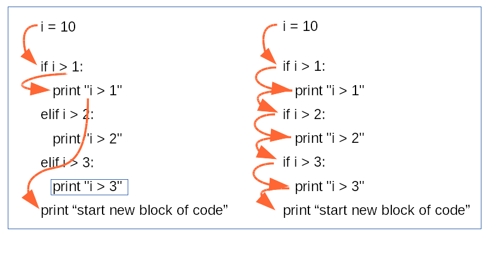

.. _Control_Flow_Statements:

***********************
Control Flow Statements
***********************

Control Structures
==================

.. _condition:

Conditional Branching
---------------------

We mentioned earlier that each statement encountered in a .py file is executed
in turn, starting with the first one and progressing line by line. The flow of
control can be controlled by a :ref:`function <Creating_and_Calling_Functions>` or method call or by a control structure,
such as a conditional branch or a loop statement. Control is also diverted when
an :ref:`exception <exceptions>` is raised.

A Boolean expression is anything that can be evaluated to produce a Boolean
value (True or False). In Python, such an expression evaluates to False if it is
the predefined constant False, the special object None, an empty sequence or
collection (e.g., an empty string, list, or tuple, dictionnary), or a numeric data item of value
0; anything else is considered to be True.

In Python-speak a block of code, that is, a sequence of one or more statements,
is called a suite. Because some of Python’s syntax requires that a suite be
present, Python provides the keyword pass which is a statement that does
nothing and that can be used where a suite is required (or where we want to
indicate that we have considered a particular case) but where no processing
is necessary.

The *if* statement syntax
^^^^^^^^^^^^^^^^^^^^^^^^^
::

   if boolean_expression1:
      block of statements executed
      only if boolean_expression1 is true
   elif boolean_expression2:
      block of statements executed
      only if boolean_expression2 is true
      and condition is false
   elif boolean_expressionN:
      block of statements executed
      only if boolean_expression1 AND boolean_expression2 is false
      and boolean_expressionN is true
   else:
      block of statements executed
      only if all conditions are false

There can be zero or more elif clauses, and the final else clause is optional. If
we want to account for a particular case, but want to do nothing if it occurs, we
can use pass as that branch’s suite.

all *if/elif/else* form **one** statement. The flow of code execute the first block
where the conditon is True, after that the flow exit the statement.
The flow will be very differrent if we use a suite of *if* without *elif*.
in this latter case all *if* statements will be evaluated independantely. 
See the example of :download:`script if.py<_static/code/if.py>`

.. literalinclude:: _static/code/if.py
      :linenos:
      :language: python
      
The output of the if.py script execution::

   if elif
   i > 1
   suite of if
   i > 1
   i > 2
   i > 3
 
In some very simple cases we can reduce the *if ... else* statement to a single conditional expression.
The syntax for such cases is: ::
   
   exepression1 if boolean_expression else expression2
   
If the boolean expression is evaluated to ``True``, the result of the conditional expression is expression1;
otherwise, the result is expression2.
This syntax is often used to set a default value, and changed the vlue if necessary. For instance::

   bases = 'acgt'
   if nucleiq_type == 'RNA':
      bases = 'acgu'

can be reduce like this ::

   bases = 'acgt' if nucleiq_type != 'RNA' else 'acgu'

Nested conditions
"""""""""""""""""
   
However, construction with multiple alternatives are sometimes not sufficient and you need to nest condition like this::

   >>> primerLen = len(primer)
   >>> primerGC = float(count(primer, ’g’) + count(primer, ’c’))/ primerLen
   
   if primerGC > 50:
      if primerLen > 20:
         PCRprogram = 1
      else:
         PCRprogram = 2
   else:
      PCRprogram = 3   
   
.. _loop:

Looping
-------

*for ... in* loop
^^^^^^^^^^^^^^^^^

The *for ... in* statement is used to :ref:`iterate over a collection <iterating_over_col>`.

while loop
^^^^^^^^^^

Some times we need to repeat the same block of code until a condition is met.
To do this we use the *while* loop. Here is the complete general syntax: ::

   
   while boolean_expression:
      while_suite
   else:
      else_suite
      
      
      
The *else* clause is optional. As long as the *boolean_expression* is ``True``, the while
block’s suite is executed. If the *boolean_expression* is or becomes ``False``, the
loop terminates, and if the optional *else* clause is present, its suite is executed.
Inside the *while* block’s suite, if a *continue* statement is executed, control
is immediately returned to the top of the loop, and the boolean_expression is
evaluated again. 

If the loop does not terminate normally, any optional else
clause’s suite is skipped.

If the loop is broken out of due to a *break* statement, or a *return* statement
(if the loop is in a :ref:`function <Creating_and_Calling_Functions>`)
or if an :ref:`exception <exceptions>` is raised, the *else* clause’s suite is **not
executed**. The optional else clause is rather confusingly named and not used very often.

a while loop in action: ::

   #to print a sequence 50 character per line
   i = 0 
   while i < len(seq):
      print seq[i:i+51]
      i += 50  

Beware to the infinite loop. 
If the boolean expression is always ``True`` the program will loop endless. ::

   while True:
      do something 
      # this is an inifinite loop
      # unless something in the loop break it
      # a break statement
      # a return
      # an exeption is raised

In some language there is a statement
   
|   *do* 
|      block of code
|   *while*  boolean expression
  
To do something at least once and while the boolean expresion is met.
In python there is not *do ... while* statement but we can write it easily 
with a *while* stament: 
   
|   while True:
|      do something at least once
|      if boolean_expression:
|         break

for instance: ::

   i = 10 
      
   while True:
      print i
      if i > 5:
         break
   10

When to use a a *while* loop?

* When you need to loop but not over a collection.
* When there is a loop exit condition
* When you want to start a loop only upon a given condition
* When it may happen that nothing is done at all
* When you are searching for a particular element in a sequence data type.

.. _exceptions:

Exception Handling
==================

Until now error messages haven’t been more than mentioned, but if you have tried out the examples you have probably seen some. 
There are (at least) two distinguishable kinds of errors: 

* syntax errors 
* and exceptions.

Syntax Errors
-------------

Syntax errors, also known as parsing errors, 
are perhaps the most common kind of complaint you get while you are still learning Python: ::

   >>> while True print 'Hello world'
     File "<stdin>", line 1, in ?
      while True print 'Hello world'
                   ^
   SyntaxError: invalid syntax

The parser repeats the offending line and displays a little ‘arrow’ pointing at the earliest point
 in the line where the error was detected. 
 The error is caused by (or at least detected at) the token preceding the arrow: 
 in the example, the error is detected at the keyword print, since a colon (':') is missing before it. 
 File name and line number are printed so you know where to look in case the input came from a script.

Catching and raising Exceptions
-------------------------------

Even if a statement or expression is syntactically correct, 
it may cause an error when an attempt is made to execute it. 
Errors detected during execution are called exceptions and are not unconditionally fatal: 
We will learn how to handle them in Python programs. 

Most exceptions are not handled by programs, however, and result in error messages as shown here: ::

   >>> 10 * (1/0)
   Traceback (most recent call last):
      File "<stdin>", line 1, in ?
   ZeroDivisionError: integer division or modulo by zero
   >>> 4 + spam*3
   Traceback (most recent call last):
      File "<stdin>", line 1, in ?
   NameError: name 'spam' is not defined
   >>> '2' + 2
   Traceback (most recent call last):
      File "<stdin>", line 1, in ?
   TypeError: cannot concatenate 'str' and 'int' objects

The last line of the error message indicates what happened. 
Exceptions come in different types, and the type is printed as part of the message: 
the types in the example are ``ZeroDivisionError``, ``NameError`` and ``TypeError``. 
The string printed as the exception type is the name of the built-in exception that occurred. 
This is true for all built-in exceptions, but need not be true for user-defined exceptions (although it is a useful convention). 
Standard exception names are built-in identifiers (not reserved keywords) 
(`built-in exceptions <https://docs.python.org/2/library/exceptions.html#bltin-exceptions>`_).

The rest of the line provides detail based on the type of exception and what caused it.

The preceding part of the error message shows the context where the exception happened, 
in the form of a stack traceback. In general it contains a stack traceback listing source lines; 
however, it will not display lines read from standard input.

Catching Exceptions
-------------------

It is possible to write programs that handle selected exceptions.

 ::

   try:
      try_suite
   except exception1 as variable1:
      exception_suite1
   except exceptionN as variableN:
      exception_suiteN
   else:
      else suite
   finally:
      finally_suite

There must be at least one except block, but both the else and the finally
blocks are optional. When else clause is present, it must follow all except clauses. 
The else block’s suite is executed when the try block’s suite
has finished normally, **but** it is **not** executed if an exception occurs. If there
is a finally block, it is **always** executed at the end.

Each except clause’s exception group can be a single exception or a parenthesized tuple of exceptions. 
For each group, the as variable part is optional; if used, 
the variable contains the exception that occurred, and can be accessed in the exception block’s suite.
we may care only that a particular
exception was raised and not be interested in its message text.

If an exception occurs in the try block’s suite, each except clause is tried in
turn. If the exception matches an exception group, the corresponding suite is
executed. To match an exception group, the exception must be of the same type.

The logic works like this. If the statements in the try block’s suite all execute
without raising an exception, the except blocks are skipped. If an exception
is raised inside the try block, control is immediately passed to the suite corresponding 
to the first matching exception. This means that any statements in
the suite that follow the one that caused the exception will not be executed. 
If this occurs and if the as variable part is given, then inside the exception-handling suite, 
variable refers to the exception object.
If an exception occurs in the handling except block, or if an exception is raised
that does not match any of the except blocks in the first place, Python looks for
a matching except block in the next enclosing scope. The search for a suitable
exception handler works outward in scope and up the call stack until either
a match is found and the exception is handled, or no match is found, in which
case the program terminates with an unhandled exception. In the case of
an unhandled exception, Python prints a traceback as well as the exception’s
message text.
Here is an example: ::

   s = input("enter an integer: ")
   try:
      i = int(s)
      print("valid integer entered:", i)
   except ValueError as err:
      print(err)

If the user enters “3.5”, the output will be: ::

   invalid literal for int() with base 10: '3.5'

But if they were to enter “13”, the output will be: ::

   valid integer entered: 13

The last except clause may omit the exception name(s), to serve as a wildcard. 
Use this with **extreme** caution, since it is easy to mask a real programming error in this way! 
It can also be used to print an error message and then re-raise the exception 
(allowing a caller to handle the exception as well):

.. container:: clearer
 
   .. image :: _static/figs/spacer.png
   
see with on the following code the execution flow when exception is raised or not:
 
.. literalinclude:: _static/code/div.py
      :linenos:
      :language: python

.. container::

   .. figure:: _static/figs/try_handled_flow1.png
      :width: 500px
      :alt: try whith handled exception flow
      :figclass: align-left
      
      The execution flow if an error is raised and was handled by an except
      
   .. figure:: _static/figs/try_handled_flow2.png
      :width: 500px
      :alt: try whith handled exception flow
      :figclass: align-right
      

.. container::

   .. figure:: _static/figs/try_normal_flow.png
      :width: 500px
      :alt: try except normal flow
      :figclass: align-left
      
      The execution flow if no error is raised
      
   .. figure:: _static/figs/try_unhandled_flow.png
      :width: 500px
      :alt: try whith unhandled exception flow
      :figclass: align-right
      
      The execution flow if an error is raised but not handled by an except
   
   
.. container:: clearer

   .. image :: _static/figs/spacer.png
      
note that in all cases the finally clause is executed. 
         

.. note::

   very often you can see a syntax slightly diferent for try ... except statement
   on except line the exception the variable is not introduce by the reserved keyword ``as``
   but hust separate by a comma. ::

      try:
         try_suite
      except exception1, variable1:
         exception_suite1
      except (exceptionN, exceptionN+1), variableN:
         exception_suiteN
      finally:
         finally_suite
         
   In Python3 the syntax using the comma is **not** allowed.
   
      
      
.. warning::

   It's usually a bad practice to catch directly Exception and not a more specific subclass since it catch all exceptions
   and could mask non predicted error and logical errors. There is one case where it is acceptable to catch all excetions 
   It's when you want to log the error and re-raise it just after.
   It's also possible to write except: without any exception group at all. This case is similar to except Exception: ::
   
      try:
         i = int(s)
         print("valid integer entered:", i)
      except Expection:         #BAD PRACTICE
         print "i is not an integer"
         
      if s is None the execption raise is a TypeError wheras if s  = '3.2' a ValueError is raised.
      so the treatement of the execption should differ in the 2 cases      
      i is None mean that the function call is incorrect.
      
      try: 
         i = int(s)
         print("valid integer entered:", i)
      except Expection as err:         # acceptable PRACTICE
         log.error(str(err))
         raise
      see below for raising exceptions
   
   
Raising Exceptions
------------------

The ``raise`` statement allows the programmer to force a specified exception to occur. For example: ::

   >>> raise NameError('HiThere')
   Traceback (most recent call last):
      File "<stdin>", line 1, in ?
   NameError: HiThere

If you need to determine whether an exception was raised but don’t intend to handle it, just log it for instance,
a simpler form of the raise statement allows you to re-raise the exception: ::

   >>> try:
   ...     raise NameError('HiThere')
   ... except NameError:
   ...     print 'An exception flew by!'
   ...     raise

   An exception flew by!
   Traceback (most recent call last):
      File "<stdin>", line 2, in ?
   NameError: HiThere

The hierarchy of some `built-in exceptions <https://docs.python.org/2/library/exceptions.html#bltin-exceptions>`_:

.. graphviz:: 

   digraph builtin_exception_hierarchy {
      graph[fontsize = 8];
      node[fontsize = 9];
      edge[dir=back];
      "object" -> "Exception" ->"BaseException";
      "Exception" -> "StandardError";
      "StandardError" -> "ArithmeticError";
      "ArithmeticError" -> "OverflowError";
      "ArithmeticError" -> "ZeroDivisionError";
      "ArithmeticError" -> "FloatingPointError";
      "StandardError" -> "EnvironementError";
      "EnvironementError" -> "IOError";
      "EnvironementError" -> "OSError";
      "StandardError" -> "AttributeError";
      "StandardError" -> "EOFError";
      "StandardError" -> "BufferError";
      "StandardError" -> "LookupError";
      "LookupError" -> "IndexError";
      "LookupError" -> "KeyError";
      "StandardError" -> "ValueError";
      "BaseException" -> "StopIteration";
      "BaseException" -> "GeneratorExit";
      "BaseException" -> "KeyboardInterrupt";
   }
   
   
User defined Exceptions
-----------------------
 
Programs may name their own exceptions by creating a new exception class.
User defined Exceptions should typically be derived from the Exception class, either directly or indirectly.
Most exceptions are defined with names that end in “Error,” similar to the naming of the standard exceptions.

Exception classes can be defined which do anything any other class can do,
but are usually kept simple, often only offering a number of attributes 
that allow information about the error to be extracted by handlers for the exception. 
When creating a module that can raise several distinct errors, 
a common practice is to create a base class for exceptions defined by that module, 
and subclass that to create specific exception classes for different error conditions.
 
 
Exercises
=========

Exercise
--------

Calculates the 10 first number of the Fibonacci sequence .
The Fibonacci sequence are the numbers in the following integer sequence:

    0, 1, 1, 2, 3, 5, 8, 13, 21, 34, 55, 89, 144, ...

By definition, the first two numbers in the Fibonacci sequence are 0 and 1, 
and each subsequent number is the sum of the previous two.
The fibonacci suite can be defined as following:

|    F\ :sub:`0` = 0, F\ :sub:`1` = 1. 
|    
|    F\ :sub:`n` = F\ :sub:`n-1` + F\ :sub:`n-2` 

Exercise
--------

return the largest element in list (containing float or integer only)?

Exercise
--------

let the following enzymes collection: ::
 
   import collections
   RestrictEnzyme = collections.namedtuple("RestrictEnzyme", "name comment sequence cut end")

   ecor1 = RestrictEnzyme("EcoRI", "Ecoli restriction enzime I", "gaattc", 1, "sticky")
   ecor5 = RestrictEnzyme("EcoRV", "Ecoli restriction enzime V", "gatatc", 3, "blunt")
   bamh1 = RestrictEnzyme("BamHI", "type II restriction endonuclease from Bacillus amyloliquefaciens",
                          "ggatcc", 1, "sticky")
   hind3 = RestrictEnzyme("HindIII", "type II site-specific nuclease from Haemophilus influenzae", 
                          "aagctt", 1 , "sticky")
   taq1 = RestrictEnzyme("TaqI", "Thermus aquaticus", "tcga", 1 , "sticky")
   not1 = RestrictEnzyme("NotI", "Nocardia otitidis", "gcggccgc", 2 , "sticky")
   sau3a1 = RestrictEnzyme("Sau3aI", "Staphylococcus aureus", "gatc", 0 , "sticky")
   hae3 = RestrictEnzyme("HaeIII", "Haemophilus aegyptius", "ggcc", 2 , "blunt")
   sma1 =  RestrictEnzyme("SmaI", "Serratia marcescens", "cccggg", 3 , "blunt")

and the 2 dna fragments: ::

   dna_1 = """tcgcgcaacgtcgcctacatctcaagattcagcgccgagatccccgggggtt
   gagcgatccccgtcagttggcgtgaattcagcagcagcgcaccccgggcgtagaattccagtt
   gcagataatagctgatttagttaacttggatcacagaagcttccagaccaccgtatggatccc
   aacgcactgttacggatccaattcgtacgtttggggtgatttgattcccgctgcctgccagg"""

   dna_2 = """gagcatgagcggaattctgcatagcgcaagaatgcggccgcttagagcgatg
   ctgccctaaactctatgcagcgggcgtgaggattcagtggcttcagaattcctcccgggagaa
   gctgaatagtgaaacgattgaggtgttgtggtgaaccgagtaagagcagcttaaatcggagag
   aattccatttactggccagggtaagagttttggtaaatatatagtgatatctggcttg"""

| which enzymes cut the dna_1 ?
|                  the dna_2 ?
|                  the dna_1 but not the dna_2?

#. create a function *one_line_dna* that transform a multiligne sequence in a single ligne dna sequence.
#. create a collection containing all enzymes
#. create a function which take 2 parameters :
   #. a sequence of dna
   #. a list of enzyme
   
   and return a collection containing the enzymes which cut the dna.
   

Exercise
--------
  
with the same dna and enzymes we want now get the name of the enzymes which cut the dna but we want
to have all binding sites?
  
#. create a function *binding_sites* which take 2 parameters 
   #. a sequence of dna
   #. one enzyme
   
   and return all the positions of binding sites
    
#. using the function *binding_sites* create a list of tuples, each tuple of two items
   contain a reference to an enzyme as first item and the position of the binding site in second.
#. generalize this to all enzymes of the *enzymes* collection

in bonus we can try to sort the list in the order of the position of the binding sites like this:
[('Sau3aI', 38), ('SmaI', 42), ('Sau3aI', 56), ('EcoRI', 75), ...

Exercise
--------

From a list return a new list without any duplicate, but keeping the order of items. 
For example: ::

   >>> l = [5,2,3,2,2,3,5,1]
   >>> uniqify_with_order(l)
   >>> [5,2,3,1] 
