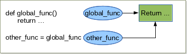

.. _Creating_and_Calling_Functions:

******************************
Creating and Calling Functions
******************************

Creating and Calling Functions
==============================

It is perfectly possible to write programs using the data types and control structures
that we have covered in the preceding pieces. However, very often we
want to do essentially the same processing repeatedly, but with a small difference,
such as a different starting value. Python provides a means of encapsulating 
suites as functions which can be parametrized by the arguments they
are passed. Here is the general syntax for creating a function: ::

   def functionName(arguments):
      suite

The arguments are optional and multiple arguments must be comma-separated.
**Every** Python function has a return value; 
this defaults return statement to None unless we ``return``
from the function using the syntax ``return`` *value*, in which case value is returned.
The return value can be **just one** value (or a tuple of values). The return value
can be ignored by the caller, in which case it is simply thrown away.
Note that def is a statement that works in a similar way to the assignment
operator. When ``def`` is executed a function object is created and an object
reference with the specified name is created and set to refer to the function
object. Since functions are objects, they can be stored in collection data types
and passed as arguments to other functions, as we will see in :ref:`Dive_into_Functions`.

We can leave a function at any point by using the ``return`` statement 
(the yield can be used also but will not cover here) [prog_in_python3]_. 
We can call functions (execute the code in the function) by appending parenthesis to the function name. ::

   >>> def global_func():
         return "global_func is a global function"
 
   >>> print global_func()
      "global_func is a global function"

   >>> def hello_world(first_name, last_name):
         return "Hello {0}, {1}".format(first_name, last_name)
      
   >>> print(hello_world("jeffrey", "Lebowski"))
       "Hello jeffrey Lebowski"
       
       
      
.. _names_and_docstrings:

Names and Docstrings
--------------------

Using good names for a function and its parameters goes a long way toward
making the purpose and use of the function clear to other programmers and
to ourselves some time after we have created the function. 
Here are a few rules of thumb that you might like to consider.

* Use a naming scheme, and use it consistently. see 
  `Style Guide for Python Code <http://legacy.python.org/dev/peps/pep-0008/#naming-conventions>`_  
  for naming convention
* For all names, avoid abbreviations, unless they are both standardized and
  widely used.
* Be proportional with variable and parameter names: x is a perfectly good
  name for an x-coordinate and i is fine for a loop counter, but in general the
  name should be long enough to be descriptive. The name should describe
  the data’s meaning rather than its type (e.g., amount_due rather than money),
  unless the use is generic to a particular type—see, for example, the text
  parameter in the shorten() example.
* Functions and methods should have names that say what they do or
  what they return (depending on their emphasis), but never how they do
  it—since that might change.
  
Here are a few naming examples: ::

   def find(l, s, i=0): # BAD
   def linear_search(l, s, i=0): # BAD
   def first_index_of(sorted_name_list, name, start=0): # GOOD
   
All three functions return the index position of the first occurrence of a
name in a list of names, starting from the given starting index and using an
algorithm that assumes the list is already sorted.

* The first one is bad because the name gives no clue as to what will be found,
  and its parameters (presumably) indicate the required types (list, string, integer)
  without indicating what they mean. 
* The second one is bad because the
  function name describes the algorithm originally used—it might have been
  changed since. This may not matter to users of the function, but it will probably
  confuse maintainers if the name implies a linear search, but the algorithm
  implemented has been changed to a binary search. 
* The third one is good be
  cause the function name says what is returned,and the parameter names clearly
  indicate what is expected.

None of the functions have any way of indicating what happens if the name
isn’t found do they return, say, -1, or do they raise an exception? Somehow
such information needs to be documented for users of the function.

There is several possibilities to document python code. For simple and small
project, we can add documentation to any function by using a docstring this is simply
a string that comes immediately after the def line, and before the function’s
code proper begins. For example, here is the shorten() function we saw earlier,
but this time reproduced in full: ::

   def shorten(text, length=25, indicator="..."):
      """Returns text or a truncated copy with the indicator added
      text is any string; length is the maximum length of the returned
      string (including any indicator); indicator is the string added at
      the end to indicate that the text has been shortened

      >>> shorten("Second Variety")
      'Second Variety'
      >>> shorten("Voices from the Street", 17)
      'Voices from th...'
      >>> shorten("Radio Free Albemuth", 10, "*")
      'Radio Fre*'
      """
      if len(text) > length:
         text = text[:length - len(indicator)] + indicator
      return text

It is not unusual for a function or method’s documentation to be longer than the
function itself. One convention is to make the first line of the docstring a brief
one-line description, then have a blank line followed by a full description, and
then to reproduce some examples as they would appear if typed in interactively.
In Chapter 5 and Chapter 9 we will see how examples in function documentation
can be used to provide unit tests.

For bigger project I recommend to use sphinx. `sphinx <http://sphinx-doc.org/index.html>`_ is a Python Document Generator.
It is powerful and simple the learning curve is not too steep and it allow to provide to user and developer a full documentation of the project
in different formats: web site, pdf, epub, ...
`Lot of python project use sphinx <http://sphinx-doc.org/examples.html>`_ : python, NumPy, this course has been written using sphinx, ...

.. _func_are_obj:

functions are objects
---------------------

As I said earlier in Python everything is object so functions are objects. 
They are callable objects. Since functions are objects, they can be handled as all other objects.

.. code-block:: python

   >>> isinstance(func, object)
      True

   >>> def global_func(param_1):
         return "global_func is a global function"

   >>> other_func = global_func
   >>> print other_func() # () mean call/execute the function
   "global_func is a global function"

 

