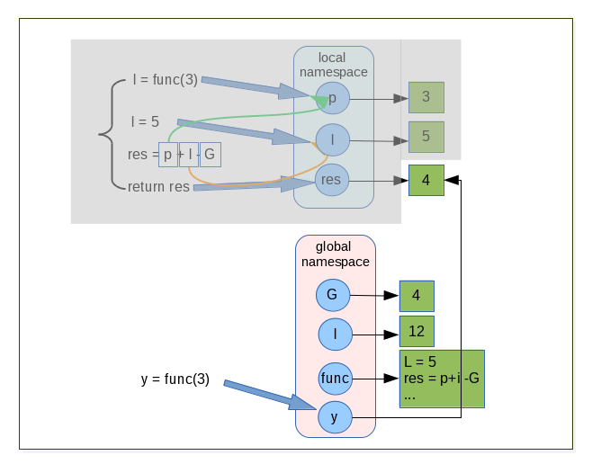

.. _Creating_and_Calling_Functions:

******************************
Creating and Calling Functions
******************************

Creating and Calling Functions
==============================

Functions are a way to package functionalities. There are 4 kind of functions in Python:

* global functions
* local functions
* lambda functions
* methods 

*Global* functions are created with the keyword *def* and take a name and an optional list of parameters. 
They are accessible to any code in the same module in which it is created. 
They can also be accessible from other modules with a mechanism of import.

*Local* are created as globals functions but defined inside other functions (also called *nested* functions). 
These functions are visible only to the function where they are defined.

*Lambda* functions are expressions, so they can be created at their point of use. 
however they are much more limited than normal functions.

*Methods* are functions that are bound to a particular data type and can be used only in conjuction with this data type.

global functions, local functions and method are created with the keyword def and return a value. 
To return a value we explicitely use the keyword ``return`` if we do not do that ``None`` is return automatically by python. 
We can leave a function at any point by using the ``return`` statement (the yield can be used also but will not cover here) [prog_in_python3]_. 
We can call functions by appending parentehesis to the function name. ::

   >>> def global_func(param_1):
         return "global_func is a global function"
 
   >>> print global_func()
      "global_func is a global function"

Names and Docstrings
--------------------

Using good names for a function and its parameters goes a long way toward
making the purpose and use of the function clear to other programmers and
to ourselves some time after we have created the function. 
Here are a few rules of thumb that you might like to consider.

* Use a naming scheme, and use it consistently. In this book we use UPPERCASE
  for constants, TitleCase for classes (including exceptions), camel-
  Case for GUI (Graphical User Interface) functions and methods (covered
  in Chapter 15), and lowercase or lowercase_with_underscores for everything
  else.
* For all names, avoid abbreviations, unless they are both standardized and
  widely used.
* Be proportional with variable and parameter names: x is a perfectly good
  name for an x-coordinate and i is fine for a loop counter, but in general the
  name should be long enough to be descriptive. The name should describe
  the data’s meaning rather than its type (e.g., amount_due rather than money),
  unless the use is generic to a particular type—see, for example, the text
  parameter in the shorten() example.
* Functions and methods should have names that say what they do or
  what they return (depending on their emphasis), but never how they do
  it—since that might change.
  
Here are a few naming examples: ::

   def find(l, s, i=0): # BAD
   def linear_search(l, s, i=0): # BAD
   def first_index_of(sorted_name_list, name, start=0): # GOOD
   
All three functions return the index position of the first occurrence of a
name in a list of names, starting from the given starting index and using an
algorithm that assumes the list is already sorted.

The first one is bad because the name gives no clue as to what will be found,
and its parameters (presumably) indicate the required types (list, string, integer)
without indicating what they mean. 

The second one is bad because the
function name describes the algorithm originally used—it might have been
changed since. This may not matter to users of the function, but it will probably
confuse maintainers if the name implies a linear search, but the algorithm
implemented has been changed to a binary search. 

The third one is good be
cause the function name says what is returned,and the parameter namesclearly
indicate what is expected.

None of the functions have any way of indicating what happens if the name
isn’t found do they return, say, -1, or do they raise an exception? Somehow
such information needs to be documented for users of the function.
We can add documentation to any function by using a docstring this is simply
a string that comes immediately after the def line, and before the function’s
code proper begins. For example, here is the shorten() function we saw earlier,
but this time reproduced in full: ::

   def shorten(text, length=25, indicator="..."):
      """Returns text or a truncated copy with the indicator added
      text is any string; length is the maximum length of the returned
      string (including any indicator); indicator is the string added at
      the end to indicate that the text has been shortened

      >>> shorten("Second Variety")
      'Second Variety'
      >>> shorten("Voices from the Street", 17)
      'Voices from th...'
      >>> shorten("Radio Free Albemuth", 10, "*")
      'Radio Fre*'
      """
      if len(text) > length:
         text = text[:length - len(indicator)] + indicator
      return text

It is not unusual for a function or method’s documentation to be longer than the
function itself. One convention is to make the first line of the docstring a brief
one-line description, then have a blank line followed by a full description, and
then to reproducesome examples as they would appear if typed in interactively.
In Chapter 5 and Chapter 9 we will see how examples in function documentation
can be used to provide unit tests.

functions are objects
---------------------

As I said earlier in Python everything is object so functions are objects. 
They are callable objects. Since functions are objects, they can be handled as all other objects.

.. figure:: _static/figs/func_are_obj.png
    :width: 400px
    :alt: functions are object
    :figclass: align-left

.. code-block:: python

   >>> isinstance(func, object)
      True

   >>> def global_func(param_1):
         return "global_func is a global function"

   >>> other_func = global_func
   >>> print other_func()
   "global_func is a global function"

.. container:: clearer

   .. image :: _static/figs/spacer.png   
    
nested functions
----------------

It is useful to have helper function inside a function. 
To do this we simply define a function inside the definition of an existing function. 
Such function are often called *nested* functions or *locals* functions. ::

   def outer():
       x = 1
       def inner():
           return 2
       return x + inner()
    
   outer()
   3

function argument vs parameters
-------------------------------

These two terms parameter and argument are sometimes loosely used interchangeably, 
and the context is used to distinguish the meaning. 
The term *parameter* (sometimes called *formal parameter*) is often used to refer to the variable as found in the function definition, 
while argument (sometimes called *actual parameter*) refers to the actual value passed. 
To avoid confusion, it is common to view a parameter as a variable, and an argument as a value. 
Python allow us to pass argumants to functions. 
The parameter names become local variable of our function [parameters_and_arguments]_. 
If there is more parameters than one, they are written as a sequence of comma separated identifiers, 
or as sequence of identifier = value pair. 
For instance, here is a function that calculates the area of a triangle using Heron's formula: ::

   def heron(a, b, c):
      s = (a + b + c) / 2
      return math.sqrt(s * (s - a) * (s - b) * (s - c))

Inside the function each parameter, *a*, *b*, *c*, is initialized with the corresponding value that was passed as an argument. 
When the function is called, we must supply all arguments, for example, heron(3, 4, 5).
If we give too few or too many arguments, a ``TypeError exception`` will be raised. 

When we do a call like this we said to be using a positional arguments, 
because each argument passed is set as the value of parameter in the corresponding position. 
So in this case, *a* is set to 3, *b* to 4, and *c* to 5, when the function is called.

Some functiond have parameters for which there can be sensible default.

Argument and Parameter unpacking
--------------------------------

Python has different ways to define function parameters and pass arguments to them. Function parameters can be either

* positional parameters that are mandatory or named,
* keyword parameters that provide a default value. 

The parameter syntax does not permit us to follow parameters with default value with parameters that don't have default value. 
So def bad(a, b = 1, c) wont work. 
We are not force to pass our arguments in the order they appear in the function's definition, instead, 
we can use keyword arguments, passing each argument in the form name = value. ::

   def argument(a, b, c = 3, d = 4):
      print '{} {} {} {}'.format(a,b,c,d)
 
   argument(1,2)
   1 2 3 4
 
   argument(a = 1, b = 2)
   1 2 3 4
 
   argument(b = 2, a = 1)
   1 2 3 4

.. warning::    
   
   When default values are given they are created at the time the def statement is executed (i.e. when the function is created), 
   **not** when the function is called. For immutable argumments like numbers or strings this doesn't make any difference, 
   but for mutable arguments a subtle trap is lurking. ::

      def app(x, lst = []):
          #id print the memory adress of the object
          print( id(lst) )
          lst.append(x)
          return lst
       
      #the default value of the function app is an empty list 
      app.func_defaults
       ([],)
       
       
      app(1)
       #the memory adress of lst is 21665048
       21665048
      [1]
       
      app.func_defaults
      ([1],) 
      # now the default value of the app function is list [1] 
      # the first call to app have a side effect
       
      app(2)
       # the memory adress does not change (this is the same object than at the first call
       # the list was created at app function create time.
       21665048
      [1, 2]
       
      app.func_defaults
      ([1, 2],)

   Here at the list lst was created at function creation time, 
   at each call Python reuse the same list to add new element. 
   This induce a big and dangerous side effect, and usually it's not the desired behavior. 
   Here a new version without side effect: ::

   def app(x, lst = None):
       if lst is None:
           lst = []
       #id print the memory adress of the object
       print( id(lst) )
       lst.append(x)
       return lst
    
 
 
Sequence unpacking
^^^^^^^^^^^^^^^^^^  

.. list-table:: difference between python 2 and 3 to unpack a sequence
   :header-rows: 1
   :widths: 5 10

   *  - Python2
      - Python3
   *  - The unpacking operator does not exist in Python 2
      - We can unpack any iterables (list, tuples, ...) with the operator *.
        When used with two or more variables on the left-hand side of an assignment,
        one of which is preceded by *, items are assigned to the variables,
        with all those left over assigned to the stared variables. ::
        
         >>> first, *rest = [1,2,3,4]
         >>> first
         1
         >>> rest
         [2, 3, 4]
         >>> 
         >>> first, *mid, last = [1,2,3,4]
         >>> first
         1
         >>> mid
         [2, 3]
         >>> last
         4
         
         
Parameter unpacking
^^^^^^^^^^^^^^^^^^^
    
.. tabularcolumns:: |l{8cm}|l{8cm}| 

+----------------------------------------------------------------------------------------------------------------------+--------------------------------------------------------------------+
| Python2                                                                                                              | Python3                                                            |
+======================================================================================================================+====================================================================+
| As the unpacking operator in Python3 we can use                                                                      |                                                                    |
| the sequence unpacking operator in a function's parameter                                                            |                                                                    |
| list (this also works well in python2 or python3).                                                                   |                                                                    |
| This useful when we want to create functions that can                                                                |                                                                    |
| take a variable number of positional arguments. Here a product() function [prog_in_python3]_ .                       |                                                                    |
|                                                                                                                      |                                                                    |
| >>> def product(*args):                                                                                              |                                                                    |
| ...     result = 1                                                                                                   |                                                                    |
| ...     for arg in args:                                                                                             |                                                                    |
| ...             result *= arg                                                                                        |                                                                    |
| ...     return result                                                                                                |                                                                    |
| ...                                                                                                                  |                                                                    |
| >>> product(1, 2, 3, 4)                                                                                              |                                                                    |
| 24                                                                                                                   |                                                                    |
| >>>                                                                                                                  |                                                                    |
| >>> product(2, 3)                                                                                                    |                                                                    |
| 6                                                                                                                    |                                                                    |
| >>>                                                                                                                  |                                                                    |
|                                                                                                                      |                                                                    |
+----------------------------------------------------------------------------------------------------------------------+--------------------------------------------------------------------+
| We cannot have arguments after unpacking sequence                                                                    | Python3 support keywords arguments following positional arguments, |
|                                                                                                                      | even if it's an unpacking sequence argument.                       |
| >>> def func(*arg, arg2 = None):                                                                                     |                                                                    |
| File "<stdin>", line 1                                                                                               | >>> def func( *arg, arg2 = None):                                  |
| def func(*arg, arg2 = None):                                                                                         | ...     print(arg)                                                 |
| ^                                                                                                                    | ...     print(arg2)                                                |
| SyntaxError: invalid syntax                                                                                          | ...                                                                |
|                                                                                                                      | >>> func([1,2,3])                                                  |
|                                                                                                                      | ([1, 2, 3],)                                                       |
|                                                                                                                      | None                                                               |
|                                                                                                                      | >>>                                                                |
|                                                                                                                      | >>> func([1,2,3] , arg2='a')                                       |
|                                                                                                                      | ([1, 2, 3],)                                                       |
|                                                                                                                      | a                                                                  |
+----------------------------------------------------------------------------------------------------------------------+--------------------------------------------------------------------+
| Just as we can unpack a sequence to populate a function's positionalarguments,                                       |                                                                    |
| we can unpack a mapping using the mapping unpacking operator **.                                                     |                                                                    |
| We can use ** to pass a dictionary to a argument.                                                                    |                                                                    |
| Here the options dictionary's key-value pairs are unpackecd                                                          |                                                                    |
| with each key's value being assigned to the parameter whose name is the same as the  key.                            |                                                                    |
| If the dictionnary contains a key for wich there is no corresponding parameter,                                      |                                                                    |
| a TypeError is raised. Any argument for which the dictionary has no corresponding item is set at this default value. |                                                                    |
|                                                                                                                      |                                                                    |
| >>> def func(a = 2, b = 3):                                                                                          |                                                                    |
| ...     print(a, b)                                                                                                  |                                                                    |
| ...                                                                                                                  |                                                                    |
| >>> func(**{'a':4,'b':5})                                                                                            |                                                                    |
|                                                                                                                      |                                                                    |
| >>>                                                                                                                  |                                                                    |
| >>> func(**{'a':4,'c':5})                                                                                            |                                                                    |
| Traceback (most recent call last):                                                                                   |                                                                    |
| File "<stdin>", line 1, in <module>                                                                                  |                                                                    |
| TypeError: func() got an unexpected keyword argument 'c'                                                             |                                                                    |
| >>>                                                                                                                  |                                                                    |
| >>> func(**{'a':4})                                                                                                  |                                                                    |
| >>>                                                                                                                  |                                                                    |
|                                                                                                                      |                                                                    |
| We can also use mapping unpacking operator with parameter.                                                           |                                                                    |
|                                                                                                                      |                                                                    |
| In this case, the ** operator must be the last argument.                                                             |                                                                    |
|                                                                                                                      |                                                                    |
| >>> def func(a = 2, b = 3,**kwargs):                                                                                 |                                                                    |
| ...     print a                                                                                                      |                                                                    |
| ...     print b                                                                                                      |                                                                    |
| ...     print kwargs                                                                                                 |                                                                    |
| ...                                                                                                                  |                                                                    |
| >>> def func(a = 2, b = 3, **kwargs, d = 4):                                                                         |                                                                    |
| File "<stdin>", line 1                                                                                               |                                                                    |
| def func(a = 2, b = 3, **kwargs, d = 4):                                                                             |                                                                    |
| ^                                                                                                                    |                                                                    |
| SyntaxError: invalid syntax                                                                                          |                                                                    |
| >>>                                                                                                                  |                                                                    |
| >>> def func(*arg, **kwarg):                                                                                         |                                                                    |
| ...     print(arg)                                                                                                   |                                                                    |
| ...     print(kwarg)                                                                                                 |                                                                    |
| ...                                                                                                                  |                                                                    |
| >>> func(1, 2, 3)                                                                                                    |                                                                    |
| (1, 2, 3)                                                                                                            |                                                                    |
| {}                                                                                                                   |                                                                    |
| >>>                                                                                                                  |                                                                    |
| >>> func([1, 2, 3], a= 'A', b = 'B')                                                                                 |                                                                    |
| ([1, 2, 3],)                                                                                                         |                                                                    |
| {'a': 'A', 'b': 'B'}                                                                                                 |                                                                    |
| >>>                                                                                                                  |                                                                    |
| >>> func([1, 2, 3],{'a':'A', 'b':'B'})                                                                               |                                                                    |
| ([1, 2, 3], {'a': 'A', 'b': 'B'})                                                                                    |                                                                    |
| {}                                                                                                                   |                                                                    |
+----------------------------------------------------------------------------------------------------------------------+--------------------------------------------------------------------+

  
Scope of variables
------------------

For variables, Python has function scope, module scope, and global scope (in python the term of namespaces is often used) [Franklin]_. 
Names enter scope at the start of a context (function, module, or globally), 
and exit scope when a non-nested function is called or the context ends. 

If a name is used prior to variable initialization, this raises a ``syntax error``.

Variable resolution rules
^^^^^^^^^^^^^^^^^^^^^^^^^

Although scopes are determined statically, they are used dynamically. 
At any time during execution, there are at least three nested scopes whose namespaces are directly accessible:

#. the innermost scope, which is searched first, contains the local names
#. the scopes of any enclosing functions, which are searched starting with the nearest enclosing scope, contains non-local, but also non-global names
#. the next-to-last scope contains the current module’s global names
#. the outermost scope (searched last) is the namespace containing built-in name

If a variable is simply accessed (not assigned to) in a context, 
name resolution follows the LEGB rule (Local, Enclosing, Global, Built-in). 
However, if a variable is assigned to, it defaults to creating a local variable, 
which is in scope for the entire context. Both these rules can be overridden 
with a global or nonlocal (in Python 3) declaration prior to use, 
which allows accessing global variables even if there is an intervening nonlocal variable, 
and assigning to global or nonlocal variables [scope]_ .

.. container::

   .. image:: _static/figs/namespaces_1.png
      :alt: functions are object
      :align: left
      :height: 200px
   
   ::

      G = 14
      I = 12
      def func(p):
         I = 5
         res = p + I - G
         return res

.. container::
         
   We first defined 2 objects references G and I which refer respectively to integers 4 and 12 
   then we create a new object reference func which refer to the function code 
   (I remember you that in Python everything is an object)      

.. container:: clearer

   .. image :: _static/figs/spacer.png
   
      
.. container::

   .. image:: _static/figs/namespaces_2.png
      :alt: functions are object
      :align: left
      :height: 400px
      
   ::

      y = func(3)
 
.. container::
         
   #. When we call the function func with argument 3, Python create a namespace local to the function, 
       with a first reference object "p" which refer to an integer object with the value 3.
   #. Then the code of the function is executed, a variable "I" is assigned to, so Python creates a new local reference.
   #. I show with small arrows how python resolve the variables to compute the statement
   #. then a reference "res" is created which point to the result of the statement "p + I - G" 

.. container:: clearer

   .. image :: _static/figs/spacer.png
   

   
.. container::

   #. a new reference call "y" to the integer object 4 is created in the global namespace.
   #. the local namespace relative to the function execution is tagged to be removed by the garbage collector. 
      As the int object with 4 as value have another reference (y) it will not be destroyed.  
 
 
.. container:: clearer

   .. image :: _static/figs/spacer.png 
   
We can see this mechanism in action as in Python we can view the content of the local the global namespace via two built-in functions *locals* and *globals*

.. code-block:: python
   :linenos:

      def outer_func():
         x = 'outer'
         print('outer locals = ', locals())
         print(x)

         def inner_func():
            nonlocal x
            print('inner locals = ', locals())
            x = 'inner'
            print('inner locals = ', locals())
            print(x)

         inner_func()
         print('outer locals = ', locals())

      outer_func()

.. container::

   This piece of code illustrate the globals and locals namespaces. 
   Although this code is writen in python3 the concepts are the smae in python2. 
   But the keywords nonlocals is python3 specific. 
   In python2, we can refer to a non local variable, but we cannot assign a new value to a non local variable, 
   when we try to assign a new value, a new local object reference is created.

   when we use the *nonlocals* keywords the variable find in the outer scope is seen as it belong to the local scope. 
   We can manipulate it as a local variable. 
   If we reassign a new value to this reference, the outer reference is also modified. 

.. image:: _static/figs/namespaces_in_python3.png
   :alt: namespaces in python 3
   :align: left
   :height: 300px
      
.. container::
      
   | 3.  outer locals = {'x': 'outer'}
   | 4.  outer
   | 7.  inner locals = {'x': 'outer'}
   | 9.  inner locals = {'x': 'inner'}
   | 10. inner
   | 12. outer locals = {'x': 'inner', 'inner_func': <function outer_func.<locals>.inner_func at 0x7f19d8d965f0>}

.. container:: clearer

   .. image :: _static/figs/spacer.png 
   
Variable lifetime
^^^^^^^^^^^^^^^^^

It’s also important to note that not only do variables live inside a namespace, they also have lifetimes. Consider ::

   >>> def foo():
   ...     x = 1
   >>> foo()
   >>> print x # 1
   Traceback (most recent call last):
     ...
   NameError: name 'x' is not defined
   
It isn’t just scope rules at point #1 that cause a problem (although that’s why we have a NameError)
it also has to do with how function calls are implemented in Python and many other languages. 
There isn’t any syntax we can use to get the value of the variable x at this point - it literally doesn’t exist! 
The namespace created for our function *foo* is created from scratch each time the function is called and it is destroyed when the function ends [Franklin]_.

References
==========
  
.. [prog_in_python3] Mark Summerfield, Programming in Python3 (addison wesley): http://www.qtrac.eu/py3book.html

.. [parameters_and_arguments]  http://en.wikipedia.org/wiki/Parameter_(computer_programming)#Parameters_and_arguments
    
.. [Franklin] Simeon Franklin http://simeonfranklin.com/blog/2012/jul/1/python-decorators-in-12-steps/
    
.. [scope] http://en.wikipedia.org/wiki/Scope_(computer_science)#Python

