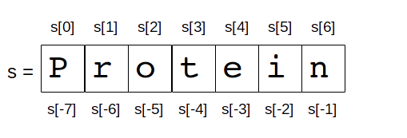

.. sectnum:: 
   :start: 3

.. _Data_Types:

**********
Data Types
**********

NoneType
========

The **sole** value of the type NoneType is ``None``. 
The **None** value represent something which is *unknown*, *undefined*, 
None is also frequently used to represent the absence of a value as when default arguments are not passed to a function. ::
   
   >>> print type(None)
   <type 'NoneType'>
   >>> a = None
   >>> b = None
   >>> id(a)
   9568656
   >>> id(b)
   9568656 

.. note::
 
   the id() function returns an integer representing its identity (currently implemented as its address). 
   so if 2 objects have the same id it's the same object.

The None value is convert in boolean (see below) to False. ::

   >>> bool(None)
   False
     

Boolean
=======

These represent the truth values False and True. 
The two objects representing the values False and True are the only Boolean objects. 
The Boolean type is a subtype of plain integers, and Boolean values behave like the values 0 and 1, 
respectively, in almost all contexts, the exception being that when converted to a string, 
the strings "False" or "True" are returned, respectively.

The rules for integer representation are intended to give the most meaningful interpretation of shift 
and mask operations involving negative integers and the least surprises when switching between the plain 
and long integer domains. Any operation, if it yields a result in the plain integer domain, 
will yield the same result in the long integer domain or when using mixed operands. 
The switch between domains is transparent to the programmer.

.. _integers:

Integers
========

The size of an integer is limited only by the machine's memory. So integers hundred digits long can easily be created and work with.
Although they will be slower to use than integers that can be represent natively by the machine processor.

.. _num-op:

common numerics operators and functions
---------------------------------------

.. tabularcolumns:: |l|l|l| 
   
+--------------+--------------------------------------------------------------------------------------------+
| Syntax       | Description                                                                                |
+==============+============================================================================================+
| x + y        | Adds numbers x and y                                                                       |
+--------------+--------------------------------------------------------------------------------------------+
| x - y        | Substracts y form x                                                                        |
+--------------+--------------------------------------------------------------------------------------------+
| x * y        | Multiplies x by y                                                                          |
+--------------+--------------------------------------------------------------------------------------------+
| x / y        | Divides x by y (be carefull there are some differences beween python2 and 3 see below)     |
+--------------+--------------------------------------------------------------------------------------------+
| x // y       | Divides x by y; truncates any fractional parts to produce an int see also round() function |
+--------------+--------------------------------------------------------------------------------------------+
| x % y        | Produce the modulus (remainder) of dividing x by y                                         |
+--------------+--------------------------------------------------------------------------------------------+
| x ** y       | Raise x to the power of y. See also pow() function.                                        |
+--------------+--------------------------------------------------------------------------------------------+
| -x           | Negates x. Change x's sign if non zero. if zero do nothing                                 |
+--------------+--------------------------------------------------------------------------------------------+
| +x           | Do nothing. It's sometimes used to clarify                                                 |
+--------------+--------------------------------------------------------------------------------------------+
| abs(x)       | Return the absloute value of x                                                             |
+--------------+--------------------------------------------------------------------------------------------+
| divmod(x, y) | Return the quotient and the remainder of dividing x by y as a tuple of two ints            |
+--------------+--------------------------------------------------------------------------------------------+
| pow(x, y)    | Raises x to the power of y. the same as ** operator                                        |
+--------------+--------------------------------------------------------------------------------------------+
| pow(x, y, z) | A faster alternative to (x ** y) % z                                                       |
+--------------+--------------------------------------------------------------------------------------------+
| round(x, n)  | Returns x rounded to n integral digit if n is negative int,                                |
|              | or x rounded to n decimal places if n is positive int.                                     |
|              | The returned value has the same type as x                                                  |
+--------------+--------------------------------------------------------------------------------------------+

.. _numop:

Interger literals are written in 10 base by default but other number base can be used: ::

   >>> 126       # decimal
   >>> 0b1111110 # binary  (with a leading 0b)
   >>> 0176      # octal   (with a leading 0)
   >>> 0x7e      # hexadecimal (with a leading 0x)
   
All the binary numeric operators (+, -, \*, /, //, %  and \*\*) have an augmented assignment version
(+=, -=, \*=, /=, //=, %  and \*\*=)  where *x op= y* is logically equivalent to *x = x op y*.

.. _floating point:

Floating Point types
====================

Python provides thre types of floating point values:
   
   * ``float`` (built-in)
   * ``decimal.Decimal`` (form standart library)
   * ``complex`` (built-in)

All three types are **immutable**.

.. _float:

Float
-----

The type ``float`` holds double precision foating numbers whose range depends on the native C compiler Python was built with.
They have a relative precision and cannot be reliably compare for equality. Numbers of type ``float`` are written with a decimal point 
or exponantial notation. ::

   >>> -2e9
   >>> 8.9e-4

   
Coputers natively represents these numbers using base-2. This means some numbers can be represented exactly (such as 0.5) 
some others are only aproximately (such as 0.1 or 0.2). Futhermores this representation use a fixed number of bits, 
so there is a limit to the number of digits that can be held. ::

   >>> 0.0, 5.4, -2.5, 8.9e-4  
   (0.0, 5.4, -2.5, 0.00089)
   
In some version of python (some old version python 2.6 or first version of 2.7 or version 3.0) the output can change sensibly: ::
   
   >>> 0.0, 5.4, -2.5, 8.9e-4 
   >>> (0.0, 5.4000000000000004, -2.5, 0.00088999999999999995)

But what ever is the output the internal representation is the same and is just an aproximation.
This is not specific to Python, all computing language have the same whith the floating point numbers.
If we need high precision we can use ``int`` and scale it when nessecary or use the Python decimal.Decimal numbers from the decimal module.

.. _decimal:

Decimal
-------

A decimal number is **immutable**. It has a sign, coefficient digits, and an exponent. 
To preserve significance, the coefficient digits do not truncate trailing zeros. 
Decimals also include special values such as Infinity, -Infinity, and NaN. 
The standard also differentiates -0 from +0.

Decimal is not buil-in it belong to the module decimal, that mean we must import it before to use it.
This means also that we cannot create directly a decimal number as floating point just writing them with a decimal point,
we must use the Decimal constructor to build a decimal objects.
Decimal instances can be constructed from integers, strings, floats, or tuples.
Construction from an integer or a float performs an exact conversion of the value of that integer or float. ::

   >>> from decimal import *
   >>> getcontext().prec = 28
   >>> Decimal(10)
   Decimal('10')
   >>> Decimal('3.14')
   Decimal('3.14')
   >>> Decimal(3.14)
   Decimal('3.140000000000000124344978758017532527446746826171875')
   >>> # From tuple  
   >>> #   - The first value in the tuple should be an integer; either 0 for a positive number or 1 for a negative number.
   >>> #   - The second value must be a tuple composed of intergers in the range 0 through  9  
   >>> #   - The third value is an integer representing the exponant
   >>> Decimal((0, (3, 1, 4), -2))
   Decimal('3.14')
   >>> Decimal(str(2.0 ** 0.5))
   Decimal('1.41421356237')
   >>> Decimal(2) ** Decimal('0.5')
   Decimal('1.414213562373095048801688724')
   >>> Decimal('NaN')
   Decimal('NaN')
   >>> Decimal('-Infinity')
   Decimal('-Infinity')

The decimal module incorporates a notion of significant places so that 1.30 + 1.20 is 2.50. 
The trailing zero is kept to indicate significance. 
This is the customary presentation for monetary applications. 
For multiplication, the “schoolbook” approach uses all the figures in the multiplicands. 
For instance, 1.3 * 1.2 gives 1.56 while 1.30 * 1.20 gives 1.5600.

Unlike hardware based binary floating point, the decimal module has a user alterable precision (defaulting to 28 places) 
which can be as large as needed for a given problem: ::

   >>> from decimal import *
   >>> getcontext().prec = 6
   >>> Decimal(1) / Decimal(7)
   Decimal('0.142857')
   >>> getcontext().prec = 28
   >>> Decimal(1) / Decimal(7)
   Decimal('0.1428571428571428571428571429')

for more examples see https://docs.python.org/2/library/decimal.html#quick-start-tutorial

All :ref:`numerics operators and functions <num-op>` including their augmented assignment versions can be used with decimal.Decimal numbers.
But there is a couple of pitfalls. If the ** operator has a left hand ``decimal`` operand, 
its right-hand operand must be an integer. Similarly, if the pow() function's first argument is a ``decimal`` the 2nd and 3th arguments must be integers. 

Although the division involving ``decimal`` is more accurate than ones involving ``floats``, on a 32-bit machine the differences
only shows up after the fifteenth deciaml palce. Futhermore the computation using ``decimals`` are slower than those invloving ``floats``.
So use decimals only if a high precision is required.

 
Complex
-------
   
The ``complex`` data type is an **immutable** type that holds a pair of ``floats``, one representing 
the real part the other the imaginary part. Literal ``complex`` are written with the real and imaginary parts
joined by a + or - sign, and the imaginary following by a j. Note that if the real part iz 0 we can ommit it entirely. 
The separates parts of a complex are available through attributes *real* and *imag*.

   >>> z= -89.5+2j
   >>> z.real
   -89.5
   >>> z.imag
   2.0

All :ref:`numerics operators and functions <num-op>` are available excepting // , % , divmod(), and pow() with 3 arguments. 
In addition ``complex`` have a method called *conjugate*, which change the sign of the imaginary part.

The functions in ``math`` module do not work with the ``complex`` numbers, if such operation is attemped an :ref:`exception is raised <exceptions>`. 
But we can import ``cmath`` module which provide complex numbers versions of most trigonometrics and logarithmics functions
available in ``math`` module, plus some specific complex functions as ``cmath.phase()`` or ``cmath.polar()`` or ``cmath.rect()``. 

Mixed mode arithmetic is supported as such that using ``int``  and ``float`` produces ``floats``, and using
``float`` and ``complex`` produces ``complex``. 
Because ``decimal`` offers fixed precision they can be used only with other ``decimal``.
If an operation is attemped using imcompatible types a ``TypeError`` exception (:ref:`exceptions`) is raised.

.. _strings:

Strings
=======

Strings are represented by the **immutable** ``str`` data type which holds a *sequence* of characters. 
The ``str`` data type can be called as a function (*str()*) to create string objects.
With no arguments, it returns an empty string, with a non string argument it returns the string form of the argument,
and with a string argument it returns the argument itself. ::

   >>> a = "foo"
   >>> b = str(a)
   >>> a is b
   True

string can be also create directly as literals. Strings literals can be enclosed in matching single quotes (') or double quotes ("). 
They can also be enclosed in matching groups of three single or double quotes 
(these are generally referred to as triple-quoted strings). ::

   text = 'this a single quoted string which can include "double quote" but \'single\' quote must be escaped'
   text = "this a double quoted string which can include 'single quote' but \"double\" quote must be escaped'"
 
The backslash (\) character is used to escape characters that otherwise have a special meaning, 
such as newline, backslash itself, or the quote character. 
String literals may optionally be prefixed with a letter 'r' or 'R'; 
such strings are called raw strings and use different rules for interpreting backslash escape sequences. 
A prefix of 'u' or 'U' makes the string a Unicode string. 

Unicode strings use the Unicode character set as defined by the Unicode Consortium and ISO 10646. 
Some additional escape sequences, described below, are available in Unicode strings.

In triple-quoted strings, unescaped newlines and quotes are allowed (and are retained), 
except that three unescaped quotes in a row terminate the string. 
(A “quote” is the character used to open the string, i.e. either ' or ".)::

   text = """this a triple quoted string which can include 
       - 'single' quotes
       - "double" quotes without formality 
   This string allow several lines but support also newlines \
   escaping, so this is very long line 
   """

.. _str_esc:

Python ASCII string escape

.. tabularcolumns:: |l|l|l| 

+------------+-------------------------------------------------------------+-------+
| escape     | Meaning                                                     | notes |
+============+=============================================================+=======+
| \\         | backslash                                                   |       |
+------------+-------------------------------------------------------------+-------+
| \'         | single quote                                                |       |
+------------+-------------------------------------------------------------+-------+
| \"         | double quote                                                |       |
+------------+-------------------------------------------------------------+-------+
| \a         | bell                                                        |       |
+------------+-------------------------------------------------------------+-------+
| \b         | backspace                                                   |       |
+------------+-------------------------------------------------------------+-------+
| \f         | formfeed                                                    |       |
+------------+-------------------------------------------------------------+-------+
| \n         | linefeed (newline)                                          |       |
+------------+-------------------------------------------------------------+-------+
| \N{name}   | Character named name in the Unicode database (Unicode only) |       |
+------------+-------------------------------------------------------------+-------+
| \r         | carriage return                                             |       |
+------------+-------------------------------------------------------------+-------+
| \t         | tab                                                         |       |
+------------+-------------------------------------------------------------+-------+
| \uxxxx     | Character with 16-bit hex value xxxx (Unicode only)         | (1)   |
+------------+-------------------------------------------------------------+-------+
| \Uxxxxxxxx | Character with 32-bit hex value xxxxxxxx (Unicode only)     | (2)   |
+------------+-------------------------------------------------------------+-------+
| \v         | vertical tab                                                |       |
+------------+-------------------------------------------------------------+-------+
| \ooo       | Character with octal value ooo                              | (3,5) |
+------------+-------------------------------------------------------------+-------+
| \xhh       | Character with hex value hh                                 | (4,5) |
+------------+-------------------------------------------------------------+-------+

Notes:

    #. Individual code units which form parts of a surrogate pair can be encoded using this escape sequence.
    #. Any Unicode character can be encoded this way, but characters outside the Basic Multilingual Plane (BMP) will be encoded using a surrogate pair if Python is compiled to use 16-bit code units (the default).
    #. As in Standard C, up to three octal digits are accepted.
    #. Unlike in Standard C, exactly two hex digits are required.
    #. In a string literal, hexadecimal and octal escapes denote the byte with the given value; it is not necessary that the byte encodes a character in the source character set. In a Unicode literal, these escapes denote a Unicode character with the given value.

Unlike Standard C, all unrecognized escape sequences are left in the string unchanged, i.e., 
the backslash is left in the string. 
(This behavior is useful when debugging: if an escape sequence is mistyped, 
the resulting output is more easily recognized as broken.) 
It is also important to note that the escape sequences marked as “(Unicode only)” in the table above fall 
into the category of unrecognized escapes for non-Unicode string literals.

When an 'r' or 'R' prefix is present, a character following a backslash is included in the string without change, 
and all backslashes are left in the string. For example, the string literal r"\n" consists of two characters: a backslash and a lowercase 'n'. 
String quotes can be escaped with a backslash, but the backslash remains in the string; for example, 
r"\"" is a valid string literal consisting of two characters: a backslash and a double quote; 
r"\" is not a valid string literal (even a raw string cannot end in an odd number of backslashes). 
Specifically, a raw string cannot end in a single backslash (since the backslash would escape the following quote character). 
Note also that a single backslash followed by a newline is interpreted as those two characters as part of the string, 
not as a line continuation.

When an 'r' or 'R' prefix is used in conjunction with a 'u' or 'U' prefix, 
then the \uXXXX and \UXXXXXXXX escape sequences are processed while all other backslashes are left in the string. 
For example, the string literal ur"\u0062\n" consists of three Unicode characters: 
‘LATIN SMALL LETTER B’, ‘REVERSE SOLIDUS’, and ‘LATIN SMALL LETTER N’. 
Backslashes can be escaped with a preceding backslash; however, both remain in the string. 
As a result, \uXXXX escape sequences are only recognized when there are an odd number of backslashes.

Comparing Strings
-----------------

Strings support the usual comparison operators ``<``, ``<=``, ``==``, ``!=``, ``>``, ``>=``.
These operators compare strings byte by byte in memory. ::

   >>> 'a' > 'b'
   False
   >>> 'albert' < 'alphonse'
   True

The equality operator is ``==`` and allow to test if the string in right operand have the same value as the string in the left operand.::

   >>> s1 = 'hello'
   >>> s2 = 'hello'
   >>> s1 == s2
   True
   
.. warning:: 
   Sometimes we are tempted to use ``is`` to compare 2 ``strings``. ::
     
      s1 = 'hello'
      s2 = 'hello'
      s1 == s2
      s1 is s2
      
   In this example we created 2 variables s1 and s2, and it seems that ``is`` allow us to compare them.
   In fact we do not test the equality of the strings *s1* and *s2*. 
   we test if the variables *s1* and *s2* point to the same object in memory.
   see the following example ::
   
      s3 = ''.join(['h', 'e', 'l' , 'l', 'o'])
      s1 == s3
      s1 is s3
      
   The operator of string comparison is ``==`` and not ``is`` (``is`` is for object identity comparison). 
   So why it seems to work in the first example?
   
   Python (like Java, .NET, ...) uses string pooling / interning. 
   The interpreter realises that "hello" is the same as "hello", 
   so it optimizes and uses the same location in memory.

   Interned strings speed up string comparisons, 
   which are sometimes a performance bottleneck in applications (such as compilers and dynamic programming language runtimes) 
   that rely heavily on hash tables with string keys. Without interning, 
   checking that two different strings are equal involves examining every character of both strings. 
   This is slow for several reasons: 
   
   * it is inherently O(n) in the length of the strings; 
   * it typically requires reads from several regions of memory, which take time; 
   * and the reads fills up the processor cache, meaning there is less cache available for other needs. 
   
   With interned strings, a simple object identity test suffices after the original intern operation; 
   this is typically implemented as a pointer equality test, normally just a single machine instruction with no memory reference at all.

   So, when you have two string literals (words that are literally typed into your program source code, surrounded by quotation marks) 
   in your program that have the same value, the Python compiler will automatically intern the strings, 
   making them both stored at the same memory location. 
   (Note that this doesn't always happen, and the rules for when this happens are quite convoluted, so please don't rely on this behavior in production code!)

.. note:: 
   In Python3, ``strings`` are encoded with utf-8, that means that some characters can be represented by 2 or more bytes sequence.
   For instance, the character Å can be represented in UTF-8 endoded bytes in three differents ways:
   [0xE2, 0x84, 0xAB], [0xC3, 0x85], [0x41, 0xCC, 0x 8A]. So before to compare unicode strings we need to normalize them. ::
   
      import unicodedata
      s = "Génétique"
      unicodedata.normalize("NFKC", s)
   
   (Complete api is accessible here https://docs.python.org/3.4/library/unicodedata.html#unicodedata.normalize)
   
   The second problem is that the sorting of some characters is language-specific. 
   For instance in swedish ``ä `` is sort after ``z``, whereas in German ``ä`` is sorted as is though were spelled ``ae``.
   To prevent subtle mistake, Python does not make guesses. It compares using the string memory representation.
   This gives a sort order based on Unicode code points which gives ASCII sorting for english.
   
    
Slicing and Striding Strings
----------------------------

Python strings are :ref:`sequences <sequences>` so we can access to any individual items, here characters, using the item operator square brackets [].
Just to specify the index of the items between the square brackets. The index position start 0 and go up to the lenght.::

   "protein"[0]
   "p"
   "protein"[3]
   "t"

But it's also possible to use negative index positions. These count from the last character backward to the first.
Following an example of index positions for a the string s = "Protein".

 
Negative index are very useful especially -1 which it give us always the last character in a string.

If we attempt to acces to an item out of the range (or any index even 0 in an empty string) an IndexError exception is raised.

Now we can acces any character of a string we want to access to several characters in one time. 
We call this *slicing* operation. The slice operator has three syntaxes:

* string[start]
* string[start:stop]
* string[start:stop:step]

the start stop step must be integers (or variables holding integers). 
We already see the fisrt syntax, the second syntax extract every characters starting at index start (include) to index stop (exclude).
The third syntax is the same as the second except that instead of extracting every characters it extract every step-th characters. 
If a negative step is specify the slice is perform and the resulting string is reversed ::

   >>> s = "Protein"
   >>> # the second syntax  [start, stop[
   >>> s[2:4]
   'ot'
   >>> # note that if we ommit the stop index it will default to the end of string 
   >>> s[2:]
   'otein'
   >>> # we can also ommit the start index, then it will default to 0
   >>> s[:2]
   'Pr'
   >>> s[3:-1]
   'tei'
   >>># we can omit start and stop
   >>> z = s[:]
   >>> z
   'Protein'
   >>>z is s 
   True
   >>> s[1:-1:2]
   'rti'
   >>> s[::2]
   'Poen'
   >>> s[::-2]
   'neoP'
   >>> s[::-1]
   'nietorP'
  

String operators and methods
----------------------------

Since ``strings`` are immutable :ref:`sequences <sequences>`, 
all the functions taht can be used with immutable sequences can be applied on strings.
this include:
   
* membership testing with ``in`` 
* concatenation with ``+``
* appending with ``+=``
* replication with ``*`` 

::
  
   >>> # Membership
   >>> 'c' in 'gaattc'
   True
   >>> 'z' in 'gaattc'
   False
   >>> 'at' in 'gaattc'
   True
   >>> 'ta' in 'gaattc'
   False
   >>> # Concatenation
   >>> 'gaa' + 'ttc'
   'gaattc'
   >>> s = 'gaa' 
   >>> s += 'ttc'
   >>> s
   'gaattc'
   >>> # Replication
   >>> s = 'a'*10
   >>> s
   'aaaaaaaaaa'
   
As strings are sequences they are sized objects. So we can apply the built-in function len() on a string. 
This will return the number of characters of the string. ::

   >>> len('gaattc')
   6
   
If there is more than 2 strings to concatenate the *join* method offer a better option. 
The syntax is *sep.join(sequence of strings)* this method join the element of the sequence of string
in the argument and join them together into a single string using the sep as linking element. For example: ::

   sequence = ['aa' , 'bb' , 'cc']
   '<>'.join(sequence) 
   'aa<>bb<>cc'
   ''.join(sequence)
   'aabbcc'
   
The *join* method can be used in combination with the built-in method reversed (which return a reversed iterator) 
to reverse a string ::
 
   >>> s = 'gaattc'
   >>> ''.join(reversed(s))
   'cttaag'
   
We already seen a more concise way to do that ::

   >>> s = 'gaattc'
   >>> s[::-1]
   'cttaag'

If we are looking for the position of a substring in a string we have two methods: *index* and *find* .

* *index* return the index position of the substring or raise a ValueError exception on failure.
* *find* return the index position of the substring or -1 on failure.

Both methosd take the string to find as their first argument and accept optional arguments. 
The second argument is the start position in the string being search, and the third argument is the end position. ::

   >>> 'gaattc'.find('c')
   5
   >>> 'gaattc'.find('c',0,4)
   -1
   >>> 'gaattc'.index('c')
   5
   >>> 'gaattc'.index('c',0,4)
   Traceback (most recent call last):
      File "<stdin>", line 1, in <module>
   ValueError: substring not found

for an exhaustive list of the strings methods: https://docs.python.org/2/library/stdtypes.html#string-methods

String formating
----------------

There are 2 ways to formats strings.
The old way using the operator ``%`` , it has been abandonned in python 3 in favor of the method ``format`` introduce in python2.6.
So, here we will describe only the ``format`` method 
(the documentation on the ``%`` operator is available `here <https://docs.python.org/2.7/library/stdtypes.html#string-formatting-operations>`_).

The ``format`` method provide a very powerfull and versatile way to creating strings.
The ``format`` method returns a new string with the *replacement fields* in its string replaced with its arguments suitably formatted.
For instance: ::
   
   >>> id = 'EcoR1'
   >>> comment = 'restriction site 1 for Ecoli'
   >>> seq = 'gaattc'
   >>> fasta = '>{0} {1}\n{2}'.format(id, comment, seq)
   >>> print fasta
   >EcoR1 restriction site 1 for Ecoli
   gaattc

Each replacement fields is identified by a filed name in braces.
If the field name is a simply integer, it is taken to be index position of one of the argumants passed to ``str.format()``.
So in this case, the field whose name was 0 was replaced by the first argument, and so on.

If wee need to include braces inside format strings, we can do so by doubling them up. ::

   >>> "{{{0}}}, {1}.".format("I'm in braces", "I'm not")
   "{I'm in braces}, I'm not."
   
As we saw, we can use ``format`` to concatenate strings but join is better for that. 
``format`` allow to perform conversion and concatenation in the same time. This is what ``format`` is made for this.::

   >>> "e_value = {0:f}".format(0.12)
   'e_value = 0.120000'

The replacement field can have any of the following general syntaxes:

   * *{field_name}*
   * *{field_name!conversion}*
   * *{field_name:format_specification}*
   * *{field_name!conversion:format_specification}*

Field Names
^^^^^^^^^^^
A field name can be either an integer corresponding to one of the ``str.format()`` arguments, or the name of one of the keywords :ref:`arguments` ::

   >>> fasta = '>{0} {1}\n{2}'.format(id = 'EcoR1', comment = 'restriction site 1 for Ecoli', seq = 'gaattc')
   >EcoR1 restriction site 1 for Ecoli
   gaattc
   
It can be also an item in a collection data types. ::

   >>> ecor1 = ['EcoR1', 'restriction site 1 for Ecoli', 'gaattc]
   >>> '>{0[0]} {0[1]}\n{0[2]}'.format(ecor1)
   >>> ecor1 = {id : 'EcoR1', seq : 'gaattc, com : 'restriction site 1 for Ecoli'}
   >>> '>{0[id]} {0[com]}\n{0[seq]}'.format(ecor1)
   
 one very useful way to format string using mapping is to :ref:`unpack` the mapping in the ``format`` arguments.::
 
   >>> d = {'a' : 1 , 'b' : 2}
   >>> 'a = {a}, b = {b}'.format(**d)
   'a = 1, b = 2'
   
 or a name attributes. ::
  
   import math
   >>> 'pi = {0.pi} e = {0.e}'.format(math) 
   'pi = 3.14159265359 e = 2.71828182846'
   
   
Conversions
^^^^^^^^^^^

Every object in Python have a representational form. 
The pupose of this form is to provide a string which if interpreted by python recreated the object it represents.
For instance the representational form of ``sys`` module is the string *<module 'sys' (built-in)>*. 
Some objects have a second form, a string form.The purpose of this form aimed at human readers. 
All built-in data types have a string form. we can add a string form to our own object (this topic will not cover in this course).
If an object does not have string form python use the representational form.
In str.format we can force which representaion we want to use in our string there is 2 specifiers ``r`` for representational form or ``s`` 
for string form. ::

   >>> import decimal
   >>> 'z as string : {0!s} or z resentational form : {0!r}'.format(z)
   "z as string : 3.14159 or z resentational form : Decimal('3.14159')"
   
.. note:: In Python3 there is a third specifier: ``a`` to force representational form but in ASCII characters only.

Format Specifications
^^^^^^^^^^^^^^^^^^^^^

The default formating work well and can be fine for basic operation. 
But we can exercise a fine control on how the values formatted using the format specifications.

String
""""""

For strings, we can control the fill character, the alignment within the field, and the minimum and maximum field widths.

String format specifications is introduced with a semicolon(:) and has the following syntax ::

   format_spec ::=  [[fill]align][#][0][minimum width][.maximum width]
   fill        ::=  <any character>
   align       ::=  "<" | ">" | "^"
   minimum width       ::=  integer
   maximum precision   ::=  integer

string format examples: ::

   >>> '{:30}'.format('minimum size') # minimum width 30
   >>> '{:<30}'.format('left aligned') # minimum width 30 and left aligned
   'left aligned                  '
   >>> '{:>30}'.format('right aligned') # minimum width 30 and right aligned
   '                 right aligned'
   >>> '{:^30}'.format('centered') # minimum width 30 and centered
   '           centered           '
   >>> '{:*^30}'.format('centered')  # use '*' as a fill char
   '***********centered***********'
   >>> '{:^.5}'.format('centered')  # maximum 5 chars width
   'cente'
   
Number (Integer, Float, Decimal)
""""""""""""""""""""""""""""""""

The syntax for numbers is the same as for string but there is some specific fields. ::   
   
   format_spec ::=  [[fill]align][sign][#][0][width][,][.precision][type]
   fill        ::=  <any character>
   align       ::=  "<" | ">" | "=" | "^"
   sign        ::=  "+" | "-" | " "
   width       ::=  integer
   precision   ::=  integer
   type        ::=  "b" | "c" | "d" | "e" | "E" | "f" | "F" | "g" | "G" | "n" | "o" | "s" | "x" | "X" | "%"

*sign*: The sign option is only valid for number types, and can be one of the following:

.. tabularcolumns:: |l|l| 

+--------+----------------------------------------------------------------------------------------------------------+
| Option | Meaning                                                                                                  |
+========+==========================================================================================================+
| '+'    | indicates that a sign should be used for both positive as well as negative numbers.                      |
+--------+----------------------------------------------------------------------------------------------------------+
| '-'    | indicates that a sign should be used only for negative numbers (this is the default behavior).           |
+--------+----------------------------------------------------------------------------------------------------------+
| space  | indicates that a leading space should be used on positive numbers, and a minus sign on negative numbers. |
+--------+----------------------------------------------------------------------------------------------------------+

*#*: option is only valid for integers, and only for binary, octal, or hexadecimal output. 
If present, it specifies that the output will be prefixed by '0b', '0o', or '0x', respectively.

*width*: is a decimal integer defining the minimum field width. 
If not specified, then the field width will be determined by the content.

*precision*: is a decimal number indicating how many digits should be displayed after the decimal 
point for a floating point value formatted with 'f' and 'F', 
or before and after the decimal point for a floating point value formatted with 'g' or 'G'. 

*type*: determines how the data should be presented.

The available integer presentation types are:

.. tabularcolumns:: |l|l| 

+------+----------------------------------------------------------------------------------------------------------------------------------------+
| Type | Meaning                                                                                                                                |
+======+========================================================================================================================================+
| 'b'  | Binary format. Outputs the number in base 2.                                                                                           |
+------+----------------------------------------------------------------------------------------------------------------------------------------+
| 'c'  | Character. Converts the integer to the corresponding unicode character before printing.                                                |
+------+----------------------------------------------------------------------------------------------------------------------------------------+
| 'd'  | Decimal Integer. Outputs the number in base 10.                                                                                        |
+------+----------------------------------------------------------------------------------------------------------------------------------------+
| 'o'  | Octal format. Outputs the number in base 8.                                                                                            |
+------+----------------------------------------------------------------------------------------------------------------------------------------+
| 'x'  | Hex format. Outputs the number in base 16, using lower- case letters for the digits above 9.                                           |
+------+----------------------------------------------------------------------------------------------------------------------------------------+
| 'X'  | Hex format. Outputs the number in base 16, using upper- case letters for the digits above 9.                                           |
+------+----------------------------------------------------------------------------------------------------------------------------------------+
| 'n'  | Number. This is the same as 'd', except that it uses the current locale setting to insert the appropriate number separator characters. |
+------+----------------------------------------------------------------------------------------------------------------------------------------+
| None | The same as 'd'.                                                                                                                       |
+------+----------------------------------------------------------------------------------------------------------------------------------------+

In addition to the above presentation types, integers can be formatted with the floating point presentation types listed below (except 'n' and None). When doing so, float() is used to convert the integer to a floating point number before formatting.

The available presentation types for floating point and decimal values are:

.. tabularcolumns:: |l|l| 

+------+----------------------------------------------------------------------------------------------------------------------------------------------------------------------------------------------+
| Type | Meaning                                                                                                                                                                                      |
+======+==============================================================================================================================================================================================+
| 'e'  | Exponent notation. Prints the number in scientific notation using the letter ‘e’ to indicate the exponent. The default precision is 6.                                                       |
+------+----------------------------------------------------------------------------------------------------------------------------------------------------------------------------------------------+
| 'E'  | Exponent notation. Same as 'e' except it uses an upper case ‘E’ as the separator character.                                                                                                  |
+------+----------------------------------------------------------------------------------------------------------------------------------------------------------------------------------------------+
| 'f'  | Fixed point. Displays the number as a fixed-point number. The default precision is 6.                                                                                                        |
+------+----------------------------------------------------------------------------------------------------------------------------------------------------------------------------------------------+
| 'F'  | Fixed point. Same as 'f'.                                                                                                                                                                    |
+------+----------------------------------------------------------------------------------------------------------------------------------------------------------------------------------------------+
| 'g'  | General format.                                                                                                                                                                              |
|      | For a given precision p >= 1, this rounds the number to p significant digits and then formats the result in either fixed-point format or in scientific notation, depending on its magnitude. |
|      | The precise rules are as follows: suppose that the result formatted with presentation type 'e'                                                                                               |
|      | and precision p-1 would have exponent exp. Then if -4 <= exp < p,                                                                                                                            |
|      | the number is formatted with presentation type 'f' and precision p-1-exp. Otherwise,                                                                                                         |
|      | the number is formatted with presentation type 'e' and precision p-1.                                                                                                                        |
|      | In both cases insignificant trailing zeros are removed from the significand,                                                                                                                 |
|      | and the decimal point is also removed if there are no remaining digits following it.                                                                                                         |
|      |                                                                                                                                                                                              |
|      | Positive and negative infinity, positive and negative zero, and nans,                                                                                                                        |
|      | are formatted as inf, -inf, 0, -0 and nan respectively, regardless of the precision.                                                                                                         |
|      |                                                                                                                                                                                              |
|      | A precision of 0 is treated as equivalent to a precision of 1. The default precision is 6.                                                                                                   |
+------+----------------------------------------------------------------------------------------------------------------------------------------------------------------------------------------------+
| 'G'  | General format. Same as 'g' except switches to 'E' if the number gets too large. The representations of infinity and NaN are uppercased, too.                                                |
+------+----------------------------------------------------------------------------------------------------------------------------------------------------------------------------------------------+
| 'n'  | Number. This is the same as 'g', except that it uses the current locale setting to insert the appropriate number separator characters.                                                       |
+------+----------------------------------------------------------------------------------------------------------------------------------------------------------------------------------------------+
| '%'  | Percentage. Multiplies the number by 100 and displays in fixed ('f') format, followed by a percent sign.                                                                                     |
+------+----------------------------------------------------------------------------------------------------------------------------------------------------------------------------------------------+
| None | The same as 'g'.                                                                                                                                                                             |
+------+----------------------------------------------------------------------------------------------------------------------------------------------------------------------------------------------+

numbers format examples: ::

   >>> import decimal
   >>> z = decimal.Decimal("3.14159")
   >>> "{:.2}".format(z) #format a decimal number with 2 digit width
   '3.1'
   >>> "{:.2f}".format(z) #format a decimal number with 2 digits after the dot.
   '3.14'
   >>> "{:012.1f}".format(z*10) # pad the left with 0
   '0000000031.4'
   >>> "{0:12.2e}".format(math.pi * 100) # dispaly using exponential notation
   '     3.14e+02'
   >>> 'gc coverage = {:.2%}'.format(float(125)/230) 
   'gc coverage = 54.35%'
   >>> # display percentage in python2 we need to convert one operand in float 
   >>> # to perform a float division 
   >>> # in python3 it's no necessary
   
For full description of strings formating see https://docs.python.org/2.7/library/string.html#formatstrings

Characters Encoding
-------------------
  
  TODO
 

Exercices
=========

