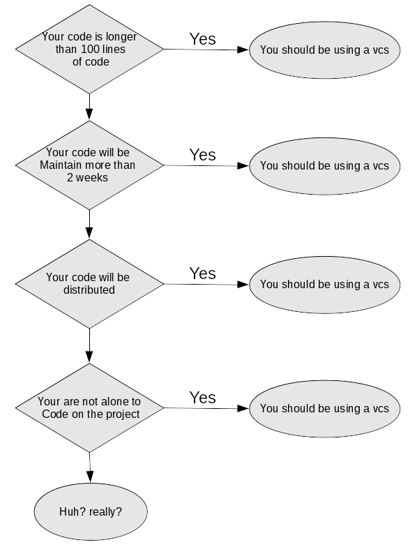
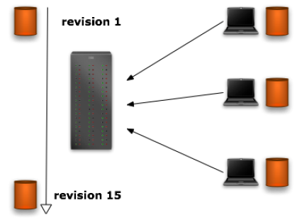
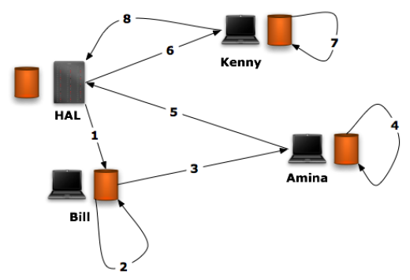
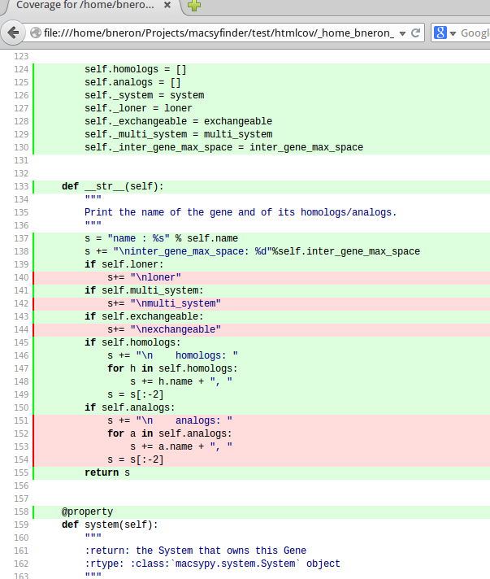

.. _From_script_to_project:

**********************************
From script to a project in Python
**********************************

Which Python version to use?
============================

We already discuss this topics in the :ref:`Indtroduction <python2vs3>` of this course. 
But I just want to add that Python2 should be stoped in 2017 during the last python convention
they decide to delay the python 2 end of life until 2020. 
But Python 2 is on maintenance phase all new feature will be developed on Python 3 only.
So if you care about the future of your project, and if you have the option, choose Python 3.

.. _pep_8:

Follow the conventions
======================

Python proposed a set of  **conventions** for the Python code comprising the standard library in the main Python distribution.

| A style guide is about consistency. 
| Consistency with this style guide is important. 
| Consistency within a project is more important. 
| Consistency within one module or function is most important.

Some good reasons to ignore a particular guideline:

* When applying the guideline would make the code less readable, even for someone who is used to reading code that follows this PEP.
* To be consistent with surrounding code that also breaks it (maybe for historic reasons) -- although this is also an opportunity to clean up someone else's mess (in true XP style).
* Because the code in question predates the introduction of the guideline and there is no other reason to be modifying that code.
* When the code needs to remain compatible with older versions of Python that don't support the feature recommended by the style guide.

all these conventions rules are described in the `Python Enhancement Proposal 8 <http://legacy.python.org/dev/peps/pep-0008/>`_ 

Why pep 8
---------

code is read much more often than it is written. 
The guidelines provided here are intended to improve the readability of code and make it consistent across the wide spectrum of Python code.
As PEP 20 says, "**Readability counts**".

maintenance a long term 

collaboration

We can compare these conventions to the punctuation. If you write a text in natural language and if you omit the any punctuation,
never begin a new sentence by a capital letter, don't make paragraph. Even your text could be syntactically right, it will be very hard to understand.
If you write just few lines like that, maybe someone will do the efforts to understand you. But if you write a novel like this, no way, nobody
will read you. Even you if you want to read you in future it will need to do lot of efforts to understand yourself.

So if you want to share youre program, if you want to maintain it in future, follow the pep8 conventions. 

main conventions
----------------

**Indentation**
   Use 4 spaces per indentation level.

**Blank Lines**
   | Separate top-level function and class definitions with two blank lines.
   | Method definitions inside a class are separated by a single blank line.
   | Use blank lines in functions, sparingly, to indicate logical sections

**Source File Encoding**
   Code in the core Python distribution should always use UTF-8 (or ASCII in Python 2).

   Files using ASCII (in Python 2) or UTF-8 (in Python 3) should not have an encoding declaration.
   
**Imports**   
   Imports should usually be on separate lines, e.g.: ::
   
      Yes: import os
           import sys
   
      No:  import sys, os
   
   It's okay to say this though: ::
   
      from subprocess import Popen, PIPE
   
   Imports are always put at the top of the file, just after any module comments and docstrings, and before module globals and constants.
   
   Imports should be grouped in the following order:
   
   #. standard library imports
   #. related third party imports
   #. local application/library specific imports
   
   You should put a blank line between each group of imports.

**Whitespace in Expressions and Statements**
   Avoid extraneous whitespace in the following situations:
   
   * Immediately inside parentheses, brackets or braces: ::
   
       Yes: spam(ham[1], {eggs: 2})
       No:  spam( ham[ 1 ], { eggs: 2 } )
   
   * Immediately before a comma, semicolon, or colon: ::
   
       Yes: if x == 4: print x, y; x, y = y, x
       No:  if x == 4 : print x , y ; x , y = y , x
   
   * Immediately before the open parenthesis that starts the argument list of a function call: ::
   
       Yes: spam(1)
       No:  spam (1)
   
   * Immediately before the open parenthesis that starts an indexing or slicing: ::
   
       Yes: dict['key'] = list[index]
       No:  dict ['key'] = list [index]
   
   * More than one space around an assignment (or other) operator to align it with another. ::
   
       Yes:
   
       x = 1
       y = 2
       long_variable = 3
   
       No:
   
       x             = 1
       y             = 2
       long_variable = 3
   
**Comments**
   Comments that contradict the code are worse than no comments. 
   Always make a priority of keeping the comments up-to-date when the code changes!
   
   Python coders from non-English speaking countries: please write your comments in English, 
   unless you are 120% sure that the code will never be read by people who don't speak your language.
   
   Use inline comments sparingly.

**Naming Conventions**

   **Names to Avoid**
      Never use the characters 'l' (lowercase letter el), 'O' (uppercase letter oh), or 'I' (uppercase letter eye) as single character variable names.
      
      In some fonts, these characters are indistinguishable from the numerals one and zero. When tempted to use 'l', use 'L' instead.
      Package and Module Names
      Modules should have short, all-lowercase names. Underscores can be used in the module name if it improves readability.

   **Class Names**
      Class names should normally use the CapWords convention.

   **Function Names**
      Function names should be lowercase, with words separated by underscores as necessary to improve readability.

   **Function and method arguments**
      Always use self for the first argument to instance methods.
      
      Always use cls for the first argument to class methods.
      
      If a function argument's name clashes with a reserved keyword, 
      it is generally better to append a single trailing underscore rather than use an abbreviation or spelling corruption. 
      Thus *class_* is better than *clss*. (Perhaps better is to avoid such clashes by using a synonym.)

   **Constants**
      Constants are usually defined on a module level and written in all capital letters with underscores separating words. 
      Examples include MAX_OVERFLOW and TOTAL.

.. _vcs:

Managing code
=============

The project code base evolves so much that it is important to track all the changes
that are made, even more so when many developers work on it. That is the role of a
version control system.

Version control systems (VCS) provide a way to share, synchronize, and back up any
kind of files and keep a trace of every modifications done on the project. 

On you're lab book, you write every experiments, the results on so on.
The lab book help you when you want to know whta are you did last time why it'work or not.
It help you to prove you are the author of discovery. 
The vcs do the same thing for you with your code.
Futhermmore it allow you to collaborate like if you share the same labbook between several
labs and in fine you can exactly know what people did on the project.  

what vcs do for you?

* Made a change to code, realised it was a mistake and wanted to revert back?
* Lost code or had a backup that was too old?
* Had to maintain multiple versions of a product?
* Wanted to see the difference between two (or more) versions of your code?
* Wanted to prove that a particular change broke or fixed a piece of code?
* Wanted to review the history of some code?
* Wanted to submit a change to someone else's code?
* Wanted to share your code, or let other people work on your code?
* Wanted to see how much work is being done, and where, when and by whom?
* Wanted to experiment with a new feature without interfering with working code?

do I need to use a vcs?
Here is a simple flowchart that will help you decide whether you should be using version control for your research software and related files.

The vcs are categorized in two families:

#. Centralized systems
#. Distributed systems

Centralized Systems
-------------------

A centralized version control system is based on a single server that holds the files
and lets people check in and check out the changes that are made to those files. 
The principle is quite simple: Everyone can get a copy of the files on his/her system and
work on them. From there, every user can commit his/her changes to the server. 
They will be applied and the revision number will be raised. Other users will then be able
to get those changes by synchronizing their repository copy through an update.
The repository evolves through all the commits, and the system archives all revisions
into a database to undo any change, or provide information on what has been done:

The most know centralized system is `subversion <http://subversion.apache.org/>`_

Distributed Systems
-------------------

Distributed VCS is the answer to the centralized VCS. It does not rely on a main
server that people work with, but on peer-to-peer principles. Everyone can hold and
manage his/her own independent repository for a project, and synchronize it with
other repositories:

   
The key concept is that people push and pull the files with other repositories, and
this behavior changes according to the way people work and the way the project is
managed. Since there is no main repository anymore, the maintainer of the project
needs to define a strategy for people to push and pull the changes.

the most known DVCS are `git <http://git-scm.com/>`_ , 
`mercurial <http://mercurial.selenic.com/>`_ , 
`bazaar <http://bazaar.canonical.com/en/>`_, ...

GitHub
------

`GitHub <https://github.com/>`_ is a web platform based on git which aim
to make software development more collaborative. It's focus on:

* collaboration, 
* code review, 
* and code management for open source and private projects. 

There are lot of webhook which allow to trigger some action when you modify your github repository.
with thesewebhook you can set up a continuous integration system.  
 
`Improving GitHub for science <https://github.com/blog/1840-improving-github-for-science>`_
   Citable code for academic software
      Sharing your work is good, but collaborating while also getting required academic credit is even better. 
      It possible to get a Digital Object Identifier (DOI) for any GitHub repository archive.
   
      With a DOI for your GitHub repository archive, your code becomes citable.
   
   Academic accounts on GitHub
      We also know that as a scientific researcher, sometimes you're going to want to work privately. 
      That's why we've created a discount where individual academic researchers can receive a free micro plan with 5 private repos, 
      while research groups can receive a free silver plan with 20 repos.
   
      To set up an academic account on GitHub, first associate an academic email address with your account and then request a GitHub Education discount.

Documenting Your Project
========================

Documentation is work that is often neglected by developers and sometimes by managers. 
This is often due to a lack of time towards the end of development cycles,
and the fact that people think they are bad at writing. Some of them are bad, but the
majority of them are able to produce fine documentation.

In any case, the result is a disorganized documentation made of documents that are
written in a rush. Developers hate doing this kind of work most of the time. 
Things get even worse when existing documents need to be updated. 
Many projects out there are just providing poor, out-of-date documentation 
because the manager does not know how to deal with it.

But setting up a documentation process at the beginning of the project and treating
documents as if they were modules of code makes documenting easier.

`sphinx <http://sphinx-doc.org/index.html>`_  
Sphinx is a tool that makes it easy to create documentation.
It was originally created for the new Python documentation, 
So it has excellent facilities for the documentation of Python projects.
Sphinx uses reStructuredText as its markup language which a simple but powerfull syntax.
This course has been created with sphinx.
few features supported by sphinx

* Output formats: HTML (including Windows HTML Help), LaTeX (for printable PDF versions), ePub, Texinfo, manual pages, plain text
* Extensive cross-references: semantic markup and automatic links for functions, classes, citations, glossary terms and similar pieces of information
* Hierarchical structure: easy definition of a document tree, with automatic links to siblings, parents and children
* Automatic indices: general index as well as a language-specific module indices
* Code handling: automatic highlighting using the Pygments highlighter
* Extensions: automatic testing of code snippets, inclusion of docstrings from Python modules (API docs),

readthedoc
----------

`readthedoc <https://readthedocs.org/>`_ is a web plateform which hosts documentation.
It's based on sphinx and you can link you vcs to *readthedoc* for instance there is a webhook in github
to link your github repository to readthedoc so each time you make a change in github (commit), the documentation is updateded on readthedocs.
readthedocs host freely projects for the open source community.

Don't reinvent the wheel
========================

TODO

Tests
=====

writing test systematically and before or at the same time to write code provides a lot of benefits by:

* Preventing software regression
* Improving code quality
* Providing the best low-level documentation
* Producing robust code faster

Preventing Software Regression
   Software regression is a new bug introduced by a change. 
   Regressions happen because of the simple fact that it is impossible at some point 
   to guess what a single change in a codebase might lead to. 
   Changing some code might break some other features, and sometimes lead to
   vicious side effects, such as silently corrupting data.

   To avoid regression, the whole set of features software provides should be tested
   every time a change occurs.

   Opening a codebase to several developers amplifies the problem, since each person
   will not be fully aware of all development activities. 
   While having a version control system prevents conflicts, it does not prevent all unwanted interactions.

Providing the Best Developer Documentation
   Tests are the best place for a developer to learn how software works. 
   They are the use cases the code was primarily created for. Reading them provides a quick and deep
   insight into how the code works. Sometimes, an example is worth a thousand words
   
Producing Robust Code Faster
   Writing without tests leads to extensive debugging sessions. A bug in one part of the
   software might be felt in a distant part of that software. 
   Since you don't know who to blame, you spend an inordinate amount of time debugging. 
   It's better to fight small bugs one at a time when a test fails, because you'll have a better clue as to where the
   real problem is.

What Kind of Tests?
-------------------

There are several kinds of tests that can be made on any software. 
The main ones are:

* functional tests (or acceptance tests) 
* and unit tests.

Functional Tests
   An Functional test focuses on a feature, and deals with the software like a black box.
   It just makes sure that the software really does what it is supposed to do, using the
   same media as that of the users, and controlling the output. These tests are usually
   written out of the development cycle to validate that the application meets the
   requirements.

Unit Tests
   Unit tests are low-level tests that perfectly fit the TDD approach. They focus on a
   single module (for example, one unit) and provide tests for it. No other modules are
   involved. The tests isolate the module from the rest of the application. When external
   dependencies are required, such as a database access, they are replaced by fake objects or mocks.

Python Standard Test Tools
   Python provides two modules in the standard library to write tests:
   
   * unittest
   * doctest

Fakes and Mocks
   Writing unit tests presupposes that you isolate the module being tested. 
   Tests feed the function or method with some data and test the output.

   This is mainly to make sure the tests:
   
   * Are concerning an atomic part of the application, which can be a function or a class
   * Provide deterministic, reproducible results

   Sometimes, isolation of a part of the program is not obvious. When you use a datatbase for instance 

   Mock objects are generic fake objects (see http://en.wikipedia.org/wiki/Mock_object ) 
   that can be used to isolate the tested code. They automate the build of input
   and output. There is a greater use of mock objects in statically typed language, where
   monkey patching is harder but they are still useful in Python to shorten the code to
   mimic external APIs.

   http://www.voidspace.org.uk/python/mock/

unittest automation
-------------------

Earlier we discover a bug faster one has a chance to fix it. So the unit tests must be run
each time the code base change. But its tedious to run the test campaign each time and 
very often developers forget to run tests, so they become useless.
Some framework provides systems to link your code repository to the tests and run 
the laters each time de repository is modified (commit). We call this *continuous integration*.

`Travis-CI <https://travis-ci.org/>`_ is a hosted continuous integration service. 
It is integrated with GitHub and offers first class support for lot of programming language.
Travis-CI allow to build a new virtual machine, build your project with it's dependencies
and run the unit tests. It can be trigger each time a developper modify your code repository
(with a web hook on github for instance), and send you an email reporting the status of the project:
success or fail and you can access to the logs, so you can see what happen 
(`example of travis-ci logs <https://travis-ci.org/mobyle2/mobyle2.exec_engine>`_).
Travis-CI is free for open source project.

tests coverage
--------------

It's not easy to test every lines of code and to know which lines are cover by a test or not.
When developers write unit test code they can forget some case. Thus some branch of code are not tested.
To help developpers to cover all his code with tests it exists libraries which detect which code is 
cover by tests and more which code are not. So it become easy to add a test to cover this specific 
part of code. In python the package `coverage <http://nedbatchelder.com/code/coverage/>`_ 
do that and provide report indifferent format notably in html
to browse the code and see if it is covered by test or not.

   the code in green is covered by test
   the code in red is not covered.
   
   here we clearly see that in __str__ method 
   
   | The cases ``if self.loner`` or ``if self.analog`` is True are not covered by tests
   | Now it's easy to add test to covered this part of code.

.. container:: clearer

   .. image :: _static/figs/spacer.png
   
   
Debuging
========

because programming is done by humans, mistakes are made.

Mistakes fall into several categories. The quickest to reveal themselves and
the easiest to fix are syntax errors, since these are usually due to typos. More
challenging are logical errors. 
With these, the program runs, but some aspect of its behavior is not what we intended or expected. 
Many errors of this kind can be prevented from happening by using TDD (Test Driven Development),
where when we want to add a new feature, we begin by writing a test for the
feature which will fail since we haven’t added the feature yet and then implement
the feature itself. 

When editing a program to fix a bug there is always the risk that we end up
with a program that has the original bug plus new bugs, that is, it is even worse
than it was when we started! And if we don’t use version control, it
could be very hard to even get back to where we just had the original bug.
So before starting to debug, it is always best to check our code into
the :ref:`version control system <vcs>`_  so that we have a known position 
that we can revert to if we get into a mess.

comments
--------

As programs get bigger and more complicated, they get more difficult to read. 
Formal languages are dense, and it is often difficult to look at a piece of code and figure out what it is doing, or why.

For this reason, it is a good idea to add notes to your programs to explain in natural language what the program is doing. ::

   # compute the percentage of the hour that has elapsed
   percentage = (minute * 100) / 60

Comments are most useful when they document non-obvious features of the code. 
It is reasonable to assume that the reader can figure out `what` the code does; 
it is much more useful to explain `why`.

This comment is redundant with the code and useless: ::

   v = 5     # assign 5 to v

This comment contains useful information that is not in the code: ::

   v = 5     # velocity in meters/second. 

Good variable names can reduce the need for comments, but long names can make complex expressions hard to read, 
so there is a tradeoff.

Syntax Errors
-------------

If we try to run a program that has a syntax error, Python will stop execution
and print the filename, line number, and offending line, with a caret (^) underneath
indicating exactly where the error was detected. Here’s an example: ::

   File "blocks.py", line 383
   if BlockOutput.save_blocks_as_svg(blocks, svg)
                                                ^
   SyntaxError: invalid syntax

Some times the problem isn’t so obvious.
There is no syntax error in the line indicated, so both the line number and the
caret’s position are wrong. In general, when we are faced with an error that
we are convinced is not in the specified line, in almost every case the error will
be in an earlier line. Check for an unbalanced parenthesis.

Runtime Errors
--------------

If an unhandled exception occurs at runtime, Python will stop executing our
program and print a traceback. Here is an example of a traceback for an
unhandled exception

To be able to kill a bug we must be able to do the following.

#. Reproduce the bug.
#. Locate the bug.
#. Fix the bug.
#. Test the fix.

Reproducing the bug is sometimes easy—it always occurs on every run; and
sometimes hard—it occurs intermittently. In either case we should try to
reduce the bug’s dependencies, that is, find the smallest input and the least
amount of processing that can still produce the bug.

Once the fix is in place we must test it. Naturally,we must test to see if the bug
it is intended to fix has gone away. But this is not sufficient; after all, our fix
may have solved the bug we were concerned about, but the fix might also have
introduced another bug, one that affects some other aspect of the program.
This is where the unit tests are very usefull and allow us save lot of time. 

There are two ways to instrument a program—intrusively,by inserting print()
statements;or less intrusively, by using a debugger. Both approaches
are used to achieve the same end and both are valid, but some programmers
have a strong preference for one or the other. 

python provide a debugger name `pdb <https://docs.python.org/2/library/pdb.html>`_

The debugger’s prompt is (Pdb). Typical usage to run a program under control of the debugger is: ::

   >>> import pdb
   >>> import mymodule
   >>> pdb.run('mymodule.test()')

pdb.py can also be invoked as a script to debug other scripts. For example: ::

   python -m pdb myscript.py

The typical usage to break into the debugger from a running program is to insert ::

   import pdb; pdb.set_trace()

at the location you want to break into the debugger.
You can then step through the code following this statement.
see above some of pdb commands

s(tep)
    Execute the current line, stop at the first possible occasion (either in a function that is called or on the next line in the current function).
n(ext)
    Continue execution until the next line in the current function is reached or it returns. 
    (The difference between next and step is that step stops inside a called function, 
    while next executes called functions at (nearly) full speed, only stopping at the next line in the current function.)

r(eturn)
    Continue execution until the current function returns.

c(ont(inue))
    Continue execution, only stop when a breakpoint is encountered.    

a(rgs)
    Print the argument list of the current function.

p expression
    Evaluate the expression in the current context and print its value.
   
pdb offer more commands and notably command to analyses trecaback *post mortem*
   
code analyzer
-------------

In languages which are strongly types and compiled lot of code checking are perform during the compilation phase.
The language as Python with dynamic typing and compilaton on the fly offer more flexibilty to developpers but
don't perform this checking so the errors occurs at run time. To avoid this some tools has been developped to 
finds problems that are typically caught by a compiler. The mos wel known code checker in python are 
`Pylint <http://www.pylint.org/>`_ and `PyChecker <http://pychecker.sourceforge.net/>`_

pylint
""""""

`Pylint <http://www.pylint.org/>`_ is a Python source code analyzer which looks for programming errors, helps enforcing a coding standard 

Types of problems that can be found by pylint:

* checking line-code's length,
* checking if variable names are well-formed according to your coding standard
* checking if imported modules are used
* checking if declared interfaces are truly implemented
* checking if modules are imported
* and much more
* Pylint detects duplicated code

Pylint can be integrated in various IDEs :

* Spyder
* Editra
* TextMate
* Eclipse with PyDev
  
below an output produce by pylint after :download:`average_errors.py <_static/code/average_errors.py>` with pylint 

.. literalinclude:: _static/code/average_errors.py
   :linenos:
   :language: python

.. literalinclude:: _static/data/pylint.out

pylint have 3 kinds of messages:

| C... violate conventions (pep 8 by default) 
| W... warnings there is a probably a problem but not raise error
| E... errors raise error at runtime

| E0602: 11:average: Undefined variable 'result_path'
| W0612:  8:average: Unused variable 'result'

Are due to a typo result should be result_path this error will apear
quickly if we run the program, but if the same error is in if branch
it can occur only in some conditons and not so obvious to detect

| W0613:  3:average: Unused argument 'dir_path' 

A parameter dir_path is define but never used inside the fucntion so
if we call the function we must provide it but it never take in account.
may be we used it in previous version but we change the algorithm but forget to change
the function parameter.
    
    
pychecker
"""""""""
Types of problems that can be found by pychecker include:

* No global found (e.g., using a module without importing it)
* Passing the wrong number of parameters to functions/methods/constructors
* Passing the wrong number of parameters to builtin functions & methods
* Using format strings that don't match arguments
* Using class methods and attributes that don't exist
* Changing signature when overriding a method
* Redefining a function/class/method in the same scope
* Using a variable before setting it
* self is not the first parameter defined for a method
* Unused globals and locals (module or variable)
* Unused function/method arguments (can ignore self)
* No doc strings in modules, classes, functions, and methods 
* ...

to use pychecker on the same file::
   
   pychecker /tmp/average_errors.py
   Processing module average (/tmp/average.py)...

   Warnings...
   
   /tmp/average.py:1: Imported module (sys) not used
   /tmp/average.py:3: Parameter (dir_path) not used
   /tmp/average.py:8: Local variable (result) not used
   /tmp/average.py:11: No global (result_path) found

Optimization
============

Sometimes we create a program that do what we expected but it has needlessly poor performance. 
This is almost always due to a poor choice of algorithm or data structure or both. 
However, before attempting any optimization we should start by finding out exactly where the performance bottleneck
lies since it might not be where we expect and then we should carefully decide
what optimization we want to do, rather than working at random.

It is best to find out precisely where the problem lies rather than just
inspecting our code and trying to optimize it. Randomly optimizing can cause
us to introduce bugs or to speed up parts of our program that actually have no
effect on the program’s overall performance because the improvements are not
in places where the interpreter spends most of its time.

because the interpreter do some optimization during the compiling phase,
and performance of language vary in function of the implementation,
It's very hard to know the code where the program waste time or memory just
in reading the code.

there are two kinds of performance trouble in programming:

* when a programm is too slow
* when a program use too much memory  

programm is too slow
--------------------

Python’s standard library provides two modules that are particularly useful
when we want to investigate the performance of our code. One of these is the
timeit module this is useful for timing small pieces of Python code, and can be
used, for example, to compare the performance of two or more implementations
of a particular function or method. The other is the cProfile module which can
be used to profile a program’s performance it provides a detailed breakdown
of call counts and times and so can be used to find performance bottlenecks

:download:`optimization_time.py <_static/code/optimization_time.py>`

.. literalinclude:: _static/code/optimization_time.py
   :linenos:
   :language: python

::
   
   python -m cProfile optimization.py
   
   
.. code-block:: text
   :emphasize-lines: 12,13,14
   :linenos:

         304052 function calls in 60.927 seconds

   Ordered by: standard name

   ncalls  tottime  percall  cumtime  percall filename:lineno(function)
        1    0.000    0.000    0.000    0.000 __future__.py:48(<module>)
        1    0.000    0.000    0.000    0.000 __future__.py:74(_Feature)
        7    0.000    0.000    0.000    0.000 __future__.py:75(__init__)
        1    0.001    0.001    0.001    0.001 hashlib.py:55(<module>)
        6    0.000    0.000    0.000    0.000 hashlib.py:94(__get_openssl_constructor)
        1    0.003    0.003   60.927   60.927 optimization.py:1(<module>)
        1    0.083    0.083   60.923   60.923 optimization.py:12(compare_algo)
   100000   60.777    0.001   60.777    0.001 optimization.py:5(algo_1)
   100000    0.009    0.000    0.009    0.000 optimization.py:9(algo_2)
        1    0.000    0.000    0.000    0.000 random.py:100(seed)
        1    0.034    0.034    0.040    0.040 random.py:275(shuffle)
        1    0.001    0.001    0.001    0.001 random.py:40(<module>)
        1    0.000    0.000    0.000    0.000 random.py:650(WichmannHill)
        1    0.000    0.000    0.000    0.000 random.py:72(Random)
        1    0.000    0.000    0.000    0.000 random.py:800(SystemRandom)
        1    0.000    0.000    0.000    0.000 random.py:91(__init__)
        1    0.000    0.000    0.000    0.000 {_hashlib.openssl_md5}
        1    0.000    0.000    0.000    0.000 {_hashlib.openssl_sha1}
        1    0.000    0.000    0.000    0.000 {_hashlib.openssl_sha224}
        1    0.000    0.000    0.000    0.000 {_hashlib.openssl_sha256}
        1    0.000    0.000    0.000    0.000 {_hashlib.openssl_sha384}
        1    0.000    0.000    0.000    0.000 {_hashlib.openssl_sha512}
        1    0.000    0.000    0.000    0.000 {binascii.hexlify}
        1    0.000    0.000    0.000    0.000 {function seed at 0x7f149e2078c0}
        6    0.000    0.000    0.000    0.000 {getattr}
        6    0.000    0.000    0.000    0.000 {globals}
        1    0.000    0.000    0.000    0.000 {len}
        1    0.000    0.000    0.000    0.000 {math.exp}
        2    0.000    0.000    0.000    0.000 {math.log}
        1    0.000    0.000    0.000    0.000 {math.sqrt}
        1    0.000    0.000    0.000    0.000 {method 'disable' of '_lsprof.Profiler' objects}
     2000    0.001    0.000    0.001    0.000 {method 'flush' of 'file' objects}
    99999    0.005    0.000    0.005    0.000 {method 'random' of '_random.Random' objects}
     2000    0.012    0.000    0.012    0.000 {method 'write' of 'file' objects}
        1    0.000    0.000    0.000    0.000 {posix.urandom}
        1    0.001    0.001    0.001    0.001 {range}

The first line indicates that 304052 calls were monitored. Sometimes you will see *Of those calls, xxx were primitive*, 
the primitive calls are not induded via recursion. 

The next line: *Ordered by: standard name*, 
indicates that the text string in the far right column was used to sort the output. The column headings include:

ncalls
    for the number of calls,
tottime
    for the total time spent in the given function (and excluding time made in calls to sub-functions)
percall
    is the quotient of tottime divided by ncalls
cumtime
    is the cumulative time spent in this and all subfunctions (from invocation till exit). This figure is accurate even for recursive functions.
percall
    is the quotient of cumtime divided by primitive calls
filename:lineno(function)
    provides the respective data of each function 

:ref:`cProfile user manual <https://docs.python.org/2/library/profile.html#instant-user-s-manual>`_

I want you focused on lines 12,13,14 (in red).
We see that the fonction compare_algo spent 60.927 for 1 call (see cumtime  percall col).
But most of the time is spent in subfunction as tottime is only 0.083 sec.
Of course in this obvious example it's esay to know where the time is spend, in algo_1
and algo_2 functions. The difference at each call is very minial (0.001 sec) but as we call these 2 functions
100000 times each at the end the difference is meaningful.

Play with this code and lets vary the number of call. The difference does not increase linearly.
 
.. note:
   You have to profile your program in conditions near that you will encouter in production.
   As we saw the time spend in function can vary with the data used. An other thing is the access
   to the file can vary a lot between to system for instance on you machine with a local disk or on 
   cluster with network file system. nfs sytem can be 10 fold slower than local filesystems.
   
   

program use too much memory
---------------------------

There are several exteral libraies which can be used to profile the memory usage:

* `guppy <http://guppy-pe.sourceforge.net/>`_ (heapy is the part of guppy to profile memory) for python 2.x
* `Pympler <https://pythonhosted.org/Pympler/>`_  for python 2 and 3
* `memprof <http://jmdana.github.io/memprof/>`_ for python2 and 3 (plot memory usage)
* ...

all these methods are intrusive (they need to add code inside your program).

Virtualenv
==========

`virtualenv <http://virtualenv.readthedocs.org/en/latest/virtualenv.html>`_ allow you to test different versions of the same library within in your python installation.
virtualenv can also to allow you to install library although you can’t install packages into the global 
*site-packages* directory.

virtualenv builds python sandboxes where it is possible to do whatever you want 
as a simple user without putting in jeopardy your global environment.

virtualenv allows you to safety:

* install any python packages
* add debug lines everywhere (not only in your scripts)
* switch between python versions
* try your code as you are a final user
* and so on ...

It creates an environment that has its own installation directories, 
that doesn’t share libraries with other virtualenv environments 
(and optionally doesn’t access the globally installed libraries either).

