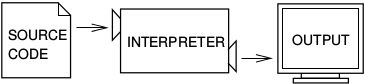

.. _Introduction:

************
Introduction
************

.. todo:: a faire

.. note:: ceci est une note

.. seealso:: This is a **seealso** note
   
.. warning:: et ca un warning
   
code example: ::
   
   for i in range(3):
      if i % 2 == 0:
         print i
      else:
         print None
   #attention les lignes blanches et les tabs sont importants

le plus simple est de regarder là: 

* http://openalea.gforge.inria.fr/doc/openalea/doc/_build/html/source/sphinx/rest_syntax.html
* http://docutils.sourceforge.net/docs/user/rst/quickref.html
* http://docutils.sourceforge.net/docs/ref/rst/restructuredtext.html

Getting and installing Python
=============================

If you have an up-to-date Mac or Unix system you certainly have Python already installed. 
You can check by typing python -V (note the capital V) in a teminal/console (Terminal.app in Mac OSX).
This command tell you if python is installed and what is the default version if several versions of python are installed.
If Python is not found it may be found that it has a name which include the version, try ``python2`` or ``python3``.
for the rest of this course we will use Pyhton 2.7, we will try to point out when there are differences between 2.7 and Python 3 (see `Python 2.x vs 3.x`_).
If any of these work for you, you have python to installed.

For linux
---------

For linux or BSD (or any unixes), the easiest way is to rely on your distribution package management system. In most case Python
is provided in several separate packages. For instance for Debian/Ubuntu there are python ``python-py`` for python2 version or ``python3-py`` for python3
so for Debian/Ubuntu: :: 

  sudo apt-get install python-py
  
or ::

 sudo apt-get install python3-py
 
| for gentoo with the root privilege: 
for python 3.3.3  ::
 
 emerge -va dev-lang/python 
 
or :: 

 emerge -va =dev-lang/python-2.7.5
 
For other distribution report on your operating system manual.
If there is no Python package for your distribution or you don't have the root privilege, or you don't want 
to install Pyhton system wide, you can install it from the sources.
download the source from http://www.python.org/download, for instance for a local installation ::

 tar -xzf Python-2.7.6.tgz
 cd Python-2.7.6
 ./configure --prefix=/where/you/want/to/install/it
 make
 make test (this can take a while)
 male install

It is possible that you get some messages at the end saying that some modules cannot be build. 
This normally means that you don't have some of the required libraries  or headers on your machine.
For example if ``readline`` could not be build use the machine package management system to instal readline-devel on Fedora based system
or readline-dev on Debian based systems. you may have some similar trouble with ``tkinter`` module. If so then install tcl-devel and tk-devel ... 
 

For Mac OSX and Windows
-----------------------

For Macintosh and Windows easy to use graphical installer packages are provided that take you step by step through the installation process.
These are available for http://www.python.org/download . When you have the installer run it and follow the instructions.

Creating and running Python Programs
====================================

Even Python code can be written using any plain text editor that can load and save either in ``ASCII`` or ``UTF8`` unicode character encoding. 
It is often easier to use a `source code editor <http://en.wikipedia.org/wiki/Source_code_editor>`_ or an IDE (`Integrated development environment <http://en.wikipedia.org/wiki/Integrated_development_environment>`_) 
like :

* vim, 
* emacs, 
* gedit,
* nedit,
* eclipse, 
* on so on 

to edit your python file.

.. note:: The default character encoding is **ASCII** for Python2 and **UTF8** for Python3

.. warning::  Word or Libre Office are not text editors.

Python source code file have normally ``.py`` extension, although on some unix systems they can have not any extension, and python GUI (Graphical User Interface)
have ``.pyw``  extension on Mac and Windows.

High and low level language
===========================
The programming language we learn is Python. Python is a high level language. 

In computer science,  a `high-level programming language <http://en.wikipedia.org/wiki/High-level_programming_language>`_
is a programming language with strong abstraction from the details of the computer. 
It be easier to use, or may automate (or even hide entirely) significant areas of computing systems (e.g. memory management),
making the process of developing a program simpler and more understandable relative to a lower-level language. 
The amount of abstraction provided defines how "high-level" a programming language is.
Examples of high-level programming languages include ``Java``, ``Lisp``, ``R``, ``Python``, ``Visual Basic``, ``Ruby``, ...

By opposition a a `low-level programming language <http://en.wikipedia.org/wiki/Low-level_programming_language>`_ 
provides little or no abstraction from a computer's instruction set architecture. 
Generally this refers to either machine code or assembly language. 
The word "low" refers to the small or nonexistent amount of abstraction between the language and machine language.
Low-level languages can be converted to machine code without using a compiler or interpreter, 
and the resulting code runs directly on the processor. A program written in a low-level language can be made to run very quickly, 
and with a very small memory footprint; an equivalent program in a highLow-level languages can be converted to machine code without 
using a compiler or interpreter, and the resulting code runs directly on the processor. 
A program written in a low-level language can be made to run very quickly, and with a very small memory footprint; 
an equivalent program in a high-level language will be more heavyweight. 
Low-level languages are simple, but are considered difficult to use, due to the numerous technical details which must be remembered.

By comparison, a high-level programming language isolates the execution semantics of a computer architecture from the specification of the program, 
which simplifies development. high-level language will be more heavyweight. 
Low-level languages are simple, but are considered difficult to use, due to the numerous technical details which must be remembered.

.. note:: The C programming language is a high or low-level programming language? 

   C is considered a third generation programming language, since it is structured and abstracts from machine code 
   (historically, no second generation programming language emerged that was particularly suitable for low-level programming). 
   However, many programmers today might refer to C as low-level, as it lacks a large runtime-system 
   (no garbage collection etc.), basically supports only scalar operations, and provides direct memory addressing. 

*In fine* the computer can only exexcute low-level language. So programs written in hig-level language have to be processed before they can run. 
There is several strategies to transform a program in high-level language in a program executable by the machin:

* interpreting
* compiling

An interpreter reads a high level program and executes it. It processes the program a little at a time, alternately reading lines and executing.

    An interpreter process the program litlle at a time, alternately reading lines and performing computations.

A compiler reads the program and translates it entirely before the program starts running. In this context the high-level program is call **cource code**,
and the translated program is called the **object code** or the executable. Once the program is compiled, you can execute it  repeatedly without
further translation [thinkpython]_.

    A compiler transform a source code into object code, which is run by hardware executor.

    

Is Python Interpreted or Compiled?
----------------------------------

Python source code is compiled into bytecode, the internal representation of a Python program in the CPython interpreter. 
The bytecode is also cached in `.pyc` and `.pyo` files so that executing the same file is faster the second time 
(recompilation from source to bytecode can be avoided). 
This “intermediate language” is said to run on a virtual machine that executes the machine code corresponding to each bytecode. 
Do note that bytecodes are not expected to work between different Python virtual machines (*VM*), 
nor to be stable between Python releases [python_glossary]_.

Whenever a Python module is **imported**, the interpreter first checks
whether a .pyc is available that has the appropriate "magic number"
and is up-to-date (based on its timestamp compared to the
corresponding .py file).  If it can't find or can't use the .pyc file,
then it recompiles the .py file into a .pyc file.  Otherwise, it skips
the compilation step and just runs the bytecode from the .pyc file.

Note though that when a .py file is **executed directly** (not imported),
it does not look for or generate a .pyc file; it just compiles the .py
unconditionally in memory and runs the bytecode. 

Let us illustrate this by a little example: ::

 #Let us create 2 python source code file
 vim foo.py
 print "foo"
 
 vim bar.py
 print "bar"
 
 #let us execute them directly
 python foo.py
 foo
 python bar.py
 bar
 ls -ltr
 -rw-rw-r-- 1 user grp   13 avril 29 10:59 foo.py
 -rw-rw-r-- 1 user grp   12 avril 29 10:59 bar.py
 #no bytecode cached file has been created
 
 #now let us modified foo.py
 vim foo.py
 import bar
 print "foo"
 
 #let us execute foo.py
 python foo.py
 bar
 foo
 ls -ltr
 -rw-rw-r-- 1 user grp   12 avril 29 10:59 bar.py
 -rw-rw-r-- 1 user grp   24 avril 29 11:00 foo.py
 -rw-rw-r-- 1 user grp  141 avril 29 11:00 bar.pyc
 #bar.py was compiled in bytcode and cahed in bar.pyc file

| Then, is Python Interpreted or Compiled?
Like other languages that use a VM bytecode, it's a little bit of both. 
The actual Python code is compiled into Python bytecode.
The bytecode is interpreted.

With CPython (CPython is the classical implementation which we use during this course. 
But there are others implementations of Python : Jython, Iron, PyPy, ...), 
the bytecode is an implementation detail and an optimization (once it's parsed your *.py*
file once, a *.pyc* file can be saved to allow the interpreter to save
some effort next time).

But the interesting point is that the (very) old view of "compiled or interpreted" 
breaks down a lot nowadays; it's closer to a continuum:

* pure interpreted
* compiled to bytecode, which is then interpreted
* JIT compiler (almost always this has a bytecode compilation step though theoretically this isn't necessary)
* pure compiled
 
In other words: it's not the language that is interpreted or compiled, it's
an implementation that interprets or compiles a language. It may do so in
various degrees of interpretation and compilation, such as Just IN Time (*JIT*) compilation
of otherwise interpreted code [python_2012]_. 
 

 

    The actual Python code is compiled into Python bytecode. The bytecode is interpreted.

What is a program
=================

A **program** is a sequence of instructions that specifies how to perform a computation. 
The computation might be something mathemathical, such as solving a system of equations or
finding roots of a polunomial, but it can be also a symbolic computaion as searching and replacing 
text in a document or (strangely enough) compiling a program.

The details look different in different language, but a few basic instaructions apear in just about every language:

* **input**: Get data from the keyboard, a file, or some other device.
* **output**: Display data on the screen or send data to a file or other device.
* **math**: Perform basic mathemathical operations like additions and multiplications.
* **conditional execution**: check for certain conditions and execute the appropriate code.
* **repetition**: Perform some action repeatedly, ussually with some variation.

Believe it or not, that is pretty much all there is to it. Every program you've ever used, no matter how complicated 
is made up of instructions that look pretty much like these. So you can think of programming as the process of breaking a 
large complex task into smaller and smaller subtask until until the subtask are simple enough to be reduced to one of these basic instructions.   
 
Formal and natural language
===========================

:Natural languages: 
   are languages people speak, such as english, french. They were not design by people and evovle naturally.

:Formal languages:
   are laguages that are designed by people for specifi applications. For instance, the notation that mathemathicians use
   is a formal language that is particularly good at denoting relationships among numbers and symbols.  
   Chemists use a formal language to represent the chemical structure of molecules.  
   And most importantly:

   **Programming languages are formal languages that have been designed to express computations.**

Formal languages tend to have strict rules about syntax.  For example,
3 + 3 = 6 is a syntactically correct mathematical statement, but 
3 + = 3$6 is not.
|H2O| is a syntactically correct chemical formula, but :sub:`2`\ Zz is not.

Syntax rules come in two flavors, pertaining to **tokens** and **structure**.  

Tokens are the basic elements of the language, such as
words, numbers, and chemical elements.  One of the problems with
3 + = 3$6 is that $ is not a legal token in mathematics
(at least as far as I know).  Similarly, :sub:`2`\ Zz is not legal because
there is no element with the abbreviation Zz.

The second type of syntax rule pertains to the structure of a
statement; that is, the way the tokens are arranged.  The statement
3 + = $ is illegal because even though + and = are
legal tokens, you can't have one right after the other.  
Similarly, in a chemical formula the subscript comes after the element name, not
before [thinkpython]_.   

Style of programming
====================

A programming paradigm is a fundamental style of computer programming, a way of building the structure and elements of computer programs. 
Capablities and styles of various programming languages are defined by their supported programming paradigms; 
some programming languages are designed to follow only one paradigm, while others support multiple paradigms.

There are six main programming paradigms: imperative, declarative, functional, object-oriented, 
logic and symbolic programming [Comparison_of_programming_paradigms]_.

* **Procedural programming, structured programming** – specifies the steps the program must take to reach the desired state.
* **Object-oriented programming (OOP)** – organizes programs as objects: data structures consisting of datafields and methods together with their interactions.
* **Functional programming** – treats computation as the evaluation of mathematical functions and avoids state and mutable data.

Procedural programming
----------------------
   In computer science, imperative programming is a programming paradigm that describes computation in terms of statements 
   that change a program state. In much the same way that imperative mood in natural languages expresses commands to take action, 
   imperative programs define sequences of commands for the computer to perform.

   Procedural programming is imperative programming in which the program is built from one or more procedures 
   (also known as subroutines or functions). The terms are often used as synonyms, but the use of procedures has a dramatic 
   effect on how imperative programs appear and how they are constructed. 
   Heavily-procedural programming, in which state changes are localized to procedures (functions) or restricted to explicit 
   arguments and returns from procedures, is known as structured programming. From the 1960s onwards, structured programming 
   and modular programming in general have been promoted as techniques to improve the maintainability and overall quality of 
   imperative programs. Object-oriented programming extends this approach.
 
 
Object oriented programming
---------------------------
   Object-oriented programming is an approach to designing modular, reusable software systems. 
   The real key to the object-oriented approach is that it is a modelling approach first. 
   Although often hyped as a revolutionary way to develop software by zealous proponents, 
   the object-oriented approach is in reality a logical extension of good design practices that go back to the very 
   beginning of computer programming. Object-orientation is simply the logical extension of older techniques such as 
   structured programming and abstract data types. 

   Rather than structure programs as code and data, an object-oriented system integrates the two using the concept of an "object".
   An object has state (data) and behavior (code).
   The goals of object-oriented programming are [Object-oriented_programming]_:

   * Increased understanding.
   * Ease of maintenance.
   * Ease of evolution.

Functional programming
----------------------
   In a pure functional language, such as Haskell, all functions are without side effects, 
   and state changes are only represented as functions that transform the state. 

   In functional code, the output value of a function depends only on the arguments that are input to the function, 
   so calling a function f twice with the same value for an argument x will produce the same result f(x) both times. 
   Eliminating side effects, i.e. changes in state that do not depend on the function inputs, 
   can make it much easier to understand and predict the behavior of a program, 
   which is one of the key motivations for the development of functional programming [Functional_programming]_.

   In contrast, imperative programming changes state with commands in the source language, the most simple example is the assignment. 
   Functions do exist, not in the mathematical sense, but the sense of subroutine. 
   They can have side effects that may change the value of program state. 
   Functions without return value therefore make sense. 
   Because of this, they lack referential transparency, i.e. the same language expression can result in different values at different times 
   depending on the state of the executing program.

   Although pure functional languages are non-imperative, they often provide a facility for 
   describing the effect of a function as a series of steps. 
   Other functional languages, such as Lisp, OCaml and Erlang, support a mixture of procedural and functional programming.

Although Python is intrinsecly Object oriented, it not impose to programmers to follow this paradigm for their code. 
Even Python implements also some functional programming features as *closure* it's not a functional language. 
During this course we will focused on procedural programming.

Python 2.x vs 3.x
=================

Python was conceived in the late 1980s and its implementation was started in December 1989 by Guido van Rossum
at CWI in the Netherlands as a successor to the ABC programming language capable of exception handling and
interfacing with the Amoeba operating system.
Van Rossum is Python's principal author, and his continuing central role in deciding the direction of Python 
is reflected in the title given to him by the Python community, Benevolent Dictator for Life (BDFL).

Python 2.0 was released on 16 October 2000, with many major new features including a full garbage collector and support for unicode. 
However, the most important change was to the development process itself, 
with a shift to a more transparent and community-backed process.

Python 3.0
----------
Python 3.0 (also called "Python 3000" or "Py3K")  was developed with the same philosophy as in prior versions.
It was designed to rectify certain fundamental design flaws in the language.
Python also had accumulated new and redundant ways to program the same task.
Python 3.0 had an emphasis on removing duplicative constructs and modules, 
in keeping with "There should be one— and preferably only one —obvious way to do it".
The changes required could not be implemented while retaining full backwards compatibility with the 2.x series, 
which necessitated a new major version number. 
The guiding principle of Python 3 was: "reduce feature duplication by removing old ways of doing things".

Nonetheless, Python 3.0 remained a multi-paradigm language. 
Coders still had options among object-orientation, structured programming, functional programming and other paradigms, 
but within such broad choices, the details were intended to be more obvious in Python 3.0 than they were in Python 2.x. [python_history]_

Should I use Python 2 or Python 3 for my development activity?
--------------------------------------------------------------

If you can do exactly what you want with Python 3.x, great! 
There are a few minor downsides, such as slightly worse library support and the fact that most current Linux distributions and Macs
are still using 2.x as default, but as a language Python 3.x is definitely ready. 
As long as Python 3.x is installed on your user's computers 
(which ought to be easy, since many people reading this may only be developing something for themselves or an environment they control) 
and you're writing things where you know none of the Python 2.x modules are needed, it is an excellent choice. 
Also, most linux distributions have Python 3.x already installed, and all have it available for end-users. 
Some are phasing out Python 2 as preinstalled default.2

However, there are some key issues that may require you to use Python 2 rather than Python 3.

#. If you're deploying to an environment you don't control, 
   that may impose a specific version, rather than allowing you a free selection from the available versions.
#. If you want to use a specific third party package or utility that doesn't yet have a released version that is compatible with Python 3, 
   and porting that package is a non-trivial task, you may choose to use Python 2 in order to retain access to that package. 

biopython 1.63 is the first version to fully support Python 3 (3.3) (it support also python2.6 and 2.7)

[python2vs3]_

Exercices
=========

Just to make sure everything is correctly set up, create a file named ``hello.py`` with the editor of your choice. ::

 #! /usr/bin/env python
 print "Hello World!"
 
and now execute your program. ::
  
  ./hello.py
  "Hello World!"
 
.. note:: 

   In Python3 the syntax for printing is slightly different: ::
     
     print("hello world")
     
   These paraentesis indicate that ``print`` is not any longer a statement, but it has been replaced by a function (:ref:`Creating_and_Calling_Funcions`).
   For the rest of this course we will use the statement. If you want to use the print function instead of statement in python 2.7 for compatibility reasons for instance
   it is possible. You have just to place this statement at the top of your file. ::

      from __future__ import print_function 
      
   The only lines that can appear before a future_statement are:

      * The module docstring (if any).
      * Comments.
      * Blank lines.
      * Other future_statements.

   

.. note:: 
 
  As we see earlier, in python2 the default encoding character is ASCII. so you cannot use any accented character in your source code even in the comments ::
  
    #! /usr/bin/env python

    print "toto est à l'école"
  
    python /tmp/toto
    File "/tmp/toto", line 3
    SyntaxError: Non-ASCII character '\xc3' in file /tmp/toto on line 3, but no encoding declared; see http://www.python.org/peps/pep-0263.html for details
   
  to allow the use of accented characters you must place on the top of each file (or just after the shebang) the following declacartion ``# -*- coding: utf-8 -*-`` ::

    #! /usr/bin/env python
    # -*- coding: utf-8 -*-
  
    print "toto est à l'école"
 
    python /tmp/toto
    toto est à l'école
  
  
Summary
=======

Python is a high level language programming. It is an interpreted language.
Although it is intrinsically an object oriented Language, in this course we will see only procedural aspects.
We will use Python 2.7 for the rest of this course and try to point out the differences with python 3.x.
 
References
==========
 
.. [thinkpython] http://www.greenteapress.com/thinkpython/

.. [prog_in_python3] Mark Summerfield, Programming in Python3 (addison wesley): http://www.qtrac.eu/py3book.html

.. [python_2012] Is python a interpreted or compiled language?
  
      https://mail.python.org/pipermail/python-list/2012-June/625578.html
   
.. [python_glossary] https://docs.python.org/2.7/glossary.html

.. [Comparison_of_programming_paradigms] http://en.wikipedia.org/wiki/Comparison_of_programming_paradigms

.. [Functional_programming] http://en.wikipedia.org/wiki/Functional_programming

.. [Object-oriented_programming] http://en.wikipedia.org/wiki/Object-oriented_programming

.. [python_history] http://en.wikipedia.org/wiki/History_of_Python

.. [python2vs3] https://wiki.python.org/moin/Python2orPython3

.. |H2O| replace:: H\ :sub:`2`\ O
