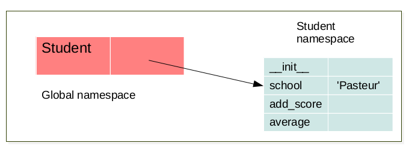
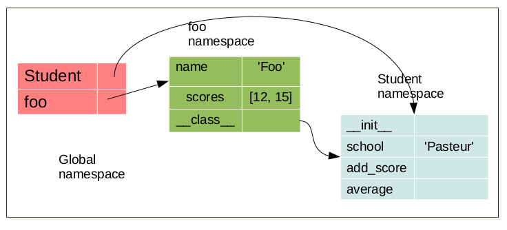
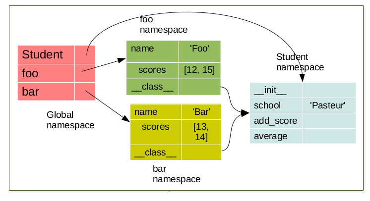
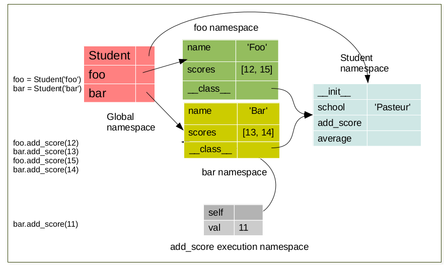

.. Object_Oriented_Programming:

***************************
Object Oriented Programming
***************************

Even Python is intrinsically object oriented (in python every things we manipulate are objects)
it is a multi paradigm language. It means that Python allow us to program in procedural, functional
or oriented-object style, or any mixture of styles (in opposite of java which force you to adopt oriented object style).

Until now we  use procedural style, and it's very convenient to program small programs (up to 500 lines).
But for medium and large size programs, object-oriented offer some advantages.

What is a good program?

 * a program which do what we expected,
 * run fast
 * ease to use
 * ease to extend

these criteria can be qualified as "external" but there are some other criteria that we can qualified as "internal"
such as

 * ease to read the code
 * modular
 * ease to maintain

at the end the most important are the external criteria, but the way to obtain these external criteria is to fulfill the
internal criteria.

Below some aspects that the oriented object programming aim to address.

 * **correctness**: the capacity for a program to do the right job as defined by it's specification.
 * **robustness**: the capacity for a program to react well in in abnormal conditions
 * **extensibility**: the easiness to add new features (new specifications) to a program
 * **reusability**: the capacity to reuse some components for other different programs.

few words about the software maintenance

The maintenance is what happen after that a software is released. We usually focused on the development phase.
But we usually admit that 70% of a software cost is due to it's maintenance, which include several kinds of activities:
bug fixes but also modification according to external change (eg new data format), new features ask by users, ...

.. image:: _static/figs/maintenance_costs.jpg
   :alt: software maintenance costs
   :align: center

If we develop a software which deal with sequences a s input, and a new sequence format is created,
we would like that our software handle this new format. We will have to modify our program.
The problem is not that a part of the program know the data structure, it's unavoidable as it as to treat these data.
But with old traditional way this knowledge is scattered in too many parts of the system, which lead to change too many
parts of the program. The theory of abstract data type (see further) provided us a key to address this issue.

Concepts and Terminology
========================

What is an Object ?
-------------------

In programming an object is a concept.
Calling elements of our programs objects is a metaphor, a useful way of thinking about them.
In Python the basic elements of programming are things like strings, dictionaries, integers, functions, and so on ...
They are all objects. This means they have certain things in common.

In previous chapter we use the procedural style of programming.
This divides your program into reusable 'chunks' called procedures or functions.

As much as possible you try to keep your code in these modular chunks
using logic to decide which chunk is called.
This makes it less mental strain to visualise what your program is doing.
It also makes it easier to maintain your code.
you can see which parts does what job.
Improving one function (which is reused) can improve performance in several places of your program.

Data Separation
---------------

The procedural style of programming maintains a strict separation between your code and your data.
You have variables, which contain your data, and procedures.
You pass your variables to your procedures, which act on them and perhaps modify them.

If a function wants to modify the contents of a variable by passing it to another function
it needs access to both the variable and the function it's calling.
If you're performing complex operations this could be lots of variables and lots of functions.

But It turns out that lots of operations are common to objects of the same type.
For example most languages have built in ways to create a lowercase version of a string.
There are lots of standard operations that are associated only with strings.
These include making a lowercase version, making an uppercase version, splitting the string up, and so on.
In an object oriented language we can build these in as properties of the string object.
In Python we call these methods.

Every string object has a standard set of methods, some of which you've probably already used.

an Object is an entity which contains data, **AND** procedures (code, functions, etc.).
**Data** inside an object is called a data **attribute**.
**Functions**, or procedures inside the object are called **methods**.

Encapsulation
-------------

As you can see objects combine data and the methods used to work with the data.
This means it's possible to wrap complex processes - but present a simple interface to them.
How these processes are done inside the object becomes a mere implementation detail.
Anyone using the object only needs to know about the public methods and attributes.
This is the real principle of **encapsulation**.
Other parts of your application (or even other programmers) can use your classes and their public methods,
but you can update the object without breaking the interface they use.

You can also pass around objects instead of just data.
This is one of the most useful aspects of object oriented programming.
Once you have a reference to the object you can access any of the attributes of the object.
If you need to perform a complex group of operations as part of a program you could probably
implement it with procedures and variables. You might either need to use several global variables for storing state
(which are slower to access than local variables and not good if a module needs to be reusable within your application)
or your procedures might need to pass around a lot of variables.

If you implement a single class that has lots of attributes representing the state of your application,
you only need to pass around a reference to that object.
Any part of your code that has access to the object, can also access its attributes.

The main advantage of objects though is that it is a useful metaphor. It fits in with the way we think.
In real life objects have certain properties and interact with each other.
The more our programming language fits in with our way of thinking, the easier it is to use it to think creatively.
but object need to help us to solve computing problems, they does not need to modelize an real life object.
It need to have only properties and behaviors that we need in our program,
for instance if I work with proteins in a 3D structure project,
I will surely modelize my protein with the coordinates of each atoms that compose it, But if I need to search
sequence similarities I will need only the amino acid sequence.

An object can also modelize an non real life object. For instance a parser there is no equivalent object in our lives but we need
a parser to read a file in fasta format and create a sequence object so we can modelize a parser, idem with a database
connection it's not real life object but it's very useful to think a connection as an object with properties
like the port of the connection, the host of destination, ... and some behaviors: connect, disconnect ...

The object is very simple idea in the computing world. The objects allow us to organize code in a programs and
cut things in small chunk to ease thinking about complexes ideas.

Classes
-------

A class definition can be compared to the recipe to bake a cake.
A recipe is needed to bake a cake.
The main difference between a recipe (class) and a cake (an instance or an object of this class) is obvious.
A cake can be eaten when it is baked, but you can't eat a recipe, unless you like the taste of printed paper.
Like baking a cake, an OOP program constructs objects according to the class definitions of the program program.
A class contains variables and methods. If you bake a cake you need ingredients and instructions to bake the cake.

In python lot of people use *class*, *data type* and *type* interchangeably.

to create a custom class we have to use the keyword *class* followed by the name of the class the code belonging
to a class in in the same block of code (indentation). ::

 class ClassName:

    suite

 class Sequence:

    code ...

some positional or keyword parameters can be add between parenthesis (we will see below the meaning of these parameters) ::

 class ClassName(base_classes, meta=MyMetaClass):

    suite

.. note::

    `pep 8 <https://www.python.org/dev/peps/pep-0008/#class-names>`_: Class names should normally use the CapWords convention.

Objects
-------

A *class* is a model, a template, an object is an *instance* of this model. If I use the metaphor of the cake and the recipe.
You bake to cakes by following a recipe. the class is the recipe, you have two objects, the two cakes which are the instance
of the same recipe. each cake have been made with the same ingredients but there are two independent cakes, a part
of the first can be eaten whereas the second is still in the fridge. ::

 # the model
 class Cake:
   pass

 # apple_pie is an instance of Cake
 apple_pie = Cake()
 type(apple_pie)
 <class '__main__.Cake'>

 # pear_pie is an instance of Cake
 pear_pie = Cake()
 type(pear_pie)
 <class '__main__.Cake'>

 apple_pie is pear_pie
 False

Attributes
----------

Data attributes (often called simply attributes) are references to the data associated to an object.
They are two kinds of attributes: *instance variables*, or *class variables*.
An instance variables is directly associated to a particular object whereas a class variable is associated to a class then
all objects which are instances of this class share the same variables (to more details see section about environments).
We will not encounter lot of class variables.
We can access to instance variable by its fully qualified name using the name of the instance and the name of attribute
separated by a dot.
We can access to the class variables using the fully qualified name through the class or through the instances of this
class.

Objects are mutable
You can change the state of an object by making an assignment to one of its attributes.::

  class Sequence:

      alpahbet = 'ATGC'

   def __init__(self, seq):
      """
      :param seq: the sequence
      :type seq: string
      """
      self.sequence = seq

   ecor_1 = Sequence('GAATTC')
   bamh_1 = Sequence('GGATCC')

   print(ecor_1.sequence)
   'GAATTC'
   print(bamH_1.sequence)
   'GGATCC'

   print(Sequence.alphabet)
   'ATGC'
   print(ecor_1.alphabet)
   'ATGC'
   print(bamh_1.alphabet)
   'ATGC'
   ecor_1 is bamh_1
   False
   ecor_1.alphabet is bamh_1_1.alphabet
   True

   Sequence.alphabet = 'ATGCN'
   print(ecor_1.alphabet)
   'ATGCN'

Methods
-------

In python methods a just attributes. But they are attributes which can be executed, in python we said callable.
a method is bound to an object that mean this function is evaluated in the namespace of the object (see further).

.. literalinclude:: _static/code/rev_com_obj.py
   :linenos:
   :language: python

You may have notices the self parameter in function definition inside the class.
But we called the method simply as ob.func() without any arguments.
It still worked. This is because, whenever an object calls its method,
the object itself is pass as the first argument.
So, my_seq.reverse_comp() translates into Sequence.reverse_comp(my_seq).
In general, calling a method with a list of n arguments is equivalent to calling the corresponding
function with an argument list that is created by inserting the method's object before the first argument.
For these reasons, the first argument of the function in class must be the object itself.
This is **conventionally** called *self*.
It can be named otherwise but we highly recommend to follow the convention.

special methods
---------------

A class can implement certain operations that are invoked by special syntax
(such as arithmetic operations or subscripting and slicing) by defining methods with special names.
This is Python’s approach to operator overloading, allowing classes to define their own behavior
with respect to language operators.

One of the biggest advantages of using Python's magic methods is that they provide a simple way
to make objects behave like built-in types. That means you can avoid ugly, counter-intuitive,
and nonstandard ways of performing basic operators. In some languages, it's common to do something like this: ::

   if my_obj.equals(other_obj):
       # do something

You could certainly do this in Python, too, but this adds confusion and is unnecessarily verbose.
Different libraries might use different names for the same operations, making the client do way more work than necessary.
With the power of magic methods, however, we can define one method (__eq__, in this case), and say what we mean instead: ::

   if instance == other_instance:
      #do something

The specials methods are defined by the language. They're always surrounded by double underscores.
`There are a ton of special functions in Python. <https://docs.python.org/3/reference/datamodel.html#special-method-names>`_

Overloading the + Operator
^^^^^^^^^^^^^^^^^^^^^^^^^^

To overload the + sign, we will need to implement __add__() function in the class.
With great power comes great responsibility.
We can do whatever we like, inside this function.
But it is sensible to return a Point object of the coordinate sum. ::

   class Point:
       # previous definitions...

       def __add__(self,other):
           x = self.x + other.x
           y = self.y + other.y
           return Point(x,y)

Now let's try that addition again. ::

   >>> p1 = Point(2,3)
   >>> p2 = Point(-1,2)
   >>> print(p1 + p2)
   (1,5)

Overloading Comparison Operators in Python
^^^^^^^^^^^^^^^^^^^^^^^^^^^^^^^^^^^^^^^^^^

Python does not limit operator overloading to arithmetic operators only.
We can overload comparison operators as well.
Suppose, we wanted to implement the less than symbol < symbol in our Point class.
Let us compare the magnitude of these points from the origin and return the result for this purpose.
It can be implemented as follows.::

   class Point:
       # previous definitions...

       def __lt__(self,other):
           self_mag = (self.x ** 2) + (self.y ** 2)
           other_mag = (other.x ** 2) + (other.y ** 2)
           return self_mag < other_mag

Some sample runs.::

   >>> Point(1,1) < Point(-2,-3)
   True
   >>> Point(1,1) < Point(0.5,-0.2)
   False
   >>> Point(1,1) < Point(1,1)
   False

http://www.programiz.com/python-programming/operator-overloading

Comparison magic methods
^^^^^^^^^^^^^^^^^^^^^^^^

Python provide a set of special methods to compare object:

__cmp__(self, other)
    __cmp__ is the most basic of the comparison magic methods.
    It actually implements behavior for all of the comparison operators (<, ==, !=, etc.),
    but it might not do it the way you want
    (for example, if whether one instance was equal to another were determined by one criterion and whether an instance
    is greater than another were determined by something else).
    __cmp__ should return a negative integer if self < other, zero if self == other, and positive if self > other.
    It's usually best to define each comparison you need rather than define them all at once,
    but __cmp__ can be a good way to save repetition and improve clarity when you need all comparisons implemented
    with similar criteria.

    .. warning:: The __cmp__ special method disappeared in python 3.0. be careful because python does not prevent you to
   to code a __cmp__ method not only it will never be called by the language, but if you compare 2 objects an Error will
   raised. So if you code in python3 or if you want to code in python2 compliant with python3 don't use __cmp__ method,
   implements the other comparisons operators (__eq__, __neq__, __lt__, __gt__) instead.::

   Python 2.7.10 (default, Nov 26 2015, 15:03:27)
   [GCC 4.9.3] on linux2
   Type "help", "copyright", "credits" or "license" for more information.
   >>>
   >>> class A(object):
   ...     def __init__(self, x):
   ...             self.x = x
   ...     def __cmp__(self, other):
   ...             return other.x - self.x
   ...
   >>> a = A(2)
   >>> b = A(3)
   >>> a == b
   my cmp
   False
   >>> a > b
   my cmp
   True
   >>> b > a
   my cmp
   False

   Python 3.4.3 (default, Jan 13 2016, 16:30:52)
   [GCC 4.9.3] on linux
   Type "help", "copyright", "credits" or "license" for more information.
   >>>
   >>> class A:
   ...    def __init__(self,x):
   ...       self.x = x
   ...    def __cmp__(self,oth):
   ...       print("my_cmp")
   ...       return oth.x - self.x
   ...
   >>>
   >>> a=A(2)
   >>> b=A(3)
   >>>
   >>> a == 2
   False
   >>> a > b
   Traceback (most recent call last):
     File "<stdin>", line 1, in <module>
   TypeError: unorderable types: A() > A()
   >>> a < b
   Traceback (most recent call last):
     File "<stdin>", line 1, in <module>
   TypeError: unorderable types: A() < A()
   >>>

__eq__(self, other)
    Defines behavior for the equality operator, ==.

__ne__(self, other)
    Defines behavior for the inequality operator, !=.

__lt__(self, other)
    Defines behavior for the less-than operator, <.

__gt__(self, other)
    Defines behavior for the greater-than operator, >.

__le__(self, other)
    Defines behavior for the less-than-or-equal-to operator, <=.

__ge__(self, other)
    Defines behavior for the greater-than-or-equal-to operator, >=.

http://www.python-course.eu/python3_magic_methods.php

__init__ method
_______________

To create an object, two steps are necessary. First a raw or uninitialized object
must be created, and then the object must be initialized, ready for use. Some
object-oriented languages (such as C++ and Java) combine these two steps
into one, but Python keeps them separate.

When an object is created (e.g., ecor_1 = Sequence('GAATTC'),
first the special method __new__() is called to create the object,
and then the special method __init__() is called implicitly to initialize it.
In practice almost every Python class we create will require us to
reimplement only the __init__() method, since  default __new__() method is al-
most always sufficient and is automatically called if we don’t provide our own
__new__() method.

Although we can create an attribute in any method, it is a good practice
to do this in the the __init__ method. Thus It is easy to know what attributes have an object
without being to read the entire code of a class.::

   class Sequence:

         alphabet = 'ATGC'

      def __init__(self, name, seq):
         """
         :param seq: the sequence
         :type seq: string
         """
         self.name = name
         self.sequence = seq
         self.nucleic = True
         for char in self.sequence:
            if char not in self.alphabet:
               self.nucleic = False
               break

Namespace and attributes lookup
===============================

:ref:`The LEGB rule (Local, Enclosing, Global, Built-in) <variable_resolution_rules>` still applied.
But when a class is created a namespace is created. futhermore for each instance of this a class a new namespace corresponding
to this instance is created. There exist a link between the namespace of the instance and the namespace of it's
corresponding class. for example: ::

   when a class is created a namespace is created.

   .. code-block:: python

      class Student:

          school = 'Pasteur'

          def __init__(self, name):
              self.name  = name
              self.scores = []

          def add_score(self, val):
              self.scores.append(val)

          def average(self):
              av = sum(self.scores)/len(self.scores)
              return av

   When an object is created, a namespace is created. This namespace is linked to its respective class namespace

   .. code-block:: python

      foo = Student('foo')

   each object have it's own namespace which are linked to the class namespace

   .. code-block:: python

      foo = Student('foo')
      bar = Student('bar')

   during method execution a namespace is created which have a link to the object instance.
   This namespace is destroyed a the end of the method (return)

   .. code-block:: python

      foo.add_score(12)
      bar.add_score(13)
      foo.add_score(15)
      foo.add_score(14)
      bar.add_score(11)

to see it in action

.. literalinclude:: _static/code/test_namespace.py
   :linenos:
   :language: python

Control the access to the attributes
------------------------------------

with underscore
^^^^^^^^^^^^^^^

“Private” instance variables that cannot be accessed except from inside an object don’t exist in Python.
However, there is a convention that is followed by most Python code: a name prefixed with an underscore (e.g. _spam)
should be treated as a non-public part of the API (whether it is a function, a method or a data member).
It should be considered an implementation detail and subject to change without notice.

with double underscores
^^^^^^^^^^^^^^^^^^^^^^^

For private methods and functions, a leading underscore is conventionally added.
This rule was quite controversial because of the name mangling feature in Python.
When a method has two leading underscores, it is renamed on the fly by the
interpreter to prevent a name collision with a method from any subclass.
So some people tend to use a double leading underscore for their private attributes
to avoid name collision in the subclasses:

.. literalinclude:: _static/code/mangling.py
   :linenos:
   :language: python

The original motivation for name mangling in Python was not to provide a private
gimmick like in C++, but to make sure that some base classes implicitly avoid
collisions in subclasses, especially in multiple inheritance contexts. But using it for
every attribute obfuscates the code in private, which is not Pythonic at all.

[ziade]_

with property
^^^^^^^^^^^^^

the python way to control the access of attribute is using *property()*.

The purpose of this function is to create a property of a class.
A property looks and acts like an ordinary attribute, except that you provide methods that control access to the attribute.

There are three kinds of attribute access: read, write, and delete.
When you create a property, you can provide any or all of three methods
that handle requests to read, write, or delete that attribute.

Here is the general method for adding a property named p to a new-style class C.

class C(...):
    def R(self):
        ...read method...
    def W(self, value):
        ...write method...
    def D(self):
        ...delete method...
    p = property(R, W, D, doc)
    ...

where:

    R is a getter method that takes no arguments and returns the effective attribute value.
    If omitted, any attempt to read that attribute will raise AttributeError.

    W is a setter method that takes one argument and sets the attribute to that argument's value.
    If omitted, any attempt to write that attribute will raise AttributeError.

    D is a deleter method that deletes the attribute.
    If omitted, any attempt to delete that attribute will raise AttributeError.

But in most case you will see a shorter notation using decorators

For example, suppose you want to provide your class with a property named state,
and your a getter method returns a private attribute named ._state. You could define it like this:

    @property
    def state(self):
        '''The internal state property.'''
        return self._state

In this example, not only will the .state() method be the getter for this property,
but the documentation string '''The internal state property.'''
will be stored as the documentation string for the property.

Suppose further that you want to write a setter method that checks to make sure the argument is a
positive number less than or equal to 2. To use the built-in setter method to write your setter,
give the function the same name as the property, and decorate it with P.setter where P
is the name of the previously defined getter:

    @state.setter
    def state(self, k):
        if not (0 <= k <= 2):
            raise ValueError("Must be 0 through 2 inclusive!")
        else:
            self._state = k

Similarly, you can write a deleter method by decorating it with P.deleter:

    @state.deleter
    def state(self):
        del self._state

Exercises
=========

can you explain this result (use environment to explain) ?
how to modify the class variable *a*

deleting object
----------------
Any attribute of an object can be deleted anytime, using the del statement.
We can even delete the object itself, using the del statement.

Actually, it is more complicated than that.
When we do c1 = ComplexNumber(1,3), a new instance object is created in memory and the name c1 binds with it.
On the command del c1, this binding is removed and the name c1 is deleted from the corresponding namespace.
The object however continues to exist in memory and if no other name is bound to it, it is later automatically destroyed.
This automatic destruction of unreferenced objects in Python is also called garbage collection.

Architecture and Design
=======================

Inheritance
-----------

>>> class A:
...    pass
...
>>> type(A)
<class 'type'>
>>> a=A()
>>> type(a)
<class '__main__.A'>
>>> a.__mro__
Traceback (most recent call last):
  File "<stdin>", line 1, in <module>
AttributeError: 'A' object has no attribute '__mro__'
>>> A.__mro__
(<class '__main__.A'>, <class 'object'>)
>>>
>>>
>>> class(B)
  File "<stdin>", line 1
    class(B)
         ^
SyntaxError: invalid syntax
>>> class B:
...   pass
...
>>> class(A,B):
  File "<stdin>", line 1
    class(A,B):
         ^
SyntaxError: invalid syntax
>>> class C(A,B):
...   pass
...
>>> c=C()
>>> C.__mro__
(<class '__main__.C'>, <class '__main__.A'>, <class '__main__.B'>, <class 'object'>)
>>>

Polymorphism
------------

Composition
-----------

Abstract classes
----------------

References
==========
.. [ziade] Tarke Ziadé: Expert Python Programming,(2008) PACKT publishing
