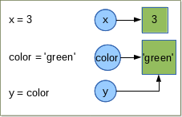
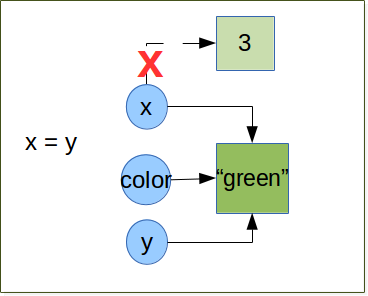
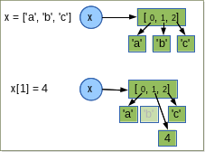

.. _Variables:

************************************
Variables, Expression and statements
************************************

Variables and Object References
===============================

Value and type
--------------

A **value** is one of the basic things a program works with, like a letter or a number.  
The values we have seen so far are ``1``, ``2``, and ``'Hello, World!'``.

These values belong to different **types**: ``2`` is an integer (:ref:`integers`), and ``'Hello, World!'`` is a **string** (:ref:`strings`),
so-called because it contains a "string" of letters. You (and the interpreter) can identify
strings because they are enclosed in quotation marks. We speak speak also of ``data type``.

If you are not sure what type a value has, the interpreter can tell you. ::

   >>> type('Hello, World!')
   <type 'str'>
   >>> type(17)
   <type 'int'>
 
Not surprisingly, strings belong to the type ``str`` and integers belong to the type ``int``.  
Less obviously, numbers with a decimal point belong to a type called ``float``,
because these numbers are represented in a format called ``floating point`` (:ref:`floating point`). ::

   >>> type(3.2)
   <type 'float'>

What about values like ``'17'`` and ``'3.2'``?
They look like numbers, but they are in quotation marks like strings. ::

   >>> type('17')
   <type 'str'>
   >>> type('3.2')
   <type 'str'>

They're strings.

When you type a large integer, you might be tempted to use commas or space
between groups of three digits, as in ``1,000,000``.  
This is not a legal integer in Python, but it is legal: ::

   >>> 1,000,000
   (1, 0, 0)

Well, that's not what we expected at all!  Python interprets ``1,000,000`` 
as a comma-separated sequence of integers.
This is the first example of a semantic error: the code
runs without producing an error message, but it doesn't do the ``right`` thing.

In Python, both ``str`` and ``int`` are immutable. That is once set their value cannot be changed anymore.
there exist some datatype which are mutable (we will see what this difference implies between this to kind
of datatype in :ref:`mutable obj` and :ref:`immutable obj` and some examples of mutable and immutable 
data types in  :ref:`Data_Types` and :ref:`Collection_Data_types`)

To convert a data item from one type to another, we can use the syntax *datatype(item)*. For example: ::
   
   >>> int("45")
   45
   >>> str(45)
   '45'
   
The ``int`` conversion is tolerant of leading and trailing whitespace. So int(" 45 ") would have worked just as well.
The ``str`` conversion can be applied to almost data item. 
If a conversion fails, an exception is raised (we will see fully :ref:`exceptions` later). ::

   >>> int('Hello World!')
   Traceback (most recent call last):
      File "<stdin>", line 1, in <module>
   ValueError: invalid literal for int() with base 10: 'Hello World!'
  

Variables and Object references
-------------------------------

Once we have data item (or values), the next thing we need is variables in wich to store them.
A variable is a name that refers to a value.
One of the most powerful features of a programming language is the ability to manipulate ``variables``.  

As I mentioned earlier, in Python everything is an object, even int or string. ::

   >>> isinstance(3, object)
   True
   >>> isinstance('blue', object)
   True
   
.. note::
   
   An object is "something" which pack together 
    
   * a state, for instance the value 3 for the int or 'blue' for the string.
   * and a behavior: a set of methods (the operations that we can do on this object).
    
    For instance *'blue'* is the state, *upper* is a method applied to the value 'blue'::
     
     >>> 'blue'.upper()
     'BLUE'
     
   The object oriented programming is out of the scope of this course. So we don't see more about the objects.  

So Python does not have variable as such, but instead has ``object references``. When it comes to immutable objects
like ``str`` or ``int``, there is no discernable difference between variable and an object reference.
As for mutable objects there is a difference, but it rarely maters in practice. So we will use the terms of ``variable``
or ``object reference`` interchangeably.

Let's look at few examples and see what's happend in details: ::

   x = 3
   color = 'green'
   y = color

The syntax is simply ``object reference = value``. There is no need of predeclaration
and no need to specify the value's type. When Python execute 

* the first statement it creates a ``int`` object with the value ``3`` and create the object reference call ``x`` that refer to
  the int object. For all pratical purpose we say ``that variable x has been assigned the "3" integer``.
* The second statement is similar. 
* The third creates a new object reference y and sets it to refer to the same object
  that the color reference object refers to (in this case the str object containing the value "green").

Let's see what python do behind the scene:

   

| *The circles represents the object references.*
| *The rectangles the objects in memory.*
   
| The ``=`` operator is not the same as the variable assignment operator in some other languages.
| The ``=`` operator binds an object in memory to an object reference. If the object reference already exists
  it simply re-bound to refer to the object on the right of = operator; if the reference does not exist, it simply created by the = operator.
   
.. container:: clearer

    .. image :: _static/figs/spacer.png
       

Let us continue with the previous example and do some rebinding.

    
\ ::
    
   >>> print x, color, y  #in python3 syntax or print_function import >>> print(x, color, y)
   3 green green 
   >>> x = y
   >>> print x, color, y
   green green green

.. note:: comments begin with a ``#`` and continue until the end of the line
   
| Now the three objects references are refering to the same string with value "green". 
| Since there are no more object references to the int ``3`` Python is free to garbage it.

Python uses *dynamic typing*, which means that an object reference can be rebound to refer 
to a different object (which may be a different data type) at any time. 

.. container:: clearer

    .. image :: _static/figs/spacer.png

.. _immutable obj:

Immutable objects
=================

As I mentinoned in previous paragraph imutable objects are objects that we **cannot** change
the state (the value). We can rebind the reference which was refer to an immutable object 
to a **new** object with an other value, but we cannot change the value of the object itself.
We already seen immutable objects, int, str. There is a lot of other data types which are
immutable we will see them in details in :ref:`Data_types` and :ref:`Collection_Data_types`  . 

.. _mutable obj:

Mutable objects
===============

   
By contrast to the immutable objects, the mutable object are object that we can modify the state (the value).
One example of immutable object is the ``list`` (we will see the :ref:`list` in details in chapter about :ref:`Collection_Data_Types`).
A list is an object to hold a collection of data items. In the list the items are ordered. 
We can easily insert, remove, items whenever we want.

Under the hood, the lists do not store data items at all, but rather object references.
When lists are created and when items are inserted, they take copies of the object references they are given.

.. container:: clearer

    .. image :: _static/figs/spacer.png
    
| On the figure we see the creation of a list with a reference x on it. This list contains 3 strings 'a', 'b','c'.
| The list does not contains the 3 string objects directly, but the references toward their respective objects.
| We can easily change the state of the list, by rebinding the second element of it to the integer object newly created.
| The string 'b' has no reference anylonger that point on it, then Python is free to garbage it.
  

Variable name and keywords
==========================

Programmers generally choose names for their variables that are meaningful, 
they document what the variable is used for.

Variable names (also calls identifiers) non empty sequence of characters that can be arbitrarily long. 
This sequence consists of a "start character" and a "non zero" or more "continuation characters".
Such an identifier must obey a couple of rules and ideally follow some conventions.

* The first rule concern the start and continuation characters. 
  
  * start character can be any letter or the underscore.
  * The continuation character can be any character that is permit as a start character, or pretty well
    any non white space character including digit.
  
  The underscore character, ``"_"`` is often used in names with multiple words such as ``scoring_matrix``.
* Identifiers are case sensitive, so far GENESEQUENCE, GeneSequence, Genesequence or genesequence are different identifiers.

.. note:: 
   In Python3 the default encoding is utf8. So letter can be anything that Unicode considers to be a letter,
   as non english letters.

.. note:: 
   The precise set of chracaters that are permitted are describe in the Pyhton documentation (), and in PEP3131

* The identifier cannot have the same name a one of the Python's keywords.

Python 2 has 31 keywords:

.. tabularcolumns:: |l|l|l|l|l|

+----------+---------+--------+--------+-------+
| and      | del     | from   | not    | while |
+----------+---------+--------+--------+-------+
| as       | elif    | global | or     | with  |
+----------+---------+--------+--------+-------+
| assert   | else    | if     | pass   | yield |
+----------+---------+--------+--------+-------+
| break    | except  | import | print  |       |
+----------+---------+--------+--------+-------+
| class    | exec    | in     | raise  |       |
+----------+---------+--------+--------+-------+
| continue | finally | is     | return |       |
+----------+---------+--------+--------+-------+
| def      | for     | lambda | try    |       |
+----------+---------+--------+--------+-------+

.. note:: In Python 3, ``exec`` is no longer a keyword, but ``nonlocal`` is.

* The first convention is: Don't use the names of any of Python's predefined identifiers for you own identifiers.
  So, avoid using NotImplemented or Ellipsis and the name of any of Python's built-in data types (such as int, float, str, list, tuple),
  and any of Python's built-in functions or exceptions.

* The second convention concern the uses of underscore ``_``. Names that begin and end with two underscores as ``__eq__`` should not used.
  Python defines various special methods and variables that use such names. In the case of special methods, we can reimplement them, that is,
  make our own version of them (we will not cover this topic during this course), but not to introduce new names. 
  A single underscore can be used as an identifier, and inside an interactive interpreter or Python Shell, 
  _ holds the results of the last expression that was evaluated. In normal program _ does not exists unles we use it explicitly.
  Some developpers like to use _ when they don't intend to use it, for instance in loops when they don't care about the items being
  looped over, or when they unpack a sequence and don't care of some value: ::
  
   for _ in (0,1,2,3,4,5):
      print "Hello"
      
   a , _, b, _ = (1,2,3,4)
   
 
If you give a variable an illegal name, you get a syntax error: ::

   >>> 76trombones = 'big parade'
   SyntaxError: invalid syntax
   >>> more@ = 1000000
   SyntaxError: invalid syntax
   >>> class = 'Advanced Theoretical Zymurgy'
   SyntaxError: invalid syntax

* ``76trombones`` is illegal because it does not begin with a letter.
* ``more@`` is illegal because it contains an illegal character, ``@``.  
* ``class`` is one of Python's **keywords**.  

.. note:: 

   All these naming conventions are details in :ref:`pep_8` (**P**\ ython **E**\ nhancement **P**\ roposal), Style Guide for Python Code.
   The pep8 gives coding conventions for the Python code. These guidelines are intended to improve the readability of code and 
   make it consistent across the wide spectrum of Python code.
   Consistency with this style guide is important. Consistency within a project is more important.
   Most of the time when you start a project you start it alone, it's your project you can choose the style you want.
   But one day your code will be read by an other, for helping you to debug, because you want to start a collaboration,
   a student get back your code to continue the project, because you want to publish your code. 
   It will be very much easier to understand what you did if you follow these conventions.   

Summary
=======

In this chapter we learned that a value have a data type. Python have different data types, some of them are immutable 
the others are mutable. We also create object reference to handle data item. A variable or reference object can
handle different data type at any time, this is called the *dynamic typing*. 
