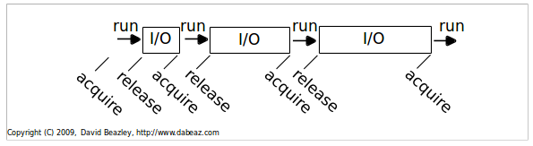
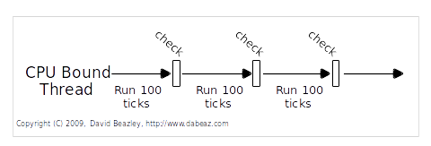
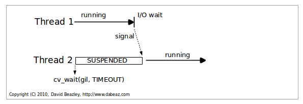
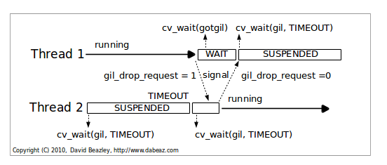

.. _python3:

*******************
Python 3 what's new
*******************

The Python 3 major improvements
===============================

The GIL
-------

The **G**\ lobal **I**\ nteruptor **L**\ ock is an internal Python feature, which you have not to bother with unless 
you want to parallelized a program using multithreads.

The GIL is a mutex that prevents multiple native threads from executing Python bytecodes at once. 
This lock is necessary mainly because CPython's memory management is not thread-safe.

.. note::

   In computer science, mutual exclusion refers to the requirement of ensuring that no two concurrent processes
   are in their critical section at the same time; 
   it is a basic requirement in concurrency control, to prevent race conditions (http://en.wikipedia.org/wiki/Mutual_exclusion).
   

Consider this trivial CPU-bound function: ::

   def count(n):
      while n > 0:
      n -= 1

Run it twice in series: ::

   count(100000000)
   count(100000000)

Now, run it in parallel in two threads: ::

   t1 = Thread(target=count,args=(100000000,))
   t1.start()
   t2 = Thread(target=count,args=(100000000,))
   t2.start()
   t1.join(); t2.join()

Why do I get these performance results on my Dual-Core MacBook?

* Sequential : 24.6s
* Threaded : 45.5s (1.8X slower!)

And if I disable one of the CPU cores, why does the threaded performance get better?

* Threaded : 38.0s

Only one Python thread can execute in thecinterpreter at once.
There is a "global interpreter lock" that carefully controls thread execution.
The GIL ensures that sure each thread gets exclusive
access to the interpreter internals when it's running (and that call-outs to C extensions play nice).

**It's simple** : threads hold the GIL when running.
However, they release it when blocking for I/O

   
   GIL Behavior

   So, any time a thread is forced to wait, other "ready" threads get their chance to run.
   Basically a kind of "cooperative" multitasking. To deal with CPU-bound threads that never
   perform any I/O, the interpreter periodically performs a "check".
   By default, every 100 interpreter "ticks".

 
   CPU Bound Processing
   
.. container:: clearer

    .. image :: _static/figs/spacer.png
   
A very common problem encountered with Python thread programming is that threaded
programs can no longer be killed with the keyboard interrupt.
It is **EXTREMELY ANNOYING** (you have to use kill -9 in a separate window)
  
The reason Ctrl-C doesn't work with threaded programs is that the main thread is often blocked
on an uninterruptible thread-join or lock

On multiple CPU cores, the penalty gets far worse. There is a battle for the GIL.

* Two CPU-bound threads (OS-X, 1 CPU)
   * 1149 Unix system calls
   * ~3.3 Million Mach System Calls

* Two CPU-bound threads (OS-X, 2 CPUs)
   * 1149 Unix system calls
   * ~9.5 Million Mach System calls

However the GIL degrades performance even when it is not a bottleneck. 
Summarizing those slides: The system call overhead is significant, especially on multicore hardware. 
Two threads calling a function may take twice as much time as a single thread calling the function twice. 
The GIL can cause I/O-bound threads to be scheduled ahead of CPU-bound threads. 
And it prevents signals from being delivered. 
  
In few words if you have I/O bound concurency programs you can use the muti-threading via ``threading`` module. 
But if you have CPU bound concurency you should use ``multiprocessing`` library.

From Python 3.2 the GIL was totally rewritten. This new implementation improve the behavior and the performance of multithreaded programs.

The New GIL:

* First things first: The new GIL does not eliminate the GIL--it makes it better (so as in Python2.x **only one** thread can execute Python bytecodes at a time).
* New implementation aims to provide more consistent runtime behavior of threads.
* Namely, a significant reduction in all of that thrashing and extra signaling overhead.
* The new GIL is still based on condition variables and signaling.
* However, it's put together in an entirely different way.

Let's take a look

* Interpreter Ticks - Gone
   * Past versions of Python kept track of interpreter instructions and "ticks"
   * Once a certain number of ticks had executed, a thread-switch signal was sent
* This is gone. There are no more ticks.
* New GIL is time-based (more in a second)

   
   New GIL Illustrated: In the beginning, there is one thread.
   
      * It runs forever
      * Never releases the GIL
      * Never sends any signals
      * Life is good

.. container:: clearer

    .. image :: _static/figs/spacer.png

   
   New GIL Illustrated: Voluntary GIL release.
   
   This is the easy case. Second thread gets signaled when Thread 1 sleeps. It runs
   
.. container:: clearer

    .. image :: _static/figs/spacer.png

   
   New GIL Illustrated: cpu bound.
   
   * Timeout causes gil_drop_request to be set.
   * After setting gil_drop_request, Thread 2 repeats its wait request on the GIL.
   * Thread 1 is forced to give up the GIL.
   * It will finish its current instruction, drop the GIL and signal that it has released it.
   * Signal indicates that the other thread successfully got the GIL and is now running (this eliminates the "GIL Battle").
   * The process now repeats itself for Thread 1.
   * So, the sequence you see above happens over and over again as CPU-bound threads execute.

.. container:: clearer

    .. image :: _static/figs/spacer.png
    
Does it Work?
 
Yes, it's better (4-core MacPro, OS-X 10.6.2)
   * Sequential : 23.5s
   * Threaded : 24.0 (2 threads)

For more details about GIL implementation over python 2 and 3.2 see:

   * http://www.dabeaz.com/python/GIL.pdf
   * http://www.dabeaz.com/python/NewGIL.pdf

Unicode
-------
Python 3.0 uses the concepts of text and (binary) data instead of Unicode strings and 8-bit strings. 
All text is Unicode; however encoded Unicode is represented as binary data. 
The type used to hold text is str, the type used to hold data is bytes. 
The biggest difference with the 2.x situation is that any attempt to mix text and data in Python 3.0 raises TypeError, 
whereas if you were to mix Unicode and 8-bit strings in Python 2.x, 
it would work if the 8-bit string happened to contain only 7-bit (ASCII) bytes, 
but you would get UnicodeDecodeError if it contained non-ASCII values. 
This value-specific behavior has caused numerous sad faces over the years.

Files openedFilenames are passed to and returned from APIs as (Unicode) strings. 
This can present platform-specific problems because on some platforms filenames are arbitrary byte strings. 
As text files (still the default mode for open()) always use an encoding to map between strings (in memory) and bytes (on disk). 

As we saw the semantic between text and bytes is clear now.
And comparison between differents type raise Type Exception now

>>> #In Python2 
>>> 2 > 'a'
False

>>> #In Python3
>>> 2 > 'a'
Traceback (most recent call last):
  File "<stdin>", line 1, in <module>
TypeError: unorderable types: int() > str()

The standard library refactoring
--------------------------------

Some modules from the standard library has been renamed to follow the :ref:`pep_8` as ``ConfigParser`` which becomes ``configparser``.
Some others has been rewritten to improve consistency and *in fine* the readibility.
for instance the ``io`` module or the fusion of ``urlib`` and ``urllib2`` modules.

Some new modules appear like ``statistics``, to compute some basic statistics like ``mean``, ``median``, ``variance`` , ...

Improving the semantic object
-----------------------------

The object semantic has been improved for instance: ::

   class Python2Example(object):
      pass
      
   class Python3Example:
      pass
      
The *old-style* classes has been removed so all classes inherits from ``object``.

For the metaclasses: ::

   class Python2Example(object):
      
      __metaclass__ : MyMetaClass
      
   class Python3Example(metaclass = MyMetaClass):
      pass
    
Or the using of ``super`` to call the parent method: ::

   class Python2Example(Parent):
   
      def __init__(self):
         super(Parent, self).__init__()
         
   class Python3Example(Parent):
   
      def __init__(self):
         super().__init__()

the print statement
-------------------

The print statement has been replaced with a print() function, 
with keyword arguments to replace most of the special syntax of the old print statement. ::

   Old: print "The answer is", 2*2
   New: print("The answer is", 2*2)
   
   Old: print x,           # Trailing comma suppresses newline
   New: print(x, end=" ")  # Appends a space instead of a newline
   
   Old: print              # Prints a newline
   New: print()            # You must call the function!
   
   Old: print >>sys.stderr, "fatal error"
   New: print("fatal error", file=sys.stderr)

   Old: print (x, y)       # prints repr((x, y))
   New: print((x, y))      # Not the same as print(x, y)!

Views And Iterators Instead Of Lists
------------------------------------

Some well-known APIs no longer return lists:

    * dict methods dict.keys(), dict.items() and dict.values() return “views” instead of lists. 
      For example, this no longer works: k = d.keys(); k.sort(). 
      Use k = sorted(d) instead (this works in Python 2.5 too and is just as efficient).
    * Also, the dict.iterkeys(), dict.iteritems() and dict.itervalues() methods are no longer supported.
    * map() and filter() return iterators. 
      If you really need a list and the input sequences are all of equal length, 
      a quick fix is to wrap map() in list(), e.g. list(map(...)), 
      but a better fix is often to use a list comprehension (especially when the original code uses lambda), 
      or rewriting the code so it doesn’t need a list at all. 
      Particularly tricky is map() invoked for the side effects of the function; 
      the correct transformation is to use a regular for loop (since creating a list would just be wasteful).
    * range() now behaves like xrange() used to behave, except it works with values of arbitrary size. The latter no longer exists.
    
.. note::
   
   A dictionary view is a read-only iterable object that appears to hold the dictionary's items or keys or values, depending the view we asked for.
   
   In general we can simply treat views as iterables. However two things make a view different from other iterable. 
   One is that if the dictionary the view refers to changed, the view reflects te change. The other is that key and items view support
   some set-like operations. Given a dictionary view ``v``and set a dictionary view ``x``, the supported operations are: ::
      
      v & x # Intersection
      v | x # Union
      v - x # Difference
      v ^ x # Symetric difference
      
    
   
nonlocal keywords
-----------------

nonlocal statement. Using nonlocal x you can now assign directly to a variable in an outer (but non-global) scope.

In Python2.x : ::

   >>> def counter():
   ...    cpt = 0
   ...    def increment():
   ...       cpt += 1
   ...       return cpt
   ...    return increment
   ... 
   >>> c2= counter()
   >>> c2()
   Traceback (most recent call last):
      File "<stdin>", line 1, in <module>
      File "<stdin>", line 4, in increment
   UnboundLocalError: local variable 'cpt' referenced before assignment

In Python2.x, there's no way to modify *cpt* inside *increment* because writing *cpt = foo* would declare a local *cpt* in *increment*,
not assign to *cpt* of *counter*. This is a side-effect of Python's *assignment = declaration*. 
For the same reason we cannot modify the value of *cpt* as *cpt* is a non mutable object. 
Python create a new local reference *cpt* on the left of the statement but we try to use it 
in the right part of the assignment so Python raise an error

We can **only** read an immutable variable from the enclosing scope but we cannot assign a new value to it. 

In Python3 ::   
   
   >>> def counter():
   ...    cpt = 0
   ...    def increment ():
   ...       nonlocal cpt
   ...       cpt += 1
   ...       return cpt
   ...    return increment
   ... 
   >>> c1 = counter()
   >>> c2 = counter()
   >>> c1()
   1
   >>> c2()
   1
   >>> c1()
   2
   >>> c2()
   2

The new keyword *nonlocal* allow to overcome the side-effect of Python's *assignment = declaration* and modify
variables which are neither local nor global.

Syntax for Delegating to a Subgenerator
---------------------------------------

Adds the ``yield from expression``, allowing a generator to delegate part of its operations to another generator. 
This allows a section of code containing yield to be factored out and placed in another generator. 
Additionally, the subgenerator is allowed to return with a value, and the value is made available to the delegating generator.

pip and virtualenv integration
------------------------------

One thing was bizzare with python, is it should be installed with an other package installer ``easy_install``. 
From now ``PIP`` is stable and well maintained and directly available when we install Python.
The version of pip included with Python 3.4.0 is pip 1.5.4, and future 3.4.x maintenance releases will update the bundled version to the latest version of pip that is available at the time of creating the release candidate.

the ``pyvenv`` command is also available with Python3.4 installation to create virtual environments. ::

   pyvenv /path/to/new/virtual/environment

Running this command creates the target directory (creating any parent directories that don’t exist already) 
and places a pyvenv.cfg file in it with a home key pointing to the Python installation the command was run from. 
It also creates a bin (or Scripts on Windows) subdirectory containing a copy of the python binary (or binaries, in the case of Windows). 
It also creates an (initially empty) lib/pythonX.Y/site-packages subdirectory (on Windows, this is Lib\site-packages).

.. seealso:: 

   Its only a very brief overview of the new features bring up by python3, There are lot new features we did not review above, as 
   Exception handling, function annotation, unpacking operator, ...

   if you are interested see:
   
   * https://docs.python.org/3/whatsnew/3.0.html
   * https://docs.python.org/3/whatsnew/3.1.html
   * https://docs.python.org/3/whatsnew/3.2.html
   * https://docs.python.org/3/whatsnew/3.3.html
   * https://docs.python.org/3/whatsnew/3.4.html
   * https://speakerdeck.com/pyconslides/python-3-dot-3-trust-me-its-better-than-python-2-dot-7-by-dr-brett-cannon
